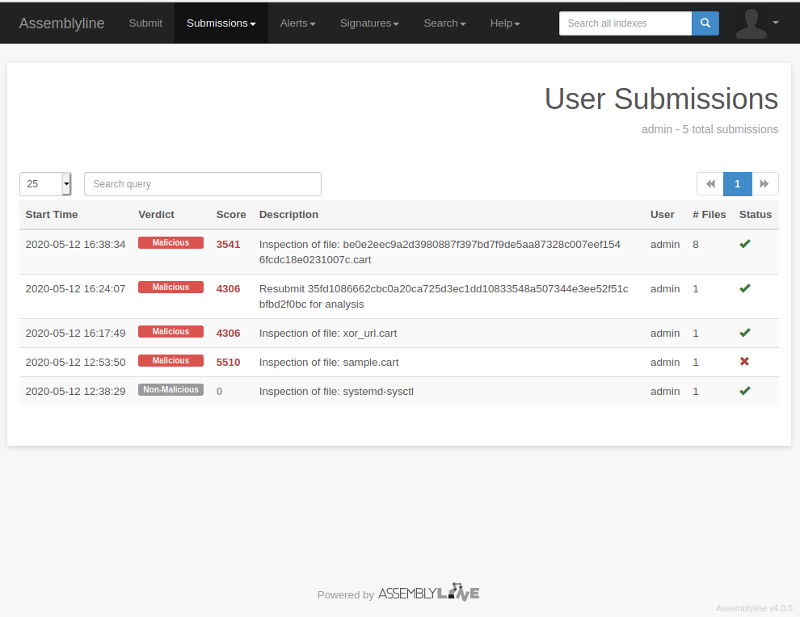
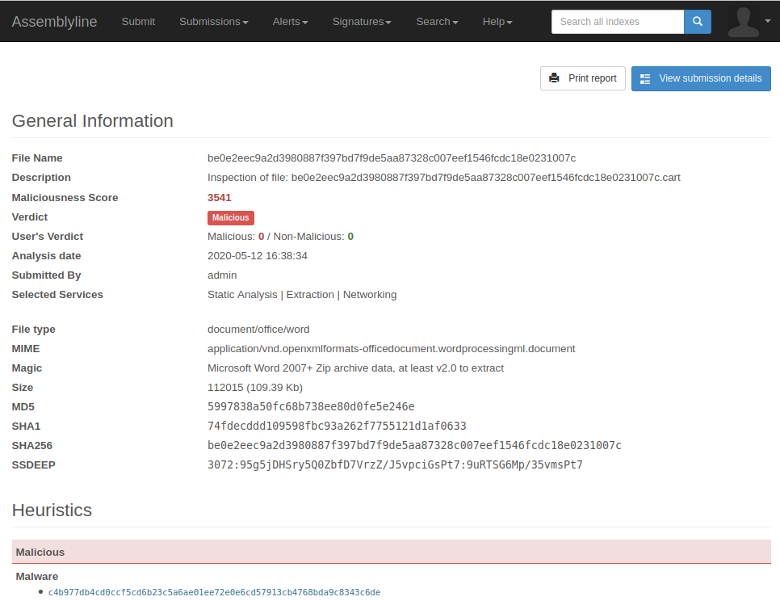
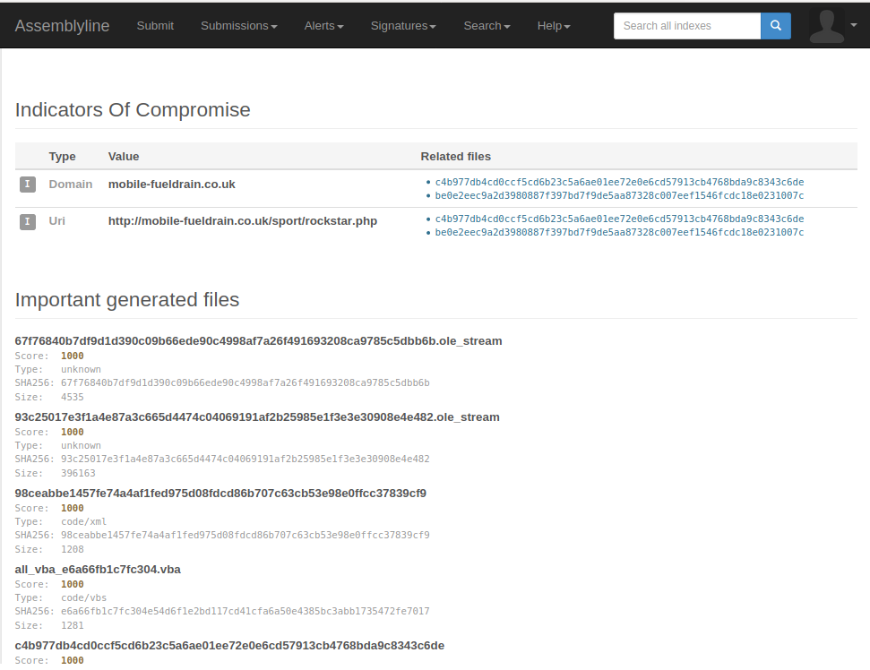
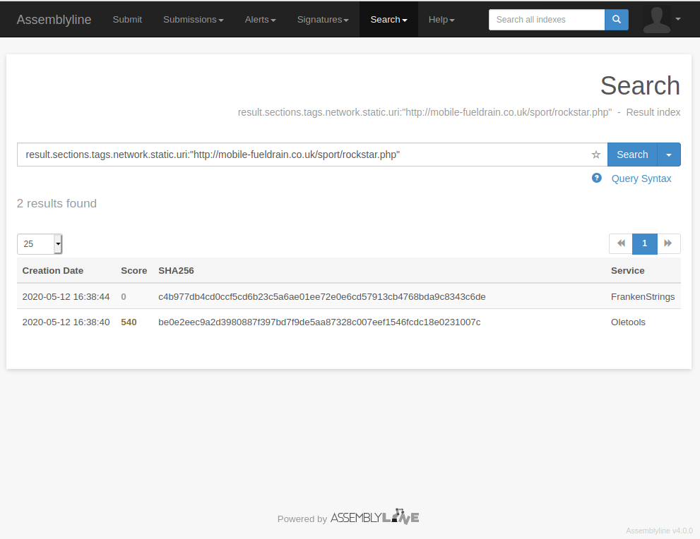
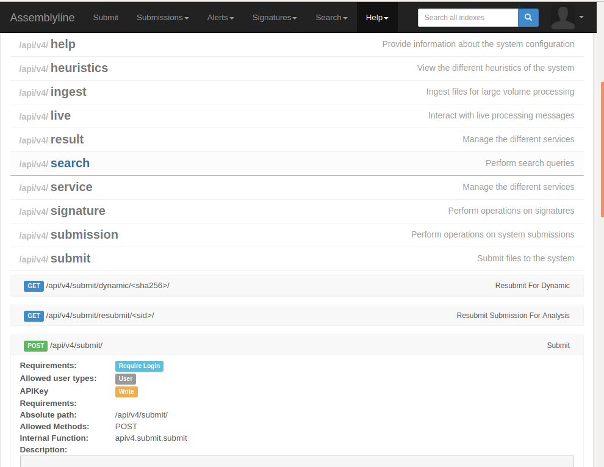
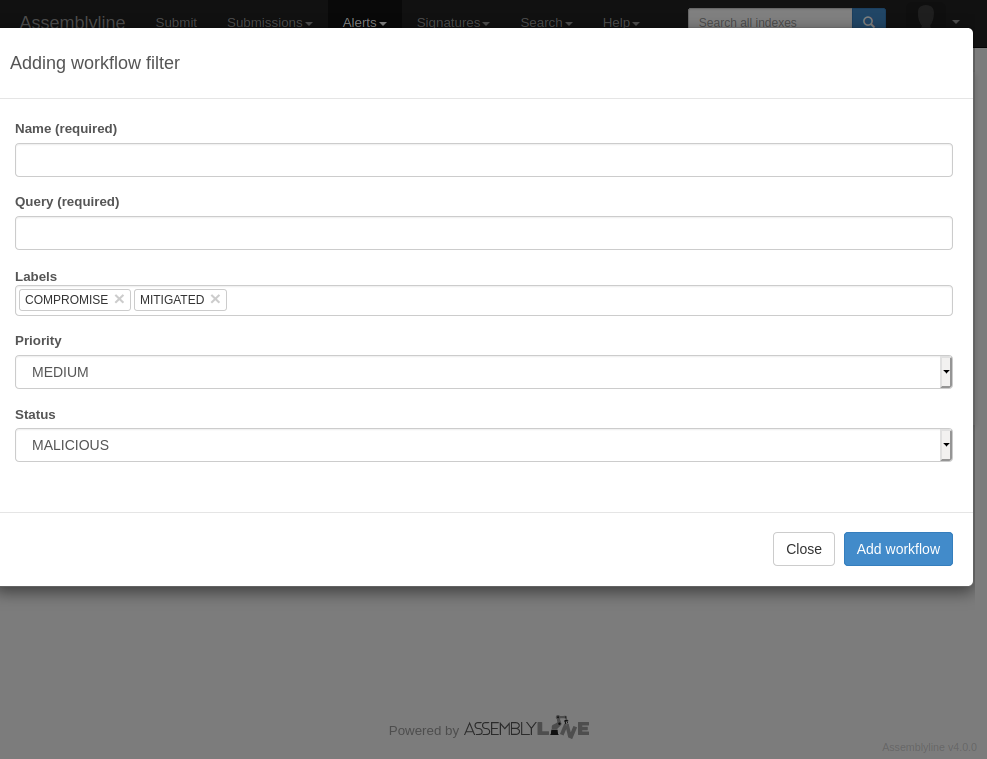
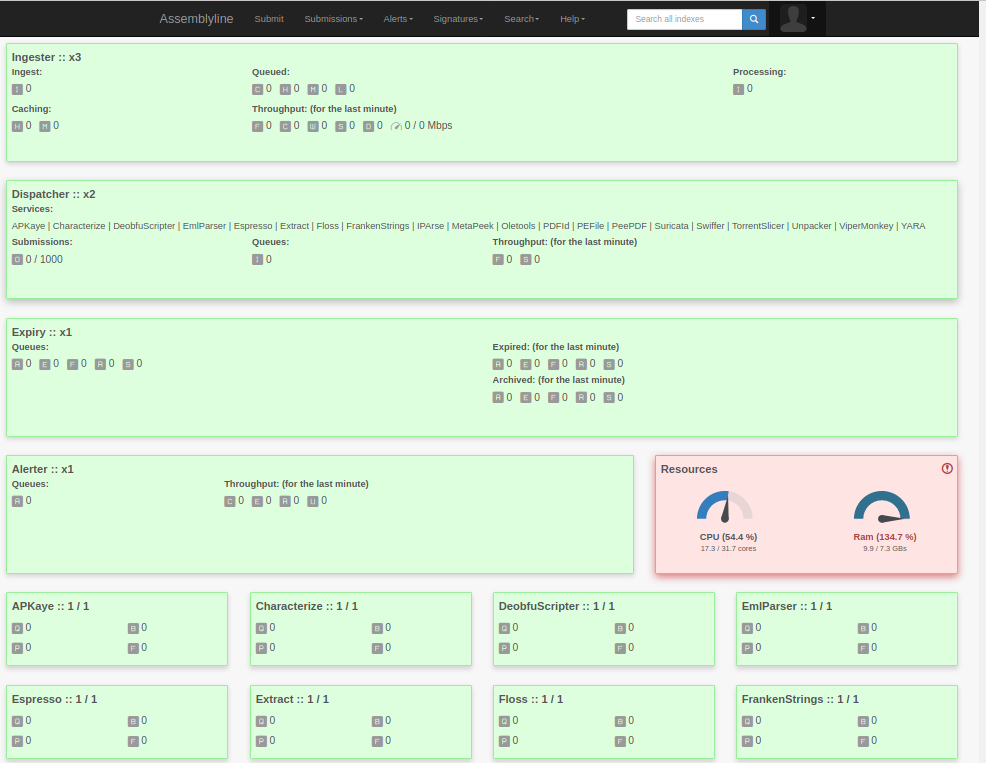

* <table><tr><td></td></tr><tr><td>
Submit a file to the system, the system will automatically select the right analysis type.
</td></tr></table>
* <table><tr><td></td></tr><tr><td>
As the system process your file a submission and verdict will be created.
</td></tr></table>
* <table><tr><td></td></tr><tr><td>
The results from each services will be presented in a summary.
</td></tr></table>
* <table><tr><td></td></tr><tr><td>
Indicators of compromise such as: IP address, hostname, malware family and virus name will be summarized.
</td></tr></table>
* <table><tr><td></td></tr><tr><td>
Extracted information is stored in an Elasticsearch database, this enable users to search for file with specific attributes.
</td></tr></table>
* <table><tr><td></td></tr><tr><td>
Behind the UI sits a powerful RESTAPI; you can automate analysis and integrate with the rest of your infrastructure.
</td></tr></table>
* <table><tr><td></td></tr><tr><td>
AssemblyLine can generate alerts; the workflow management allows you to triage them automatically based on queries.
</td></tr></table>
* <table><tr><td></td></tr><tr><td>
AssemblyLine has it's own user management system, but also support OAuth, 2FA and apikeys.
</td></tr></table>
* <table><tr><td></td></tr><tr><td>
AssemblyLine runs on Docker and Kubernetes; it can scale from one machine to cloud size infrastructure.
</td></tr></table>

