# User Interface Walkthrough for Administrators

In the user interface, there is a menu on the left-hand side. We will be walking through each option under the "Administration" topic as well as some other features:

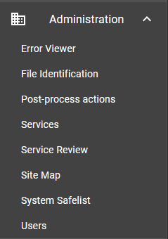{: .center }

## Error Viewer

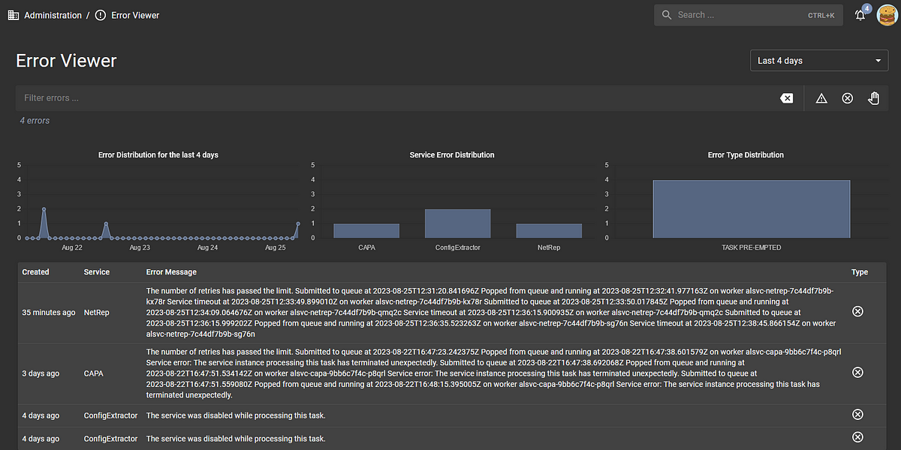

The "Error Viewer" page is an important feature in Assemblyline in terms of service management and development. The errors that you see here are for services only, so you won't see any errors taking place in core components on this page. 

You can see the distribution of errors over a given time range, you can filter for all errors from a specific service by using a Lucene query in the filter bar or by clicking on a service column in the "Service Error Distribution" graph, and you can do the same for a specific error type via the filter bar or the "Error Type Distribution" graph. 

The buttons located on the right of the filter bar can apply pre-defined queries such as unhandled exceptions, canceled tasks, and maximum depth, level, or retries errors.
When you select an error card, a side-drawer appears with the details for that error:

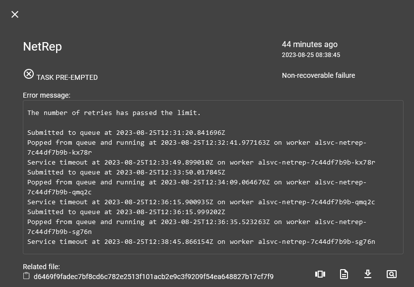

By the looks of this error message, the NetRep service had difficulty analyzing the related file to the point where the service timed out. All Assemblyline services retry two times on service timeouts, after which a non-recoverable failure is raised with the phrase "Task Pre-empted". A service developer can look at this error and try to reproduce it locally in their development environment, or a service administrator can raise it to the service owners for them to debug.

## File Identification

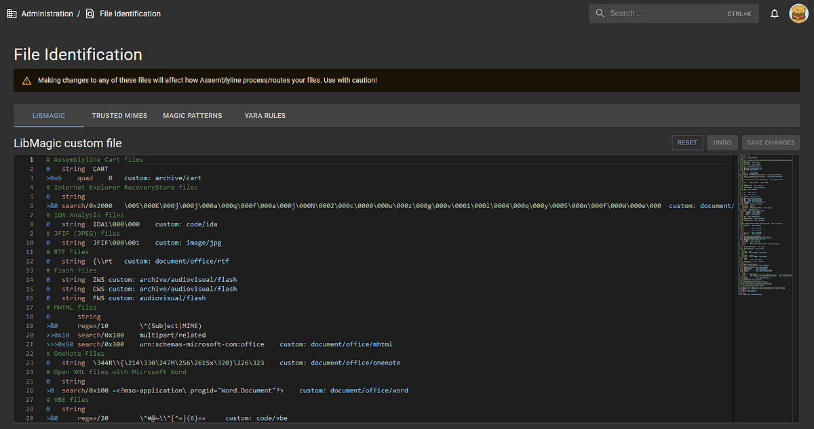

Assemblyline does not look at file names or file extensions to determine the file type of a file. Instead, it uses file class analysis to assign an Assemblyline file type to each file that it sees, so that this file can be routed to the specific service that is tailored for that file type. File identification is one of the most important features of Assemblyline since the entire analysis of a file relies on the type that it is identified as. The main file in charge of identification can be found [here](https://github.com/CybercentreCanada/assemblyline-base/blob/master/assemblyline/common/identify.py).

Assemblyline's file class analysis can be broken into a few distinct aspects:

- [Magic](https://man7.org/linux/man-pages/man3/libmagic.3.html)
- [MIME](https://developer.mozilla.org/en-US/docs/Web/HTTP/Basics_of_HTTP/MIME_types)
- [Yara](https://github.com/VirusTotal/yara)

An example of where file identification lives in Assemblyline is on the "File Details" page:

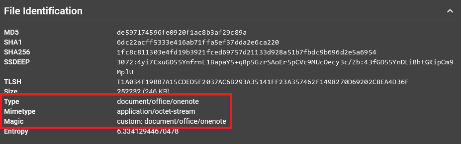

You can see that Assemblyline's file type is present as the "Type": `document/office/onenote`. The MIME type is `application/octect-stream` and the Magic label is a custom value `custom: document/office/onenote`. Custom Magic labels will be explained later.

In most cases, a combination of Magic and MIME is enough to produce an identification for a file. We use a subset of Magic labels and MIME types that are high-confidence and label them as "trusted", which you can see in the "TRUSTED MIMES" and "MAGIC PATTERNS" tabs. 

In the "TRUSTED MIMES" view, you can see the MIME types that are high-confidence and are mapped directly to the Assemblyline file type:

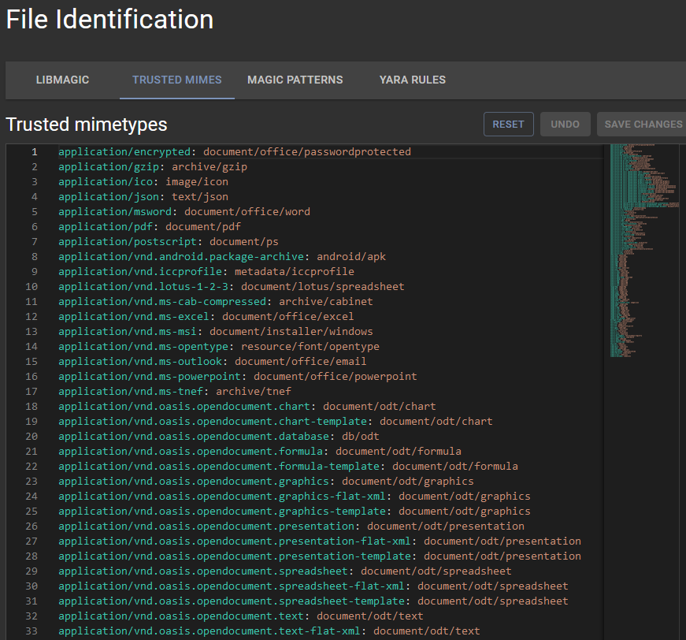

Trusted Magic labels are a little trickier, so we use high-confidence regular expressions to map labels to Assemblyline file types, as seen in the "MAGIC PATTERNS" view:

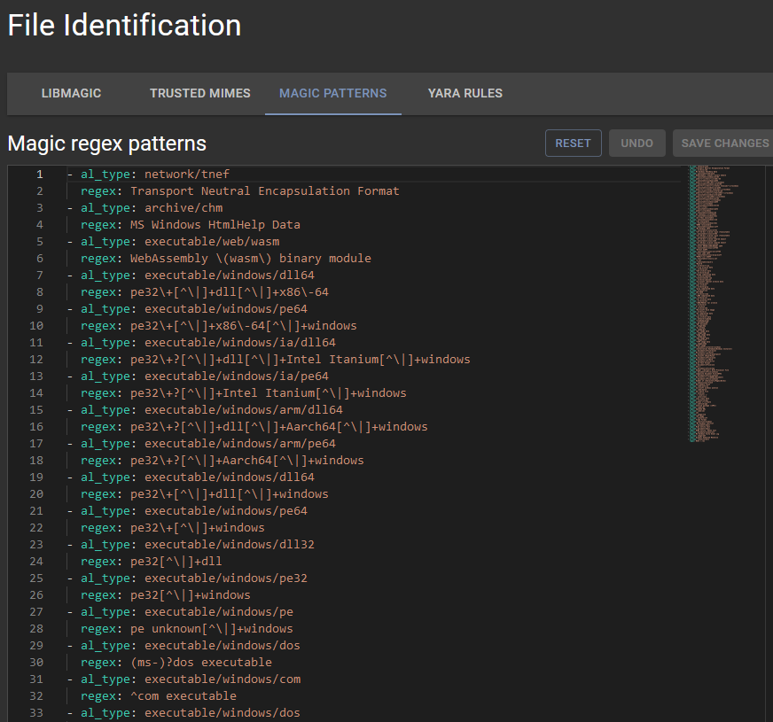

On top of this, we use custom Magic rules to apply labels to a file, as seen in the "LIBMAGIC" tab. This is where that `custom: document/office/onenote` label came from for the OneNote file mentioned above.

This is all fine and dandy, but some files do not have obvious metadata or headers where Magic labels and MIME types can be applied, like scripts. This is where the Yara rules come into play.

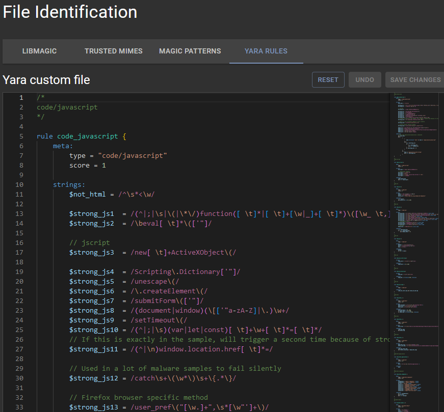

These Yara rules are designed to look for high-confidence pieces of code that are language-specific to determine the file type of the script.

The best part about all these tabs on the "File Identification" page is that they are all customizable! If you see a file that is being identified incorrectly, you can easily add either a custom Magic label, a trusted MIME type, a regular expression for Magic labels, or a Yara rule.

## [Post-process actions](../../administration/submission_actions)

## [Services](../../administration/service_management)

## Service Review

You can find the service review interface by clicking the *Administration* topic then choose *Service Review* subtopic.

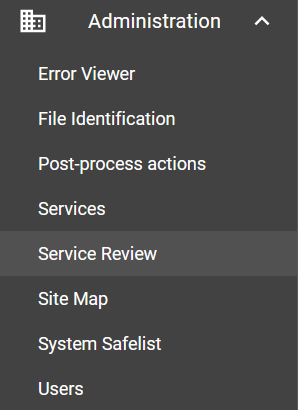{: .center }

This is a page where you can compare different versions of a service and how it behaved in terms of the number of results processed, the average score, the average number of extracted and supplementary files, etc.

Here is an example of comparing different versions of the APIVector service:

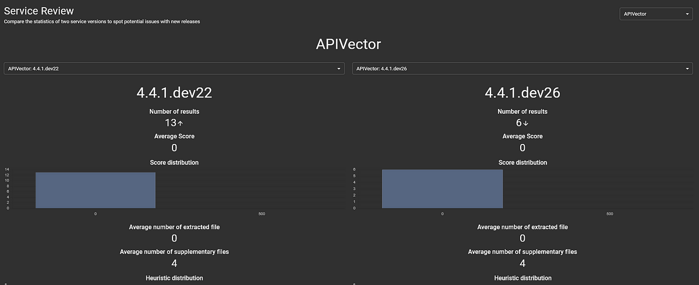

## Site Map
You can find the site map interface by clicking the *Administration* topic then choose the *Site Map* subtopic.

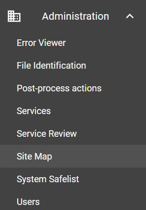{: .center }

This page is useful for seeing how the URL endpoints map to Python client functions, the method types of these functions, and the RBAC roles required to use them.

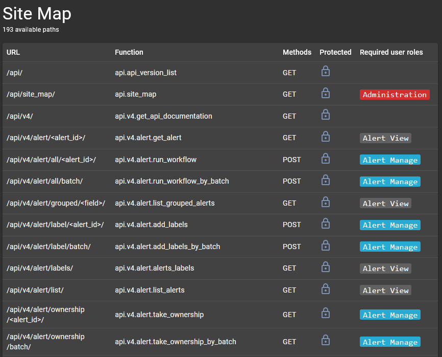

## [System Safelist](../../administration/system_safelist)

## [Users](../../administration/user_management)

We have made it through the Administration subtopics, now let's look at over useful features when managing Assemblyline.

## [Signature Management](../../administration/signature_management)

## [Heuristic Management](../../administration/heuristic_management)

## [Source Management](../../administration/source_management)

## Workflow Management

Previously, [we talked about workflows on the Alerts page](../../user_manual/user_walkthrough#alerts), which could be applied a single time on all alerts currently in the system. The "Workflows" page is where you can create workflows that are persistent and will run on all alerts currently in the system as well as all new alerts that come in.

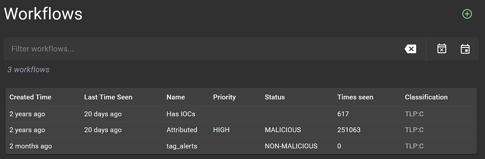

## Dashboard

Now let's look at one last feature that is incredibly useful for an administrator, the Dashboard page.

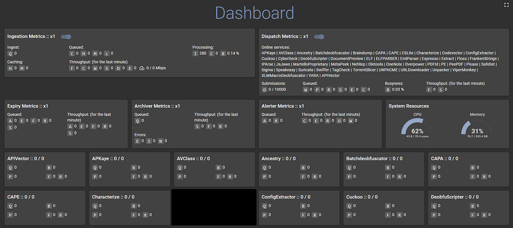

This is the ultimate visualization of what is going on with the Assemblyline system. To the point where there is so much information, we must hide it behind cute buttons with tooltips. It is overwhelming at first, but once you know what to look for, using this page is crucial to Assemblyline administration.

This page can be separated into two main sections: Core and Services cards.

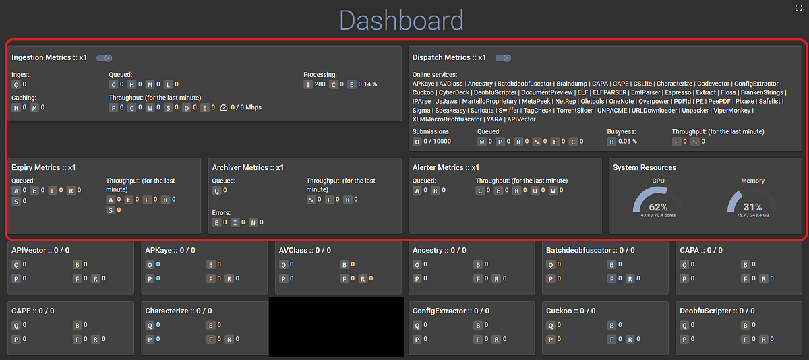

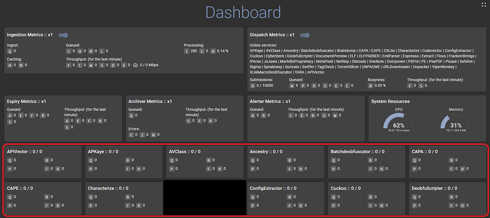

Core cards represent core components described in [Design and Architecture](../../overview/architecture) and Service cards represent services. Let's start by looking at the Ingestion component card.

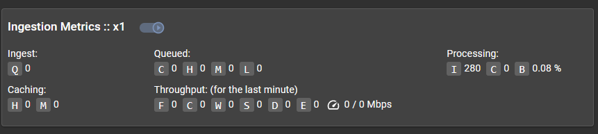

Here are those cute buttons that I was talking about. The small box with a Q in it has a tooltip if you hover your mouse over it which explains what the value next to it represents:

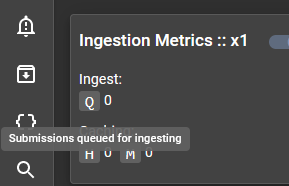{: .center }

You can hover over the other buttons to discover what everything means.

For Service cards, the following graphic describes what is going on for each service:

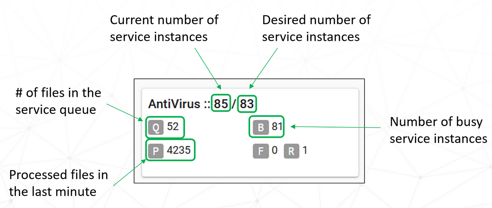

The following are useful pages to manage and troubleshoot your Assemblyline deployment.

## [System Management](../../administration/system_management)

## [Troubleshooting](../../administration/troubleshooting)
