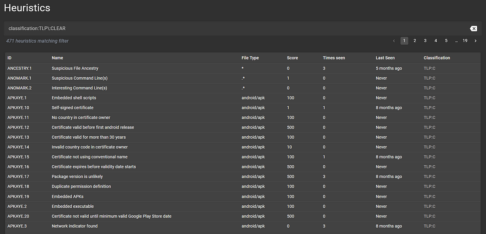
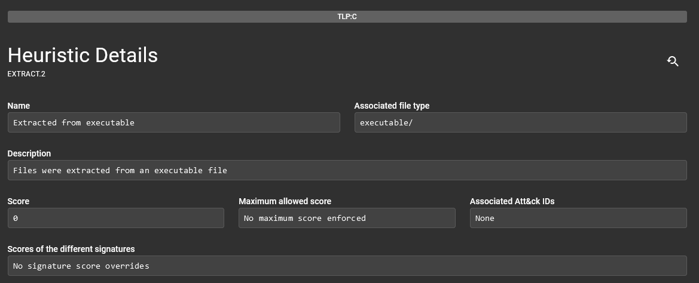
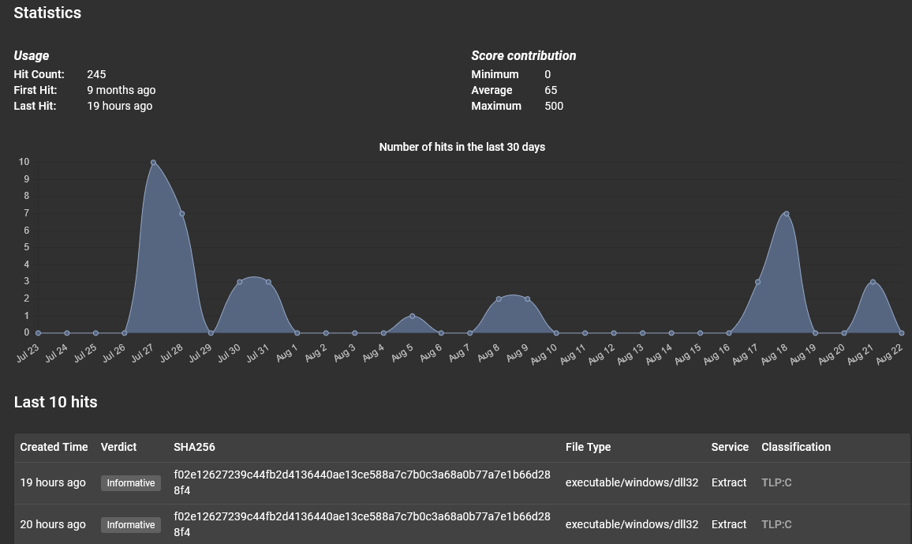

# Heuristic Management

Assemblyline's heuristic management interface lets you:

1. List all heuristics in the system
2. Filter and search the current set of heuristics
3. View details about those heuristics

The main difference between heuristics and signatures in Assemblyline is that heuristics are created by service writers, while signatures are written by trusted sources outside of Assemblyline such as CAPE, Suricata, Yara, and Sigma.

In this view, you can see the names of the heuristics, how often they have been seen, when they were last seen, and their classifications. By selecting one of these cards, you are brought to a detailed view of the heuristic:

Something interesting on this page, if you scroll down, is the "Statistics" section:

This graph allows you to visualize when certain files with the same features come into the system, which is useful in campaign attribution and monitoring.
