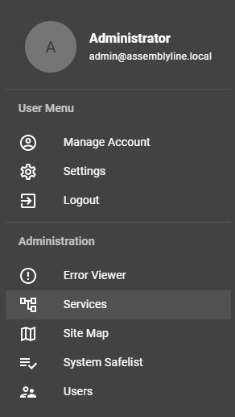

# Service management

Assemblyline's service management interface lets you:

1. List all the services in the system
3. View details about those services
4. Add/Modify/Remove services
5. Download/Restore a backup of the current services configurations

You can find the service managment interface by clicking the *User Avatar* then choose *Services* from the administrator menu.

## Service list

The first page you will be taken to when loading the service management interface will list all the services of the system.

From this interface you can:

1. Add services to the system
2. Perform service updates
3. Download/Restore a backup of the current services configurations
4. View the detail of a service

### Update services

If the system detected that there is a container with a newer version for your current deployment type (dev/stable). The service list will show an update button.

Hovering over the button will let you know which new service version is available and clicking the button will kick off the update for the service.

## Add a service

From the service management page, you can add a service by clicking the circled green "*+*" sign in the top right corner. This will open a popup window with an empty textbox.

Simply paste the `service_manifest.yml` content of the service you which to add to the system then hit the "*Add*" button to add it to the system.

!!! tip
    If your manifest properly uses the following environment variables, they will be replaced by the right values by the service add API:

    * **$SERVICE_TAG**: Will de replaced by the latest tag for you current deployment type (dev/stable) found in the docker registry where the service container is hosted
    * **$REGISTRY**: Will be replaced by your local registry

## Create / Restore Service config backups

At the top right corner of the service management page, you will also find backup and restore buttons for creating and restoring backups for the services configurations.

The backup button which looks like an "*arrow pointing down*" will create a yml with a filename of the following format: `<FQDN>_service_backup.yml`. The file will automatically be downloaded by your browser in your download directory.

Once you want to restore the backup in your system, you can simply click the restore button, "*clock with a counter-clockwise arrow*", This will open a modal window with an empty textbox.

Simply paste the content of the backup created earlier in the text box and hit the "*Restore*" button to restore the services configurations to their backed up values.

## Service Details

If you which to modify or remove a service, you can simply click on that service from the service list which will bring you to the service detail page.

The service detail page header contains two button shown all time that will let you:

* Delete the service (red "*circled minus*" button)
* Toggle between enabled/disable state (big square button right on top of the tabs)

You will then have a tabbed interface which we will describe each tab bellow.

### General tab

The "*General*" tab will let you see general informations about the service.

In this tab, you will be able to modify the service's:

* Version
* Description
* Execution Stage
* Category
* Accepted/Rejected file types
* Execution timeout
* Maximum number of instances
* Location
* Result caching

!!! tip
    You can refer to the [service manifest](../../developer_manual/services/advanced/service_manifest/) documentation for more information about those different fields.

### Container tab

The "*Container*" tab will show information about containers used by the service.

In this tab, you will be able to:

* Change the update channel (Development/Stable)
* Change the main service service container
* Add/modify/remove dependency containers

#### Main service container

The main service container is the container containing and running the service code. By clicking the main service container, you will be able to modify the parameters used to launch that container.

The list of parameters you will be able to modify is the following:

* Container image name
* Type of container registry
* Resources limits (CPU/RAM)
* Container registry credentials (username/password)
* Command executed in the container
* Allow internet access to the container
* Environment variables set before loading the container

!!! tip
    Check the [docker config](../../developer_manual/services/advanced/service_manifest/#docker-config) block from the [service manifest](../../developer_manual/services/advanced/service_manifest/) documentation to know more about the different field you can modify in the docker container configuration.

#### Dependency containers

Dependency containers are containers use to support the main services in some ways. Either by offering an external place to store data (A database for exemple) or to perform service updates.

A service can have multiple dependency containers and these containers are shared between the multiple intances of the service that can be loaded in the system i.e. there will only be one instance of each dependency containers.

By either click the "*Add Dependency*" button or clicking a dependency container, you will be able to either add or modify container dependencies of the current service.

The dependency container configuration window look almost the same and let you modify the same values as the [main service container](#main-service-container) window. There is however an added parameter that you can configure to give the container persistent storage.

!!! tip
    Check the [persistent volume](../../developer_manual/services/advanced/service_manifest/#persistent-volume) block from the [service manifest](../../developer_manual/services/advanced/service_manifest/) documentation to know more about the different fields to configure to get persistent storage in a dependency container.

### Updates tab

The "*Updates*" tab shows information about how the service updates itself or its signatures.

!!! warning
    This tab is optional and will not be shown for all service. Only services that define and [update config](../../developer_manual/services/advanced/service_manifest/#update-config) block in their [service manifest](../../developer_manual/services/advanced/service_manifest/) will have that tab shown.

In this tab, you will be able to view/modify the following information:

* Interval at which the service updates
* If the service generates signatures in the system or not
* If the service needs to wait for a successful updates to start intances of itself
* The different sources where the service pulls its updates from

!!! tip
    Checkout the [Modifying sources](../../administration/source_management/#modifying-sources) documentation to know more about the different values you can change in the signature sources.

### Parameters tab

Finally, the "*Parameters*" tab will let you view and customize the different parameters the service can take in.

Service parameters are split into two categories:

* User specified parameters
* Service variables

#### User specified parameters

User specified parameters are parameters that a user can modify for each specific submission it does in the system.

They are often but not exclusively used for things like:

* Turning on/off features of a service
* Specifying a password used during a submission
* Limit what the service can and cannot do
* Extract more or less files when a service runs

!!! tip
    When these parameters are defined for a service, they will be shown in the [submission options](../../user_manual/submitting_file/#options) available for the user at submission time.

#### Service variables

Service variable are configuration parameters only shared between the service an your deployment. They are used to help the service configure itself to run well in your environment.

Service variables are often but not exclusively things like:

* URLs to connect to external services
* Credentials use to connect to external services
* List of default values used in a service
* Configuration parameter that will limit or increase scanning capabilities of a service
