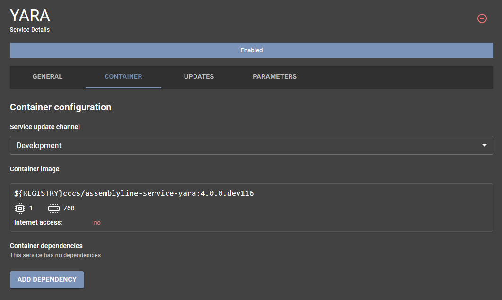

# Service Management

Assemblyline's service management interface allows users to effectively manage services by performing actions such as listing, updating, adding, removing, and backing up services. This guide provides a step-by-step overview of how to manage services in Assemblyline.

## Accessing Service Management

Navigate to the service management interface by selecting the *Administration* topic and choosing the *Services* subtopic.

{: .center }

## Service List

Upon loading the service management interface, you are presented with a list of all services in the system.


### Service Management Buttons

The top-right section of the service list page includes several important buttons:

{: .center }

1. **Add Service**: Add new services to the system.
2. **Update Services**: Perform updates on existing services.
3. **Install All Services**: Install all available services.
4. **Download Backup**: Download a backup of the current services configurations.
5. **Restore Backup**: Restore services configuration from a previously downloaded backup.

## Adding a Service

To add a new service:
1. Click the green "*(+)*" button in the top-right corner.
2. In the popup window, paste the new YAML-formatted [service manifest](../../developer_manual/services/advanced/service_manifest/) contents.
3. Click "*Add*" to incorporate the service into the system.


!!! tip
    The "service-add" API will automatically replace certain environment variables in your manifest:

    * **$SERVICE_TAG**: Will be replaced by the latest tag for your current deployment type (dev/stable) found in the docker registry where the service container is hosted.
    * **$REGISTRY**: Will be replaced by your local registry.

## Updating Services

As malware evolves, so too must the services that analyze and counteract these threats. Assemblyline's rapid development cycle ensures frequent updates for its supported services, enabling timely responses to new and emerging threats.

The system automatically detects if a newer container version is available for your deployment type (dev/stable). An update button will be displayed on the service card for services that require updating.


Hover over the button to see the new version and click to kick off the update.

## Installing Available Services

The system tracks which services are installed and highlights additional services that are available for installation. To install all available services, click the "Install all services" button at the top right corner. This will prompt the system to install any services that you do not currently have.

Alternatively, if you prefer to install services individually, scroll to the bottom of the service list page. Here, you will find a section listing all services that are available but not yet installed. Click the install button on the service card for each individual service you wish to add.


## Creating and Restoring Service Config Backups

Backup and restore functionality allows you to save and recover service configurations.

To manage backups:
1. Click the "*arrow pointing down*" button to download the current services configuration as a YAML file, named `<FQDN>_service_backup.yml`.
2. To restore a backup, click the "*clock with counter-clockwise arrow*" button. Paste the backup content into the textbox and click "*Restore*" to reinstate the services configurations to their saved state.


## Service Listing Overview

The service listing table provides comprehensive information on each of the services configured in Assemblyline. Below is a detailed explanation of each column and the type of data it represents:


**Name**

The **Name** column contains the name of the service. This is the identifier that you will use to refer to this service throughout the system.

**Version**

The **Version** column lists the current running version of the service.

**Category**

The **Category** column categorizes the services into predefined groups. This helps in organizing services and understanding the role each service plays. Available categories out-of-the-box include:

- **Antivirus**: Services that utilize built-in signatures to scan files for viruses and malware detection.
- **Dynamic Analysis**: Services that execute the file in a sandbox environment to observe behaviors.
- **External**: Services that rely on external data sources or submit data to external systems.
- **Extraction**: Services that extract files from archives or other compound file formats.
- **Filtering**: Services that eliminate certain files from being processed further.
- **Internet Connected**: Services that allow executed files to interact with the internet for additional analysis, such as receiving instructions or retrieving supplementary data.
- **Networking**: Services that analyze network traffic or related data.
- **Static Analysis**: Services that analyze files without executing them.

**Stage**

The **Stage** column delineates at which point in the analysis pipeline a service will execute. The stages determine the sequence in which services operate, ensuring an organized and efficient workflow. Each service belongs to a single stage, executed in the following order:

- **FILTER**: Initial filtering of files (e.g., Safelist). This stage determines whether subsequent stages will analyze a file.
- **EXTRACT**: File extraction and unpacking (e.g., Extract, Unpacker). Services in this stage focus on extracting files from archives or other compound formats.
- **CORE**: Core analysis tasks. This stage is where the majority of services perform their analysis.
- **SECONDARY**: Additional analysis performed with context from previous stages (e.g., VirusTotal). These services offer further insights based on the initial core analysis.
- **POST**: Subsequent processing steps (e.g., URLCreator). Services in this stage act upon the results generated by earlier stages.
- **REVIEW**: This final stage involves services that review the entire context of the analysis before performing their own tasks (e.g., Ancestry).

**File Types**

The **File Types** column specifies the Assemblyline file types that the service will accept for processing. This is defined using regular expressions. For instance:

- `.*` will accept all files for analysis.
- Specific regex patterns can be used to target certain Assemblyline file types, such as `executable/windows` for Windows executables.

**External**

The **External** column indicates whether the service sends data outside of Assemblyline's infrastructure. This is an important consideration for privacy and data security. An example is the VirusTotal service, which submits files to the VirusTotal platform for analysis.

**Mode**

The **Mode** column specifies how the service operates, providing key information on its interaction with Assemblyline's core infrastructure. Here are the possible modes:

- **Uses Service Server**: These services utilize the [Service Server](../overview/architecture.md#service-server), which isolates them from the core infrastructure. The Service Server provides APIs for task handling, result publishing, file downloading, and accessing the system safelist, ensuring that services have all necessary functionalities while remaining unaware of the underlying infrastructure.
- **Runs in Privileged Mode**: Services operating in this mode bypass the Service Server, directly pulling tasks from Redis. They can save analysis results into the [Datastore](../overview/architecture.md#datastore) and store embedded and supplementary files directly into the [Filestore](../overview/architecture.md#filestore). This results in faster processing due to the direct access to core components.

For more detailed information, please refer to the [full documentation](../overview/architecture.md#alternate-service-process).

**Classification**

The **Classification** column lists the classification level at which the service operates, which governs how the service handles and labels data.

**Enabled**

The **Enabled** column indicates if the service is currently enabled or disabled. An enabled service will have one or more instances running and actively process files, whereas a disabled service will not operate until re-enabled.


## Service Details

The service details page allows you to visualize and customize various parameters of a service across multiple tabs.

### Modifying or Removing a Service

Click on any service from the service list to view its details. The service detail page allows you to:

- **Delete the service**: Red "circled minus" button.
- **Toggle Enabled/Disabled state**: Big square button above the tabs.

### General Tab

This tab allows you to view and modify general information about the service.


Here, you can adjust various general settings:

- **Version**: Change the service version.
- **Description**: Edit the service description.
- **Execution Stage**: Specify when the service should run.
- **Category**: Group the service under a specific category.
- **Accepted/Rejected File Types**: Define regular expressions for file types.
- **Execution Timeout**: Modify the time limit for service execution.
- **Maximum Instances**: Set the maximum number of service instances.
- **Location**: Configure the service location to be internal of external.
- **Result Caching**: Enable or disable result caching.

!!! tip
    Refer to the [service manifest](../../developer_manual/services/advanced/service_manifest/) documentation for more detailed information about these fields.

### Container Tab

The *Container* tab provides comprehensive information about the containers your service utilizes.



Within this tab, you can adjust the following settings:

- **Update Channel**: Select between Development or Stable channels for updates.
- **Main Service Container**: Modify the primary container that executes the service.
- **Dependency Containers**: Add, modify, or remove supporting containers.

#### Main Service Container

The main service container is the container housing and running the service code. By clicking on the main service container, you can modify the parameters used to launch it.


You can adjust the following settings:

- **Container Image Name**: Set the name of the container image.
- **Container Registry Type**: Specify the type of container registry.
- **Resource Limits**: Define CPU and RAM limits.
- **Container Registry Credentials**: Provide registry credentials (username/password).
- **Command Execution**: Change the command executed within the container.
- **Internet Access**: Enable or disable internet access for the container.
- **Environment Variables**: Set necessary environment variables before launching the container.

!!! tip
    For more details on configuring the Docker block, refer to the [docker config](../../developer_manual/services/advanced/service_manifest/#docker-config) section in the service manifest documentation.

#### Dependency Containers

Dependency containers support the main service by providing external resources (like a database) or facilitating updates. These containers are shared among multiple service instances.

To add or modify a dependency container, click "Add Dependency" or select an existing container.


The dependency container configuration window allows you to modify similar settings as the main service container, with an added option for persistent storage.

!!! tip
    Refer to the [persistent volume](../../developer_manual/services/advanced/service_manifest/#persistent-volume) section in the service manifest documentation to learn more about configuring persistent storage for dependency containers.

### Updates Tab

The *Updates* tab displays information about the service's self-update mechanism or signature updates.


!!! warning
    This tab appears only if the service defines an [update config](../../developer_manual/services/advanced/service_manifest/#update-config) block in its service manifest.

In this tab, you can view and modify:

- **Update Interval**: Set the frequency of updates.
- **Signature Generation**: Indicate whether the service generates signatures.
- **Startup Dependency**: Specify if the service must wait for a successful update before starting instances.
- **Update Sources**: List the sources from which the service pulls its updates.

!!! tip
    For more information on modifying signature sources, refer to the [Modifying sources](../../administration/source_management/#modifying-sources) documentation.

### Parameters Tab

The *Parameters* tab allows customization of various service parameters.


Parameters are divided into two categories:

- **User-Specified Parameters**
- **Service Variables**

#### User-Specified Parameters

These parameters can be adjusted by users for each specific submission in the system. They often include:

- Feature toggles for the service
- Passwords for specific submissions
- Limits on the service's actions
- Extraction sensitivity

!!! tip
    When defined, these parameters appear in the [submission options](../../user_manual/submitting_file/#options) available to the user during submission.

#### Service Variables

Service variables are configuration parameters specific to your deployment, aiding the service in running effectively. They often include:

- URLs for external services
- Credentials for external connections
- Default values used by the service
- Scanning capabilities configuration

##### OCR Configuration

Certain services conduct OCR (Optical Character Recognition) analysis on images either found in submissions or generated during the analysis. You can override or customize the default OCR terms defined in the [service base](https://github.com/CybercentreCanada/assemblyline-v4-service/blob/master/assemblyline_v4_service/common/ocr.py) by using the `ocr` key within the `config` block of the service manifest.

###### Simple Term Override (Legacy)

To use a custom set of terms for `ransomware` detection, you can configure the following in your service manifest:

```yaml
config:
    ocr:
        ransomware: ['bad1', 'bad2', ...]
```

This configuration will instruct the service to **only** use the specified terms for `ransomware` detection, adhering to the default hit threshold as defined in the service base.

###### Advanced Term Override

If you need to use custom terms for `ransomware` detection and set a specific hit threshold, you can configure the following:

```yaml
config:
    ocr:
        ransomware:
            terms: ['bad1', 'bad2', ...]
            threshold: 1
```

This setup not only specifies custom terms but also defines a threshold value. The service will use **only** these terms for `ransomware` detection, with the detection threshold you have set.

###### Term Inclusion/Exclusion

To modify the default set of terms by adding or excluding certain terms for `ransomware` detection, use the following configuration:

```yaml
config:
    ocr:
        ransomware:
            include: ['bad1', 'bad2', ...]
            exclude: ['bank account']
```

This configuration allows the service to augment the default terms by including the terms specified in `include` and excluding those in `exclude`. The service will employ this adjusted set for OCR-based `ransomware` detection.
