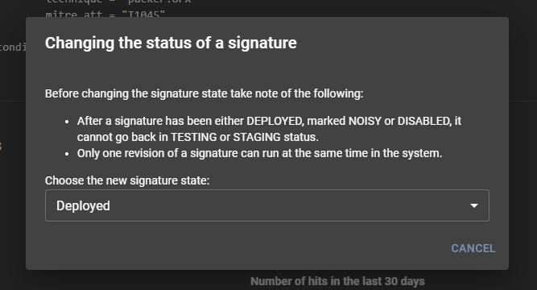

# Signature Management

The Assemblyline's signature management lets you:

1. List all signatures in the system
2. Filter and search the current set of signatures
3. View details about those signatures
4. Set the status of a specific signature
5. Remove signatures from the system

You can find the signature management interface by clicking *Manage* then the *Signatures* menu from the navigation bar.

!!! warning
    You cannot add new signatures to the system via this interface. Instead, Assemblyline has a [source management](../source_management) interface which lets you add a variety of external sources to fetch signatures from. The updater of the different services take care of loading the source URLs and the new signature(s) into the system. It will also sync existing signatures that have changed since the last import.

## Signature list

The first page you will be taken to when loading the signature management interface will list all signatures that have been loaded into the system.

From this interface you can:

1. Page through the different signatures from the list
2. Filter the displayed signatures with the search bar
    * Assemblyline signatures can be searched using a Lucene query. As you start typing in the search box, the system will suggest fields that you can search into.
    * You can also use the quick filter buttons for pre-defined searches. These pre-defined searches will help you get started with writing more complex signature searches.
3. Download the currently viewed signature set with the download arrow on the top right
4. View the detail of a signature by clicking on it

## Signature detail

Once you click on a signature, the detail view for that signature will be shown.

This page will show you the following information:

1. ID of the signature (under the signature detail header)
2. The raw signature
3. Statistics about the signature
4. A histogram of the signature for the last 30 days
5. A list of the last ten hits for that signature

On the top right, it will also show actions on the signature:

1. You can hit the search button to find all instances where that signature hits in the system
2. Use the red delete button to delete the signature from the system
    * If the signature is still present in the source where it was retrieved from, it will be re-added on the next update. In this case, you should disable the signature instead.
3. Change the state of a signature

### Changing the signature state

Signature states are synced with the source they are coming from but the state in your Assemblyline deployment will supersede the state that the rule updater is trying to set. This means that if you disable a rule in your Assemblyline instance, it will remain disabled even if the source where that rule is from changes.

There are three different signature states: **Deployed**, **Noisy**, and **Disabled**

* **Deployed**:
    * *Deployed* will be used for detection and will generate a score depending on how the service handles these types of signatures
* **Noisy:**
    * *Noisy* will used for detection but rules with these states will not affect the score of the file
* **Disabled:**
    * *Disabled* signatures are completely ignored in the system and the service will not even realize that these signatures exist

You can change the signatures by clicking the current signature state in the signature detail view. This will bring up the state-changing modal window which will let you pick a new state for the current rule.

