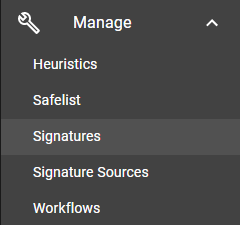

# Signature Management

The signature management of Assemblyline line lets you:

1. List all the signatures in the system
2. Filter and search the current set of signatures
3. View details about those signatures
4. Set the status of a specific signatures
5. Remove signatures form the system

You can find the signature managment interface by clicking the *Manage* then *Signatures* menu from the navigation bar.

!!! warning
    You cannot add new signatures to the system via this interface. Instead, Assemblyline has a [source management](../source_management) interface which lets you add a bunch of external sources to fetch to signatures from. The updater of the different service take care of loading the URL for the source and loading the new signature in the system. It will also sync existing signatures that changed since the last import.

## Signature list

The first page you will be taken to when loading the signature management interface will list all the signatures that have been loaded in the system.

From this interface you can:

1. Page throught the different signatures from the list
2. Filter the displayed signatures with the search bar
    * Assemblyline signatures can be searched using a lucene query. As you start typing in the search box, the system will suggest you field you can search into.
    * You can also use the quick filter buttons for pre-defined searches. These pre-defined search will help you get started writting more complex signature searches.
3. Download the currently viewed signature set with the download arrow on the top right
4. View the detail of a signature by clicking on it

## Signature detail

Once you click on a signature, the detail view for that signature will be shown.

This page will show you the following information:

1. ID of the siganture (Under the signature details header)
2. The raw signature
3. Statistics about the signature
4. An histogram of the signature for the last 30 days
5. A list of the last ten hits for that signature

On the top right, it will also take actions on the signature:

1. You can hit the search button to find all instance where that signature hits in the system
2. Use the red delete button to delete the signature from the system
    * If the signature is still in the source that it is attached to, it will be re-added on next update. In this case, you should disable it instead.
3. Change the state of a signature

### Changing the signature state

Signature states are synced with the source they are comming from but the state in your Assemblyline deployment will superseed the state that the rule updater is trying to set. Which means that if you disable a rule in your Assemblyline instance, it will remain disabled even if the source where that rule is from changes.

There are three different signature states: **Deployed**, **Noisy**, and **Disabled**

* **Deployed**:
    * Deployed will be used for detection and will generate a score depending on how the service handles these types of signatures
* **Noisy:**
    * Noisy used for detection but that rule will not affect the score of the file
* **Disabled:**
    * Disabled signatures are completely ignored in the system and the service will not even realized that those signatures exist

You can change the signatures by clicking the current signature state in the signature detail view. This will bring up the state changing modal window which will let you pick a new state for the current rule.

