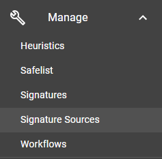
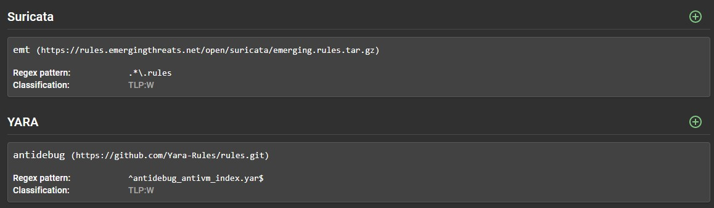

# Signature Source Management

Modifying the signature set to support analysis is very simple and can be done directly through the Assemblyline User Interface.

You can access the source management interface by selecting "*Source managment*" in the navigation menu.



The source management interface will list all services that support external sources and will show you the different sources currently configured in the system.



## Modifying sources

With the source management interface, you can add, modify or delete any sources of any service with the following actions:

  1. To add a new source to a given service, you can simply press the "*+*" button beside the service name for which you which to add the source for.
  2. To modify or delete a source, simply click on the source you which to modify/delete.

Both these options will bring you to an interface that looks like this:


### Required input

The following sections are <ins>required</ins> in order to add/modify a signature source in Assemlyline:

-	***URI***
    - This is the path to your sources. In this case, we will use a github repository.
    - The URI section also accepts HTTP URLs as input.
-	***Source Name***
    - This can be labelled at the user’s discretion. For this example, we have used REVERSING_LABS_EXAMPLE.
    - Please note that input for "Source Name" <ins>***must not***<ins> have any spaces.

### Optional input

-   ***Pattern***
    - The user may add a regex pattern to pull certain file types for a particular service. In this example,
    only `.yara` or `.yar` files will be added as signatures.
-   ***Username / Password***
    - This is the username and password for the URL or git repo you are targeting.
-   ***Private Key***
    - If using SSH to connect to Github, you must generate a private SSH key and add it to this section.
-   ***Headers***
    - Header name and Header value are for special HTTP headers that may be passed to the HTTP server, such as
    passing an api key.

## Alternate methods of updating sources

There are alternate ways the system administrator can use to modify the signatures in the system:

-    Before loading the service into Assemblyline
-    Inside the service management interface

### Option 1 - Before loading the service

The updater can be configured through the service_manifest.yml, which is located in the root directory of each service. If you edit the files prior to pasting it into the system to add that service, the correct signatures sources will be set once the service first load.

!!! example "Suricata's updater"
    You can find the suricata updater configuration in its [service_manifest.yml](https://github.com/CybercentreCanada/assemblyline-service-suricata/blob/master/service_manifest.yml) file.

    It's config block looks like this:
    ``` yaml
    ...
    update_config:
      generates_signatures: true
      method: run
      run_options:
        allow_internet_access: true
        command: ["python", "-m", "suricata_.suricata_updater"]
        image: ${REGISTRY}cccs/assemblyline-service-suricata:$SERVICE_TAG
      sources:
        - name: emt
          pattern: .*\.rules
          uri: https://rules.emergingthreats.net/open/suricata/emerging.rules.tar.gz
      update_interval_seconds: 21600 # Quarter-day (every 6 hours)
    ...
    ```

    For more info about the update config block, you should check out the [update config](../../developer_manual/services/advanced/service_manifest/#update-config) and [update source](../../developer_manual/services/advanced/service_manifest/#update-source) section of the *service_manifest.yml* documentation.

### Option 2 - Inside the service management interface

-   First navigate to User/Administration/Services through the navbar:

-   Click on the relevant service you wish to update.
-   Navigate to the "*Updates*" tab.
-   You can change any value related to the updates in this section.


!!! tip
    The source update interface in this section is similar to the Source management page although there is a few added options to:

    1. Turn on/off the generate signature flag
    2. Wait for valid update or not
    3. Set the updating interval
