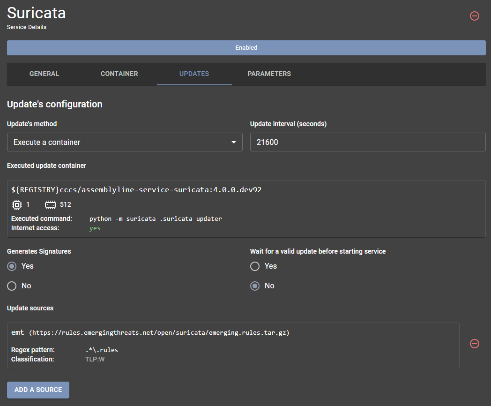

# Source Management

You can access the source management interface by selecting "*Update Sources*" in the navigation menu.


The source management interface will list all services that support external sources and will show you the various sources currently configured in the system.


Here is where you can add sources for services that consume signatures or the safelist. In the above screenshot, you can see that the Sigma and Suricata services have configured sources where they ingest rules from.

On this page, you can manually pull signatures from sources, add new sources, synchronize signatures on your system based on their source or view all signatures from a source.

## Modifying sources

With the source management interface, you can add, modify, or delete any sources of any service with the following actions:

  1. To add a new source to a given service, you can simply press the "*+*" button beside the service name for which you want to add the source.
  2. To modify or delete a source, simply click on the source you want to modify/delete.

Both options will bring you to an interface that looks like this:


### Required input

The following sections are <ins>required</ins> to add/modify a signature source in Assemblyline:

-	***URI***
    - This is the path to your sources. In this case, we will use a GitHub repository.
    - The URI section also accepts HTTP URLs as input.
-	***Source Name***
    - This can be labeled at the user’s discretion. For this example, we have used REVERSING_LABS_EXAMPLE.
    - Please note that input for "Source Name" <ins>***must not***<ins> have any spaces.

### Optional input

-   ***Pattern***
    - The user may add a regex pattern to pull certain file types for a particular service. In this example,
    only `.yara` or `.yar` files will be added as signatures.
-   ***Username / Password***
    - This is the username and password for the URL or git repository that you are targeting.
-   ***Private Key***
    - If using SSH to connect to GitHub, you must generate a private SSH key and add it to this section.
-   ***Headers***
    - Header name and Header value are for special HTTP headers that may be passed to the HTTP server, such as passing an API key.

## Alternate methods of updating sources

There are alternate ways that the system administrator can use to modify the signatures in the system:

-    Before loading the service into Assemblyline
-    Inside the service management interface

### Option 1 - Before loading the service

The updater can be configured through the `service_manifest.yml`, which is in the root directory of each service. If you edit the files before pasting them into the system to add that service, the correct signature source(s) will be set once the service is first loaded.

!!! example "Suricata's updater"
    You can find the Suricata updater configuration in its [service_manifest.yml](https://github.com/CybercentreCanada/assemblyline-service-suricata/blob/master/service_manifest.yml) file.

    Its config block looks like this:
    ``` yaml
    ...
    update_config:
      generates_signatures: true
      method: run
      run_options:
        allow_internet_access: true
        command: ["python", "-m", "suricata_.suricata_updater"]
        image: ${REGISTRY}cccs/assemblyline-service-suricata:$SERVICE_TAG
      sources:
        - name: emt
          pattern: .*\.rules
          uri: https://rules.emergingthreats.net/open/suricata/emerging.rules.tar.gz
      update_interval_seconds: 21600 # Quarter-day (every 6 hours)
    ...
    ```

    For more information about the update config block, you should check out the [update config](../../developer_manual/services/advanced/service_manifest/#update-config) and [update source](../../developer_manual/services/advanced/service_manifest/#update-source) sections of the *service_manifest.yml* documentation.

### Option 2 - Inside the service management interface

-   First navigate to "*User*" -> "*Administration*" -> "*Services*" through the navigation bar:


-   Click on the relevant service that you wish to update.
-   Navigate to the "*Updates*" tab.
-   You can change any value related to the updates in this section.



!!! tip
    The source update interface in this section is like the Source management page although there are a few added options for:

    1. Turning the "generate signature flag" on/off
    2. Waiting for a valid update or not
    3. Setting the updating interval
