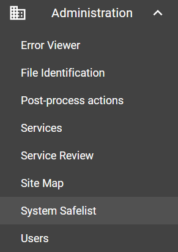

# System safelist

Assemblyline includes a safelisting system that will let you ignore certain tags generated by services. Although safelisting is available to all users throughout the interface, you can specify more complex rules via the administration interface.

## Editing the safelist
You can find the system safelist interface by clicking the *Administration* topic then choose the *System Safelist* subtopic.

{: .center }

Once the safelist management interface is open you will be greeted with a YAML file in an editor. From here you can edit the YAML directly in the interface and hit the "*Save changes*" button to apply the changes to the system.


The system safelist is composed of two sections and each of those sections are composed of tag types with lists of values:

1. `match` is where you list values for specific tag types that you want to safelist by using a direct string comparison (`==`)
2. `regex` is where you list regular expressions for specific tag types that you want to safelist by using regular expression matching (`.match()`)

!!! example
    ```yaml
      match:
        <tag-type>:
          - <value>

      regex:
        <tag-type>:
          - <regular expression>
    ```

## Default system safelist
There is a safelist installed in the system by default which covers some basic cases. These are the tags that are safelisted by default:

???+ info "Default system safelist"

    ```yaml
    # Default tag_safelist.yml file
    #
    #    The following tags are safelisted:
    #     - Domains pointing to localhost
    #     - Domains commonly found in XML files, certificates, and during dynamic analysis runs
    #     - IPs in the private network IP space
    #     - URIs pointing to IPs in the private network IP space
    #     - URIs commonly found in XML files, certificates, and during dynamic analysis runs
    #
    #    Note: - You can override the default tag_safelist.yml by putting an
    #            updated version in /etc/assemblyline/tag_safelist.yml.
    #          - If you want to add values to one of the following tag types,
    #            you must copy the default values to the new file.
    #          - You can nullify values by putting an empty object or an empty list
    #            in your new file

    # Match section contains tag types where each tag type is
    #  a list of values that should be safelisted by using a direct
    #  string comparison.
    match:
      # Direct match to dynamic domains
      network.dynamic.domain:
        - localhost
        - android.googlesource.com
        - play.google.com
        - schemas.android.com
        - xmlpull.org
        - schemas.openxmlformats.org
        - schemas.microsoft.com
        - settings-win.data.microsoft.com
        - vortex-win.data.microsoft.com
        - wpad.reddog.microsoft.com
        - verisign.com
        - csc3-2010-crl.verisign.com
        - csc3-2010-aia.verisign.com
        - ocsp.verisign.com
        - logo.verisign.com
        - crl.verisign.com
        - ctldl.windowsupdate.com
        - ns.adobe.com
        - www.w3.org
        - purl.org
      # Direct match to static domains
      network.static.domain:
        - localhost
        - android.googlesource.com
        - play.google.com
        - schemas.android.com
        - xmlpull.org
        - schemas.openxmlformats.org
        - schemas.microsoft.com
        - settings-win.data.microsoft.com
        - vortex-win.data.microsoft.com
        - wpad.reddog.microsoft.com
        - verisign.com
        - csc3-2010-crl.verisign.com
        - csc3-2010-aia.verisign.com
        - ocsp.verisign.com
        - logo.verisign.com
        - crl.verisign.com
        - ctldl.windowsupdate.com
        - ns.adobe.com
        - www.w3.org
        - purl.org

    # Regex section contains tag types where each tag type is
    #  a list of regular expressions to be run to safelist
    #  the associated tags.
    regex:
      # Regular expressions to safelist dynamic IPs (Private IPs)
      # Note: Since IPs have already been validated, the regular expression is simpler
      network.dynamic.ip:
        - (?:127\.|10\.|192\.168|172\.1[6-9]\.|172\.2[0-9]\.|172\.3[01]\.).*
      # Regular expression to safelist static IPs (Private IPs)
      # Note: Since IPs have already been validated, the regular expression is simpler
      network.static.ip:
        - (?:127\.|10\.|192\.168|172\.1[6-9]\.|172\.2[0-9]\.|172\.3[01]\.).*
      # Regular expression to safelist dynamic URIs
      network.dynamic.uri:
        - (?:ftp|http)s?://localhost(?:$|/.*)
        - (?:ftp|http)s?://(?:(?:(?:10|127)(?:\.(?:[2](?:[0-5][0-5]|[01234][6-9])|[1][0-9][0-9]|[1-9][0-9]|[0-9])){3})|(?:172\.(?:1[6-9]|2[0-9]|3[0-1])(?:\.(?:2[0-4][0-9]|25[0-5]|[1][0-9][0-9]|[1-9][0-9]|[0-9])){2}|(?:192\.168(?:\.(?:25[0-5]|2[0-4][0-9]|1[0-9][0-9]|[1-9][0-9]|[0-9])){2})))(?:$|/.*)
        - https?://schemas\.android\.com/apk/res(-auto|/android)
        - https?://xmlpull\.org/v1/doc/features\.html(?:$|.*)
        - https?://android\.googlesource\.com/toolchain/llvm-project
        - https?://schemas\.microsoft\.com(?:$|/.*)
        - https?://schemas\.openxmlformats\.org(?:$|/.*)
        - https?://schemas\.openxmlformats\.org/officeDocument/2006/relationships/(image|attachedTemplate|header|footnotes|fontTable|customXml|endnotes|theme|settings|webSettings|glossaryDocument|numbering|footer|styles)
        - https?://schemas\.microsoft\.com/office/word/2010/(wordml|wordprocessingCanvas|wordprocessingInk|wordprocessingGroup|wordprocessingDrawing)
        - https?://schemas\.microsoft\.com/office/word/(2012|2006)/wordml
        - https?://schemas\.microsoft\.com/office/word/2015/wordml/symex
        - https?://schemas\.microsoft\.com/office/drawing/2014/chartex
        - https?://schemas\.microsoft\.com/office/drawing/2015/9/8/chartex
        - https?://schemas\.openxmlformats\.org/drawingml/2006/(main|wordprocessingDrawing)
        - https?://schemas\.openxmlformats\.org/package/2006/relationships
        - https?://schemas\.openxmlformats\.org/markup-compatibility/2006
        - https?://schemas\.openxmlformats\.org/officeDocument/2006/(relationships|math)
        - https?://schemas\.openxmlformats\.org/word/2010/wordprocessingShape
        - https?://schemas\.openxmlformats\.org/wordprocessingml/2006/main
        - https?://www\.verisign\.com/(rpa0|rpa|cps0)
        - https?://wpad\.reddog\.microsoft\.com/wpad\.dat
        - https?://ocsp\.verisign\.com
        - https?://logo\.verisign\.com/vslogo\.gif04
        - https?://crl\.verisign\.com/pca3-g5\.crl04
        - https?://csc3-2010-crl\.verisign\.com/CSC3-2010\.crl0D
        - https?://csc3-2010-aia\.verisign\.com/CSC3-2010\.cer0
        - https?://ctldl\.windowsupdate\.com/.*
        - https?://ns\.adobe\.com/photoshop/1\.0/
        - https?://ns\.adobe\.com/xap/1\.0/
        - https?://ns\.adobe\.com/xap/1\.0/mm/
        - https?://ns\.adobe\.com/xap/1\.0/sType/ResourceEvent#
        - https?://purl\.org/dc/elements/1\.1/
        - https?://www\.w3\.org/1999/02/22-rdf-syntax-ns#
      # Regular expression to safelist static URIs
      network.static.uri:
        - (?:ftp|http)s?://localhost(?:$|/.*)
        - (?:ftp|http)s?://(?:(?:(?:10|127)(?:\.(?:[2](?:[0-5][0-5]|[01234][6-9])|[1][0-9][0-9]|[1-9][0-9]|[0-9])){3})|(?:172\.(?:1[6-9]|2[0-9]|3[0-1])(?:\.(?:2[0-4][0-9]|25[0-5]|[1][0-9][0-9]|[1-9][0-9]|[0-9])){2}|(?:192\.168(?:\.(?:25[0-5]|2[0-4][0-9]|1[0-9][0-9]|[1-9][0-9]|[0-9])){2})))(?:$|/.*)
        - https?://schemas\.android\.com/apk/res(-auto|/android)
        - https?://xmlpull\.org/v1/doc/features\.html(?:$|.*)
        - https?://android\.googlesource\.com/toolchain/llvm-project
        - https?://schemas\.microsoft\.com(?:$|/.*)
        - https?://schemas\.openxmlformats\.org(?:$|/.*)
        - https?://schemas\.openxmlformats\.org/officeDocument/2006/relationships/(image|attachedTemplate|header|footnotes|fontTable|customXml|endnotes|theme|settings|webSettings|glossaryDocument|numbering|footer|styles)
        - https?://schemas\.microsoft\.com/office/word/2010/(wordml|wordprocessingCanvas|wordprocessingInk|wordprocessingGroup|wordprocessingDrawing)
        - https?://schemas\.microsoft\.com/office/word/(2012|2006)/wordml
        - https?://schemas\.microsoft\.com/office/word/2015/wordml/symex
        - https?://schemas\.microsoft\.com/office/drawing/2014/chartex
        - https?://schemas\.microsoft\.com/office/drawing/2015/9/8/chartex
        - https?://schemas\.openxmlformats\.org/drawingml/2006/(main|wordprocessingDrawing)
        - https?://schemas\.openxmlformats\.org/package/2006/relationships
        - https?://schemas\.openxmlformats\.org/markup-compatibility/2006
        - https?://schemas\.openxmlformats\.org/officeDocument/2006/(relationships|math)
        - https?://schemas\.openxmlformats\.org/word/2010/wordprocessingShape
        - https?://schemas\.openxmlformats\.org/wordprocessingml/2006/main
        - https?://www\.verisign\.com/(rpa0|rpa|cps0)
        - https?://wpad\.reddog\.microsoft\.com/wpad\.dat
        - https?://ocsp\.verisign\.com
        - https?://logo\.verisign\.com/vslogo\.gif04
        - https?://crl\.verisign\.com/pca3-g5\.crl04
        - https?://csc3-2010-crl\.verisign\.com/CSC3-2010\.crl0D
        - https?://csc3-2010-aia\.verisign\.com/CSC3-2010\.cer0
        - https?://ctldl\.windowsupdate\.com/.*
        - https?://ns\.adobe\.com/photoshop/1\.0/
        - https?://ns\.adobe\.com/xap/1\.0/
        - https?://ns\.adobe\.com/xap/1\.0/mm/
        - https?://ns\.adobe\.com/xap/1\.0/sType/ResourceEvent#
        - https?://purl\.org/dc/elements/1\.1/
        - https?://www\.w3\.org/1999/02/22-rdf-syntax-ns#
    ```

!!! tip
    You can also find the default safelist in the code: [tag_safelist.yml](https://github.com/CybercentreCanada/assemblyline-base/blob/master/assemblyline/common/tag_safelist.yml)
