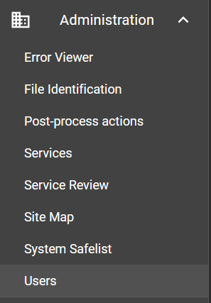
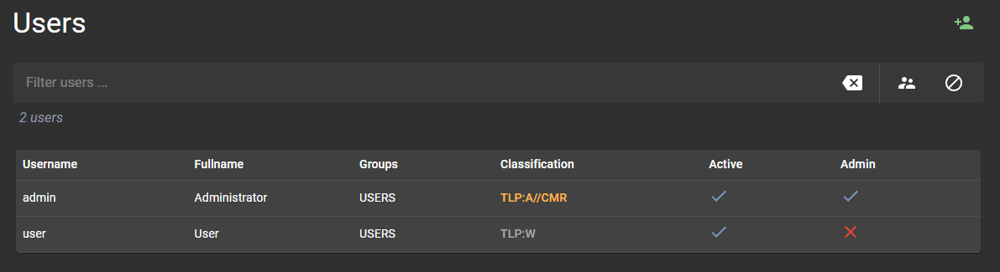
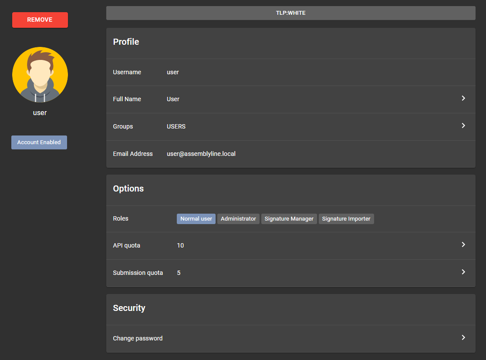

# User Management Guide

Managing users effectively is a key aspect of maintaining the security and efficiency of Assemblyline. This guide provides you with step-by-step instructions to utilize the user management interface within Assemblyline to manage user accounts with ease.

## Accessing the User Management Interface

To begin managing user accounts in Assemblyline, follow these steps to access the user management interface:

1. Click on the **Administration** topic in your Assemblyline interface.
2. Under the Administration section, select the **Users** subtopic.
3. Once in the Users, you will be presented with the user management interface.

{: .center }

## Managing User Accounts

### Viewing All Users

The initial screen of the user management interface displays a list of all user accounts currently in the system.

Here are various actions you can perform from this interface:

- Navigate through the pages of the user list to explore the accounts.
- Apply filters using the query bar at the top. Begin typing, and the interface will provide suggestions for fields you can refine by. This feature helps you to quickly narrow down the list according to specific criteria.
- Click on the quick filter buttons for common predefined searches to assist in creating complex queries.
- Add new users to the system by clicking the **Add User** button located at the top right.

### User Account Details

To view further details about a particular user, simply click on their username in the user list. This will open the user detail page, which provides comprehensive information about the user, including:

- Profile: Including username, avatar, full name, groups, and email address.
- Roles: The permissions the user has within the system.
- Quotas: The usage limits for the user's API calls.
- Status: Whether the user account is active or disabled.

On the user detail page, you can take various administrative actions:

- Remove the user account entirely.
- Enable or disable the user's access to Assemblyline.
- Adjust the user's role settings or classification as appropriate.
- Set or modify the user's API usage quotas.
- Change the user's password securely.

### Step-by-Step Actions on User Detail Page

#### Enabling or Disabling a User

To change a user's access to the system:

1. Click the **Account Enabled** or **Account Disabled** button, depending on the desired action, located below the avatar in the user's detail page.

#### Modifying User Roles

To update a user's roles:

1. Locate the *Roles* section within the detail page.
2. Select or unselect roles as needed.

#### Adjusting User Quotas

To set or change usage quotas:

1. Go to the relevant quota setting in the *Options* section.
2. Input the new quota values as per your requirements.

#### Updating User Password

To change a user's password:

1. In the *Security* section, click on the **Change Password** button.
2. Follow the prompts to enter and confirm the new password.

### Removing a User

To permanently remove a user account from the system:

1. Select the *Remove* action located above the avatar in the user's detail page
2. Confirm the removal when prompted.

To apply any changes to the user account, you'll need to select the **Save changes** button located at the bottom of the window.

By following the detailed steps outlined in this guide, you can effectively manage user accounts within Assemblyline to ensure a secure and streamlined operation.
