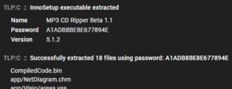

## Blog Entries
That's right, we blog now! Check out our posts on Medium!

### [Supercharge Your Malware Analysis Workflow](https://medium.com/@kevin.hardy-cooper/supercharge-your-malware-analysis-workflow-b7e2b08c2fc9)

{ align=right }

Assemblyline Blog Entry #1 — Welcome!👋 My name is Kevin and I work at the Canadian Centre for Cyber Security on the Assemblyline team and spend my days improving a free, open-source tool that supports the cyber security posture for Canada, Canadians, and everyone else who uses Assemblyline all over the world!

---

### [A Little Bit Of History](https://medium.com/@steve.garon/a-little-bit-of-history-b9383f90602)

{ align=right }

Assemblyline Blog Entry #2 —  In the previous blog entry of the Assemblyline series “Supercharge Your Malware Analysis Workflow”, my colleague Kevin talked about the high-level background required for understanding the need behind Assemblyline. In this post, as one of the original developers for Assemblyline, I will be telling you the story behind how Assemblyline got started.

---

### [Static Analysis Showcase](https://medium.com/@kevin.hardy-cooper/static-analysis-showcase-13f9224cbbc)

{ align=right }

Assemblyline Blog Entry #3 — ⚠️⚠️⚠️ CAUTION ⚠️⚠️⚠️ This document describes malware analysis in Assemblyline. Malware analysis must be performed in an isolated environment. In this post, we will be illustrating the power of Assemblyline’s static analysis services when analyzing a malware sample!

---

### [Can Assemblyline beat HackTheBox Business CTF 2023 Forensic Challenges? (1/3)](https://medium.com/@gdesmar/hackthebox-business-ctf-2023-forensic-challenges-1-3-13248862a380)

{ align=right }

Assemblyline Blog Entry #4 — This post is the first part of a write-up detailing the solutions for forensic challenges that were part of the HackTheBox Business CTF 2023 competition.

---

### [Can HackTheBox Business CTF 2023 Forensic Challenges beat Assemblyline? (2/3)](https://medium.com/@gdesmar/hackthebox-business-ctf-2023-forensic-challenges-2-3-224c83cac72f)

{ align=right }

Assemblyline Blog Entry #5 — This post is the second part of a write-up detailing the solutions for forensic challenges that were part of the HackTheBox Business CTF 2023 competition.

---

### [One last HackTheBox Business CTF 2023 Forensic Challenge (3/3)](https://medium.com/@gdesmar/hackthebox-business-ctf-2023-forensic-challenges-3-3-d05b026062c0)

{ align=right }

Assemblyline Blog Entry #6 - This post is the third part of a write-up detailing the solutions for forensic challenges that were part of the HackTheBox Business CTF 2023 competition.

---

### [What other security products WON’T tell you about malicious archives](https://medium.com/@kevin.hardy-cooper/what-other-security-products-wont-tell-you-about-malicious-archives-5d5704f96da7)

{ align=right }

Assemblyline Blog Entry #7 — In this post, we will be discussing how a malware campaign centred around archives seen in 2022 triggered large improvements to Assemblyline and CAPE Sandbox!

---

### [The Great OneNote Scramble of 2023](https://medium.com/@kevin.hardy-cooper/the-great-onenote-scramble-of-2023-6fa2ee4a32ad)

{ align=right }

Assemblyline Blog Entry #8 — This article will illustrate another, more recent, campaign in 2023 that focused on OneNote files and how the Assemblyline team adapted quickly to improve detection.

---

### [What Can Assemblyline Learn From Other Malware Analysis Projects?](https://medium.com/@kevin.hardy-cooper/what-can-assemblyline-learn-from-other-malware-analysis-projects-d5e189462349)

{ align=right }

Assemblyline Blog Entry #9 — I wanted to find what Assemblyline could learn from these tools to improve the Government of Canada’s defences.

---

### [Crack any password-protected InnoSetup installer](https://medium.com/@gdesmar/crack-any-password-protected-innosetup-installer-5daabb52dbfb)

{ align=right }

Assemblyline Blog Entry #10 — This post takes a look at and offer solutions to analyze password-protected InnoSetup files.

## Video Entries
That's right, we have videos too! Check out videos made by the community that showcase Assemblyline!

### Supercharging Open Source Malware Analysis ([Bitwarden](https://bitwarden.com/))
<iframe width="560" height="315" src="https://www.youtube.com/embed/4B4s2J3VW5w?si=iRLjIibx8eR262_d" title="YouTube video player" frameborder="0" allow="accelerometer; autoplay; clipboard-write; encrypted-media; gyroscope; picture-in-picture; web-share" referrerpolicy="strict-origin-when-cross-origin" allowfullscreen></iframe>

### Supercharge your malware analysis workflow ([VirusBulletin](https://www.virusbulletin.com/))
<iframe width="560" height="315" src="https://www.youtube.com/embed/urbdca-mOJE?si=hJY5pZS9PYxbCwgF" title="YouTube video player" frameborder="0" allow="accelerometer; autoplay; clipboard-write; encrypted-media; gyroscope; picture-in-picture; web-share" referrerpolicy="strict-origin-when-cross-origin" allowfullscreen></iframe>

### Beginner Malware Analysis - Emotet Infection Chain ([Invoke RE](https://www.youtube.com/@InvokeReversing))
<iframe width="560" height="315" src="https://www.youtube.com/embed/ROZ5e-5iXpY?si=RuFUhO-CSig8aI28" title="YouTube video player" frameborder="0" allow="accelerometer; autoplay; clipboard-write; encrypted-media; gyroscope; picture-in-picture; web-share" referrerpolicy="strict-origin-when-cross-origin" allowfullscreen></iframe>

### Beginner Automated Malware Analysis and LLM Reversing ([Invoke RE](https://www.youtube.com/@InvokeReversing))
<iframe width="560" height="315" src="https://www.youtube.com/embed/JoxlufoAKA0?si=4GLLy9FHrHigo51Y" title="YouTube video player" frameborder="0" allow="accelerometer; autoplay; clipboard-write; encrypted-media; gyroscope; picture-in-picture; web-share" referrerpolicy="strict-origin-when-cross-origin" allowfullscreen></iframe>

### Automating Malware Triage ([Invoke RE](https://www.youtube.com/@InvokeReversing))
<iframe width="560" height="315" src="https://www.youtube.com/embed/8aWnFld4qgc?si=6SZ5Tt1S0CTJZc2R" title="YouTube video player" frameborder="0" allow="accelerometer; autoplay; clipboard-write; encrypted-media; gyroscope; picture-in-picture; web-share" referrerpolicy="strict-origin-when-cross-origin" allowfullscreen></iframe>

### Introducing CSE’s open source AssemblyLine ([Hackfest](https://hackfest.ca/))
<iframe width="560" height="315" src="https://www.youtube.com/embed/bsOlDOHAL8Y?si=s66_7nt0l5c2WZHi" title="YouTube video player" frameborder="0" allow="accelerometer; autoplay; clipboard-write; encrypted-media; gyroscope; picture-in-picture; web-share" referrerpolicy="strict-origin-when-cross-origin" allowfullscreen></iframe>
