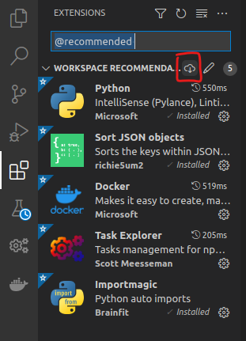

# Setup script

Assemblyline's VSCode installation is entirely scripted. It will set up the following things for you:

- Install VSCode via `snap` (Optional)
- Install AL4 development dependencies
- Clone all core component sources from GitHub
- Clone all service sources from GitHub (Optional)
- Create a virtual Python environment for core component development
- Create a virtual Python environment for service development (optional)
- Create Run targets inside VSCode for all core components and other important scripts
- Create Tasks inside VSCode for development using Docker-Compose
- Setup our code formatting standards
- Deploy a local Docker registry on port 32000

!!! note
    We recommend installing the VSCode extensions needed to use this environment once VSCode is launched in the workspace.

## Pre-requisites

The setup script assumes the following:

- You are running this on an Ubuntu machine / VM (20.04 and up).
- VSCode does not have to be running on the same host where you run this script so run the setup script on the target VM of a remote development setup.
- You have read the setup_vscode.sh script. This script will install and configure packages for ease of use.

!!! important
    If you are uncomfortable with some of the changes that the script makes, you should comment them out before running the script.

## Installation instruction

Create your repository directory
```shell
mkdir -p ~/git
cd ~/git
```

Clone repository
```shell
git clone https://github.com/CybercentreCanada/assemblyline-development-setup alv4
```

Run setup script. Choose the type of development you want to do and on what type of system.

=== "Core only (Local)"
    ```shell
    cd alv4
    ./setup_vscode.sh -c
    ```

=== "Core and Services (Local)"
    ```shell
    cd alv4
    ./setup_vscode.sh -c -s
    ```

=== "Core only (Remote)"
    ```shell
    cd alv4
    ./setup_vscode.sh
    ```

=== "Core and Services (Remote)"
    ```shell
    cd alv4
    ./setup_vscode.sh -s
    ```

!!! important
    When running the setup script for the `Core and Services` installation you will get two dev folders: `~/git/alv4` and `~/git/services`.

    The reason for this is that we want to make sure that service Python dependencies don't interfere with core component dependencies. Therefore, two separate `venv` are created with different sets of dependencies. The service `venv` will point to the core components' live code to install `assemblyline-base`, `assemblyline-core`, `assemblyline-v4-service`, and `assemblyline-client`. That way, any modification you do to the core package code will be reflected in your service instantly.

## Post-installation instructions

When the installation is complete, you will be asked to reboot the VM. This is required for sudo-less Docker to work.

After the VM has finished rebooted, you can use a shell to open VSCode:

```shell
code ~/git/alv4
```

!!! note
    If you've installed the services, you should open another VSCode window pointing to the services folder.
    ```shell
    code ~/git/services
    ```

### Install recommended extensions

To take full advantage of this setup, we strongly advise installing the recommended extensions when prompted or typing `@recommended` in the `Extensions tab`.



### Start using VSCode

You can now refer to the "[use VSCode](../use_vscode)" instructions to get you started using the VSCode environment with Assemblyline.
