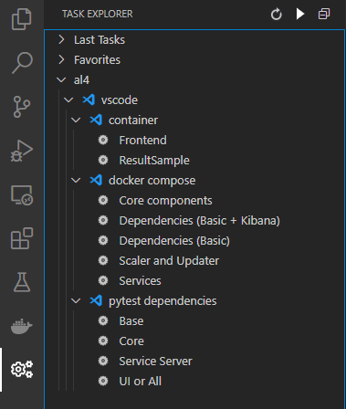
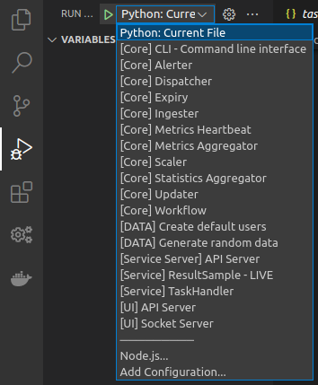
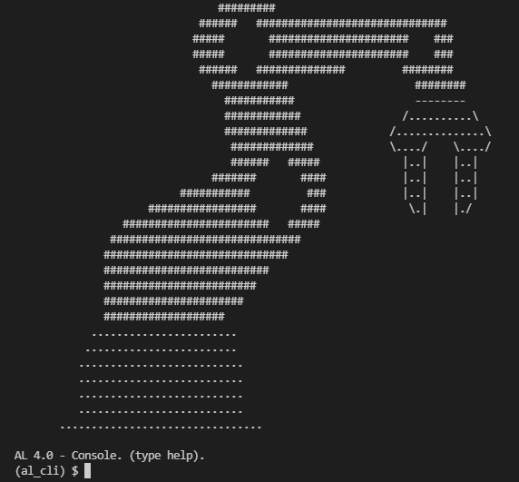
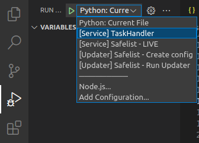
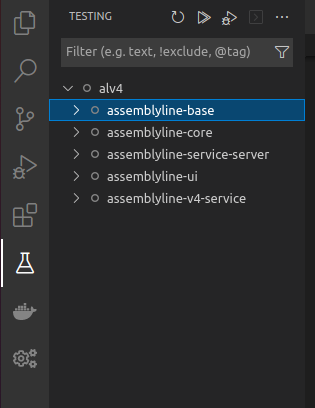

# Use VSCode

Once you are done running the [setup script](../setup_script), your installation of VSCode will be ready to run and debug any components of Assemblyline and most launch targets are already pre-configured. This page will point you in the right direction to perform some of the more common tasks that you'll have to do when developing an aspect of Assemblyline.

## Running Tasks

After all recommended extensions are finished installing in VSCode, the task button on the sidebar should be revealed and will give you quick access to the most important tasks in the system.



These tasks are split into 3 categories:

1. Container - Run a single container for a single task
2. Docker-compose - Execute a set of containers for a specific task dependency
3. Pytest dependencies - Run necessary dependencies to run tests

!!! tip
    You can edit the task list by modifying the ```.vscode/tasks.json```. The default `task.json` file can be found in the [assemblyline-development-setup](https://github.com/CybercentreCanada/assemblyline-development-setup/blob/master/.vscode/tasks.json) repository.

### Container tasks

A container task executes one specific container in the system. Two of these tasks are predefined:

#### Frontend

The Frontend task is used to run the User Interface of Assemblyline. It is only useful for when you launch the Assemblyline API Server in debug mode and are **NOT** using the ```core components``` task. Assemblyline's frontend is now built using ReactJS and is served via ```NPM serve``` which is why it is not part of this setup. Refer to the [frontend development](../../../frontend/frontend) page for more information on how to do development on the Assemblyline frontend.

#### ResultSample

The ResultSample task was created to show the developers how to run newly created service containers in the system.

!!! example "Deep dive in the ResultSample Task"
    This is what the JSON block for executing the ResultSample service in VSCode looks like:
    ```json
    ...
    {
        "label": "Container - ResultSample",
        "type": "shell",
        "options": {
            "env": {
                "LOCAL_IP": "172.17.0.1"
            }
        },
        "command": "docker run --env SERVICE_API_HOST=http://${LOCAL_IP}:5003 --network=host cccs/assemblyline-service-resultsample",
        "runOptions": {
            "instanceLimit": 1
        }
    },
    ...
    ```

    Essentially, this runs the ```docker run``` command and specifies where the *service server* API is located. You can change the ```LOCAL_IP``` environment variable if your Docker subnet is different.

    If you want to make sure Docker's local IP is indeed the default, `172.17.0.1`, just run this command:
    ```shell
    ip addr show docker0 | grep "inet " | awk '{print $2}' | cut -f1 -d"/"
    ```

### Docker-compose tasks

The `docker-compose` tasks are used to run sets of predefined dependencies in the system.

#### Dependencies

Before trying to run anything, at the bare minimum you will need one of the two ```Dependencies``` tasks running.

* ```Dependencies (Basic)``` will run the bare minimum set of containers to start components in the system: Elasticsearch, Redis, Minio, and Nginx.
* ```Dependencies (Basic + Kibana)``` will run the same containers as the Basic task but will add Kibana, Filebeat, and APM so that you can have access to the Kibana dashboard and debug your system more efficiently.

#### Core components

The `core components` `docker-compose` task runs all Assemblyline core components:

* Service server
* Frontend
* API Server
* Socket IO Server
* Alerter
* Expiry
* Metrics
* Heartbeats
* Statistics
* Workflow
* Plumber
* Dispatcher
* Ingester

!!! tip
    If you are wondering what each component does, you should read the [Infrastructure](../../../core/infrastructure) documentation which gives a brief description of each component.

The `core components` task will also add two test users to the system:

| uid   | password | is_admin | apikey       |
| ----- | -------- | -------- | ------------ |
| user  | user     | no       | devkey:user  |
| admin | admin    | yes      | devkey:admin |

#### Scaler and Updater

This task is an extra core component task that will launch Updater and Scaler. This task requires you to run one of the `dependency` tasks as well as the `core components` task to run properly. Scaler and Updater have been separated from the `core components` task because they interfere with running services live in the system. You are unlikely to ever run this task unless you are working on an issue loading containers from Scaler or Updater.

#### Services

This task will register all services to the system and allow them to be instantiated by Scaler and Updater. You are unlikely to run this task unless you want a working dev system that can scan files just like an appliance can.

### Pytest dependencies

The Pytest dependencies tasks are used to set up the environment properly to be able to run the tests like if you were building the packages. There are 4 possible dependencies for the tests:

* Base - To run the tests for the `assemblyline-base` repository
* Core - To run the tests for the `assemblyline-core` repository
* Service Server - To run the tests for the `assemblyline-service-server` repository
* UI or All - To run the tests for the `assemblyline-ui` repository or any other repository for that matter

!!! tip
    In most cases, if you are running tests you can use ```UI or All``` tasks because all the tests will work with it, but you might want to use the other tasks to save on resources and on dependency loading time.

## Launching components in debug mode

Using debug mode on all of Assemblyline's components will probably be the single most useful thing that is pre-configured by the [setup script](../setup_script). All Assemblyline's components get a launch target out of the box to simplify your debugging needs. Simply click the ```Run/Debug``` quick access side menu, select the component that you want to launch, and click the play button.



The configured launch targets have been pre-fixed with category to help you identify what they do:

* Core - Core components unrelated to services
* Data - Script that generates random data in the system
* Service Server - Service API server
* Service - Service Live debugging
* UI - Assemblyline API Servers

!!! warning
    To be able to successfully run these components, you will have to run at minimum the [Dependencies (Basic)](#dependencies) tasks

### Core, Service Server, and UI

The core, service server, and UI categories of launch targets are mostly self-explanatory. They will launch in debug mode any of the core components from the system.

!!! tip
    If you are wondering what each component does, you should read the [Infrastructure](../../../core/infrastructure) which gives a brief description of every single one of them.

#### CLI - Command Line Interface

This launch target from the core category launches an interactive console that will let perform a specific task in the system. You can use the `help` command to find out what possible commands are available.



!!! warning
    The commands that are found in this interactive console can be very dangerous and most of them should not be run on a production system.

### Data Launch target

The launch targets in the data category are used to create random data in the system.

#### Create default users

This launch target will generate the same default user as the [Core components tasks](#core-components) does:

| uid   | password | is_admin | apikey       |
| ----- | -------- | -------- | ------------ |
| user  | user     | no       | devkey:user  |
| admin | admin    | yes      | devkey:admin |

#### Generate random data

In addition to creating the default users, this task will also use the random data generator to fill the different indexes of the system with data that has been randomly generated. This is especially useful when testing APIs or Frontend which require you to have data in the different indices.

### Running live services

Running services in a live Assemblyline dev environment is the most important thing to know while building a service. It will allow you to send files via the user interface and put breakpoints in your service to catch files as they come through for processing.

To run a service live in the system you will need to launch two components:

* Task Handler
* Your service

!!! warning
    Here are a few things to consider before running a service live in debug mode:

    1. You need to start both the [Dependencies (Basic)](#dependencies) and the [Core components](#core-components) tasks before starting your service to ensure that it will receive files.
    2. You can have **one** Task handler instance running at the time therefore can only debug one service at the time. Task handler communicates with the service via fixed named pipes in the `/tmp` directory which is the reason for that limitation.
    3. The first time you start a service, you'll have to start the task handler and your service twice because the service stops itself after registering in the DB.
    4. You should launch your service from the VSCode window pointing to your services git folder (`~/git/services`) and for it to exist, you should have run the `setup_script.sh` with the `-s` option.

#### Create a launch target for your service

To add a launch target for your service, you will have to modify the `.vscode/launch.json` file in your `~/git/services` directory. You can mimic the Safelist launch target as a baseline.

!!! example "Demo Safelist launch target"
    ```json
    ...
        {
            "name": "[Service] Safelist - LIVE",
            "type": "python",
            "request": "launch",
            "module": "assemblyline_v4_service.run_service",
            "env": {
                "SERVICE_PATH": "safelist.Safelist"
            },
            "console": "internalConsole",
            "cwd": "${workspaceFolder}/assemblyline-service-safelist"
        },
    ...
    ```

The only three things you will have to change for launching your service are the following

1. The name of the launch target so you can pick it from the list later
2. The environment variable `SERVICE_PATH`. This should be the Python path to the service class relative to your current working directory.
3. The current working directory. This should be the directory where your service code is, a new directory you've created for your service inside the `~/git/services` folder.

#### Launch the service

Launching the service will take place again in the VSCode window dedicated to services. From the `Run/Debug` quick access sidebar, you will launch the `Task handler` first then the launch target for your service that you've just created.



Your service should now be running in live mode!

## Running Tests

After running the [setup script](../setup_script) for VSCode, the testing interface from the VSCode Python extension will be shown in your quick access side menu and will present you with all available unit tests. You can then simply click the test or group of tests you want to run and hit the `play` button to run the tests.

!!! warning
    Do not forget to first launch the appropriate [Pytest Dependency](#pytest-dependencies) from the tasks otherwise all the tests will fail.



!!! Bug "No tests available?"
    If the testing interface is not showing any tests, load up the ['UI and All' Pytest Dependency](#pytest-dependencies) task and hit the "Reload tests" button.
