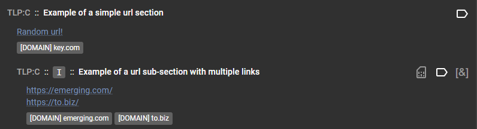

# *ResultSection* class
A `ResultSection` is bascally part of a service result that encapsulates a certain type of information that your service needs to convey to the user. For example, if you have a service that extracts networking indicators as well as process lists, you should put network indicators in their own section and then the process list in another.

Result sections have the following properties:

* They have different [types](#section-types) that will display information in different manners
* They can attach a heuristic which will add a maliciousness score to the result section
* They can tag important pieces of information about a file
* They can contain subsections which are just sections inside of another section
* They can have a classification which allows the API to redact partial results from a service depending on the user

You can view the source for the class here: [ResultSection class source](https://github.com/CybercentreCanada/assemblyline-v4-service/blob/master/assemblyline_v4_service/common/result.py)

## Class variables
The `ResultSection` class includes many instance variables which can be used to shape the way the section will be shown to the user.

The following table describes all of the variables of the `ResultSection` class.

| Variable Name | Description |
|:---|:---|
| parent | Parent `ResultSection` object (Only if the section is a child of another) |
| subsections | List of children `ResultSection` objects |
| body | Body of the section. Can take multiple forms depending on the section [type](#section-types): List of strings, string, JSON blob... |
| classification | The classification level of the current section |
| body_format | The [types of body](#section-types) of the current section (Default: TEXT) |
| tags | Dictionary containing the different tags that have been added to the section |
| heuristic | Current heuristic assigned to the section |
| zeroize_on_tag_safe | Should the section be forced to a score of 0 if all tags found in it are marked as Safelisted? (Default: False) |
| auto_collapse | Should the section be displayed in collapsed mode when first rendered in the UI? (Default: False) |
| zeroize_on_sig_safe | Should the section be forced to a score of 0 if all heuristic signatures found in it are marked as Safelisted? (Default: True) |

## Class functions

### \_\_init\_\_()

The constructor of the `ResultSection` object allows you to set all variables from the start.

Parameters:

* `title_text`: (Required) Title of the section
* `body`: Body of the section
* `classification`: Classification of the section
* `body_format`: [Type of body](#section-types)
* `heuristic`: Heuristic assigned to the section
* `tags`: Dictionary of tags assigned to the section
* `parent`: Parent of the section (either another section or the [Result](../result) object)
* `zeroize_on_tag_safe`: Should the section be forced to a score of 0 if all tags found in it are marked as Safelisted?
* `auto_collapse`: Should the section be displayed in collapsed mode when first rendered in the UI?
* `zeroize_on_sig_safe`: Should the section be forced to a score of 0 if all heuristic signatures found in it are marked as Safelisted?


??? Example
    Excerpt from the Assemblyline ResultSample service: [result_sample.py](https://github.com/CybercentreCanada/assemblyline-v4-service/blob/master/assemblyline_result_sample_service/result_sample.py)

    ```python
    ...
    # The classification of a section can be set to any valid classification for your system
    section_color_map = ResultSection("Example of colormap result section", body_format=BODY_FORMAT.GRAPH_DATA,
                                        body=json.dumps(color_map_data), classification=cl_engine.RESTRICTED)
    result.add_section(section_color_map)
    ...
    ```

### add_line()
This function allows the service to add a line to the body of a [ResultSection](../result_section) object.

Parameters:

* `text`: A string containing the line to add to the body

??? Example
    Excerpt from the Assemblyline ResultSample service: [result_sample.py](https://github.com/CybercentreCanada/assemblyline-v4-service/blob/master/assemblyline_result_sample_service/result_sample.py)

    ```python
    ...
    text_section = ResultSection('Example of a default section')
    # You can add lines to your section one at a time
    #   Here we will generate a random line
    text_section.add_line(get_random_phrase())
    ...
    ```

### add_lines()
This function allows the service to add multiple lines to the body of a [ResultSection](../result_section) object.

Parameters:

* `lines`: List of string to add as multiple lines in the body

??? Example
    Excerpt from the Assemblyline ResultSample service: [result_sample.py](https://github.com/CybercentreCanada/assemblyline-v4-service/blob/master/assemblyline_result_sample_service/result_sample.py)

    ```python
    ...
    text_section = ResultSection('Example of a default section')
    ...
    # Or your can add them from a list
    #   Here we will generate random amount of random lines
    text_section.add_lines([get_random_phrase() for _ in range(random.randint(1, 5))])
    ...
    ```

### add_subsection()
This function allows the service to add a subsection to the current `ResultSection` object.

Parameters:

* `subsection`: The `ResultSection` object to add as a subsection
* `on_top`: (Optional) Boolean value that indicates if the section should be on top of the other sections or not

??? Example
    Excerpt from the Assemblyline ResultSample service: [result_sample.py](https://github.com/CybercentreCanada/assemblyline-v4-service/blob/master/assemblyline_result_sample_service/result_sample.py)

    ```python
    ...
    url_sub_section = ResultSection('Example of a url sub-section with multiple links',
                                    body=json.dumps(urls), body_format=BODY_FORMAT.URL,
                                    heuristic=url_heuristic, classification=cl_engine.RESTRICTED)
    ...
    url_sub_sub_section = ResultSection('example of a two level deep sub-section',
                                        body=json.dumps(ips), body_format=BODY_FORMAT.URL)
    ...
    # Since url_sub_sub_section is a sub-section of url_sub_section
    # we will add it as a sub-section of url_sub_section not to the main result itself
    url_sub_section.add_subsection(url_sub_sub_section)
    ...
    ```

### add_tag()
This function allows the service writer to add a tag to the `ResultSection`

Parameters:

* `type`: Type of tag
* `value`: Value of the tag

??? Example
    Excerpt from the Assemblyline ResultSample service: [result_sample.py](https://github.com/CybercentreCanada/assemblyline-v4-service/blob/master/assemblyline_result_sample_service/result_sample.py)

    ```python
    ...
    # You can tag data to a section. Tagging is used to quickly find defining information about a file
    text_section.add_tag("attribution.implant", "ResultSample")
    ...
    ```

### set_body()
Set the body and the body format of a section

Parameters:

* `body`: New body value
* `body_format`: (Optional) [Type of body](#section-types) - Default: TEXT

### set_heuristic()
Set a heuristic for a current section/subsection. A heuristic is required to assign a score to a result section/subsection.

Parameters:

* `heur_id`: Heuristic ID as set in the service manifest
* `attack_id`: (optional) Attack ID related to the heuristic
* `signature`: (optional) Signature name that triggered the heuristic

??? Example
    Excerpt from the Assemblyline ResultSample service: [result_sample.py](https://github.com/CybercentreCanada/assemblyline-v4-service/blob/master/assemblyline_result_sample_service/result_sample.py)

    ```python
    ...
    # If the section needs to affect the score of the file you need to set a heuristic
    #   Here we will pick one at random
    #     In addition to adding a heuristic, we will associate a signature to the heuristic.
    #     We're doing this by adding the signature name to the heuristic. (Here we use a random name)
    text_section.set_heuristic(3, signature="sig_one")
    ...
    ```

## Section types
These are all result section types that Assemblyline supports. You can see a screenshot of each section as well as the code that was used to generate the actual section.

### TEXT


??? example "Code used to generate the TEXT section"
    Excerpt from the Assemblyline ResultSample service: [result_sample.py](https://github.com/CybercentreCanada/assemblyline-v4-service/blob/master/assemblyline_result_sample_service/result_sample.py)

    ```python
    ...
    # ==================================================================
    # Standard text section: BODY_FORMAT.TEXT - DEFAULT
    #   Text sections basically just dump the text to the screen...
    #     The scores of all sections will be SUMed in the service result
    #     The Result classification will be the highest classification found in the sections
    text_section = ResultSection('Example of a default section')
    # You can add lines to your section one at a time
    #   Here we will generate a random line
    text_section.add_line(get_random_phrase())
    # Or your can add them from a list
    #   Here we will generate a random amount of random lines
    text_section.add_lines([get_random_phrase() for _ in range(random.randint(1, 5))])
    # You can tag data to a section. Tagging is used to quickly find defining information about a file
    text_section.add_tag("attribution.implant", "ResultSample")
    # If the section needs to affect the score of the file you need to set a heuristics
    #   Here we will pick one at random
    #     In addition to adding a heuristic, we will associate a signature to the heuristic.
    #     We're doing this by adding the signature name to the heuristic. (Here we use a random name)
    text_section.set_heuristic(3, signature="sig_one")
    # You can attach ATT&CK IDs to heuristics after they where defined
    text_section.heuristic.add_attack_id(random.choice(list(software_map.keys())))
    text_section.heuristic.add_attack_id(random.choice(list(attack_map.keys())))
    text_section.heuristic.add_attack_id(random.choice(list(group_map.keys())))
    text_section.heuristic.add_attack_id(random.choice(list(revoke_map.keys())))
    # Same thing for the signatures, they can be added to a heuristic after the fact and you can even say how
    #   many time the signature fired by setting its frequency. If you call add_signature_id twice with the
    #   same signature, this will also increase the frequency of the signature.
    text_section.heuristic.add_signature_id("sig_two", score=20, frequency=2)
    text_section.heuristic.add_signature_id("sig_two", score=20, frequency=3)
    text_section.heuristic.add_signature_id("sig_three")
    text_section.heuristic.add_signature_id("sig_three")
    text_section.heuristic.add_signature_id("sig_four", score=0)
    # The heuristic for text_section should have the following properties:
    #   1. 1 ATT&CK ID: T1066
    #   2. 4 signatures: sig_one, sig_two, sig_three and sig_four
    #   3. Signature frequencies are cumulative, therefore they will be as follows:
    #      - sig_one = 1
    #      - sig_two = 5
    #      - sig_three = 2
    #      - sig_four = 1
    #   4. The score used by each heuristic is driven by the following rules: signature_score_map is the highest
    #      priority, then score value for the add_signature_id is in second place and finally the default
    #      heuristic score is used. The score used to calculate the total score for the text_section is
    #      as follows:
    #      - sig_one: 10    -> heuristic default score
    #      - sig_two: 20    -> score provided by the function add_signature_id
    #      - sig_three: 30  -> score provided by the heuristic map
    #      - sig_four: 40   -> score provided by the heuristic map because it's higher priority than the
    #                          function score
    #    5. Total section score is then: 1x10 + 5x20 + 2x30 + 1x40 = 210
    # Make sure you add your section to the result
    result.add_section(text_section)
    ...
    ```

### MEMORY_DUMP


??? example "Code used to generate the MEMORY_DUMP section"
    Excerpt from the Assemblyline ResultSample service: [result_sample.py](https://github.com/CybercentreCanada/assemblyline-v4-service/blob/master/assemblyline_result_sample_service/result_sample.py)

    ```python
    ...
    from assemblyline.common.hexdump import hexdump
    ...
    # ==================================================================
    # Memory dump section: BODY_FORMAT.MEMORY_DUMP
    #     Dump whatever string content you have into a <pre/> html tag so you can do your own formatting
    data = hexdump(b"This is some random text that we will format as an hexdump and you'll see "
                   b"that the hexdump formatting will be preserved by the memory dump section!")
    memdump_section = ResultSection('Example of a memory dump section', body_format=BODY_FORMAT.MEMORY_DUMP,
                                    body=data)
    memdump_section.set_heuristic(random.randint(1, 4))
    result.add_section(memdump_section)
    ...
    ```

### GRAPH_DATA


??? example "Code used to generate the GRAPH_DATA section"
    Excerpt from the Assemblyline ResultSample service: [result_sample.py](https://github.com/CybercentreCanada/assemblyline-v4-service/blob/master/assemblyline_result_sample_service/result_sample.py)

    ```python
    ...
    # ==================================================================
    # Color map Section: BODY_FORMAT.GRAPH_DATA
    #     Creates a color map bar using a minimum and maximum domain
    #     e.g. We are using this section to display the entropy distribution in some services
    cmap_min = 0
    cmap_max = 20
    color_map_data = {
        'type': 'colormap',
        'data': {
            'domain': [cmap_min, cmap_max],
            'values': [random.random() * cmap_max for _ in range(50)]
        }
    }
    # The classification of a section can be set to any valid classification for your system
    section_color_map = ResultSection("Example of colormap result section", body_format=BODY_FORMAT.GRAPH_DATA,
                                        body=json.dumps(color_map_data), classification=cl_engine.RESTRICTED)
    result.add_section(section_color_map)
    ...
    ```

### URL



??? example "Code used to generate the URL section"
    Excerpt from the Assemblyline ResultSample service: [result_sample.py](https://github.com/CybercentreCanada/assemblyline-v4-service/blob/master/assemblyline_result_sample_service/result_sample.py)

    ```python
    ...
    # ==================================================================
    # URL section: BODY_FORMAT.URL
    #   Generate a list of clickable URLs using a JSON encoded format
    #     As you can see here, the body of the section can be set directly instead of line by line
    random_host = get_random_host()
    url_section = ResultSection('Example of a simple url section', body_format=BODY_FORMAT.URL,
                                body=json.dumps({"name": "Random url!", "url": f"https://{random_host}/"}))

    # Since URLs are very important features, we can tag those features in the system so that they are easy to find
    #   Tags are defined by a type and a value
    url_section.add_tag("network.static.domain", random_host)

    # You may also want to provide a list of URLs!
    #   Also, no need to provide a name, the URL link will be displayed
    host1 = get_random_host()
    host2 = get_random_host()
    urls = [
        {"url": f"https://{host1}/"},
        {"url": f"https://{host2}/"}]

    # A heuristic can fire more then once without being associated to a signature
    url_heuristic = Heuristic(4, frequency=len(urls))

    url_sub_section = ResultSection('Example of a URL sub-section with multiple links',
                                    body=json.dumps(urls), body_format=BODY_FORMAT.URL,
                                    heuristic=url_heuristic, classification=cl_engine.RESTRICTED)
    url_sub_section.add_tag("network.static.domain", host1)
    url_sub_section.add_tag("network.dynamic.domain", host2)

    # Since url_sub_section is a subsection of url_section
    # we will add it as a subsection of url_section, not to the main result itself
    url_section.add_subsection(url_sub_section)

    result.add_section(url_section)
    ...
    ```

### JSON


??? example "Code used to generate the JSON section"
    Excerpt from the Assemblyline ResultSample service: [result_sample.py](https://github.com/CybercentreCanada/assemblyline-v4-service/blob/master/assemblyline_result_sample_service/result_sample.py)

    ```python
    ...
    # ==================================================================
    # JSON section:
    #     Re-use the JSON editor we use for administration (https://github.com/josdejong/jsoneditor)
    #     to display a tree view of JSON results.
    #     NB: Use this sparingly! As a service developer you should do your best to include important
    #     results as their own result sections.
    #     The body argument must be a json dump of a python dictionary
    json_body = {
        "a_str": "Some string",
        "a_list": ["a", "b", "c"],
        "a_bool": False,
        "an_int": 102,
        "a_dict": {
            "list_of_dict": [
                {"d1_key": "val", "d1_key2": "val2"},
                {"d2_key": "val", "d2_key2": "val2"}
            ],
            "bool": True
        }
    }
    json_section = ResultSection('Example of a JSON section', body_format=BODY_FORMAT.JSON,
                                    body=json.dumps(json_body))
    result.add_section(json_section)
    ...
    ```

### KEY_VALUE


??? example "Code used to generate the KEY_VALUE section"
    Excerpt from Assemblyline Result sample service: [result_sample.py](https://github.com/CybercentreCanada/assemblyline-v4-service/blob/master/assemblyline_result_sample_service/result_sample.py)

    ```python
    ...
    # ==================================================================
    # KEY_VALUE section:
    #     This section allows the service writer to list a bunch of key/value pairs to be displayed in the UI
    #     while also providing easy to parse data for auto mated tools.
    #     NB: You should definitely use this over a JSON body type since this one will be displayed correctly
    #         in the UI for the user
    #     The body argument must be a dictionary (only str, int, and booleans are allowed)
    kv_section = ResultKeyValueSection('Example of a KEY_VALUE section')
    # You can add items individually
    kv_section.set_item('key', "value")
    # Or simply add them in bulk
    kv_section.update_items({
        "a_str": "Some string",
        "a_bool": False,
        "an_int": 102,
    })
    result.add_section(kv_section)

    # ==================================================================
    # ORDERED_KEY_VALUE section:
    #     This section provides the same functionality as the KEY_VALUE section except the order of the fields
    #     are garanteed to be preserved in the order in which the fields are added to the section. Also with
    #     this section, you can repeat the same key name multiple times
    oredered_kv_section = ResultOrderedKeyValueSection('Example of an ORDERED_KEY_VALUE section')
    # You can add items individually
    for x in range(random.randint(3, 6)):
        oredered_kv_section.add_item(f'key{x}', f"value{x}")

    result.add_section(oredered_kv_section)
    ...
    ```

### PROCESS_TREE


??? example "Code used to generate the section"
    Excerpt from Assemblyline Result sample service: [result_sample.py](https://github.com/CybercentreCanada/assemblyline-v4-service/blob/master/assemblyline_result_sample_service/result_sample.py)

    ```python
    ...
    # ==================================================================
    # PROCESS_TREE section:
    #     This section allows the service writer to list a bunch of dictionary objects that have nested lists
    #     of dictionaries to be displayed in the UI. Each dictionary object represents a process, and therefore
    #     each dictionary must have be of the following format:
    #     {
    #       "process_pid": int,
    #       "process_name": str,
    #       "command_line": str,
    #       "children": [] NB: This list either is empty or contains more dictionaries that have the same
    #                          structure
    #     }
    nc_body = [
        {
            "process_pid": 123,
            "process_name": "evil.exe",
            "command_line": "C:\\evil.exe",
            "signatures": {},
            "children": [
                {
                    "process_pid": 321,
                    "process_name": "takeovercomputer.exe",
                    "command_line": "C:\\Temp\\takeovercomputer.exe -f do_bad_stuff",
                    "signatures": {"one": 250},
                    "children": [
                        {
                            "process_pid": 456,
                            "process_name": "evenworsethanbefore.exe",
                            "command_line": "C:\\Temp\\evenworsethanbefore.exe -f change_reg_key_cuz_im_bad",
                            "signatures": {"one": 10, "two": 10, "three": 10},
                            "children": []
                        },
                        {
                            "process_pid": 234,
                            "process_name": "badfile.exe",
                            "command_line": "C:\\badfile.exe -k nothing_to_see_here",
                            "signatures": {"one": 1000, "two": 10, "three": 10, "four": 10, "five": 10},
                            "children": []
                        }
                    ]
                },
                {
                    "process_pid": 345,
                    "process_name": "benignexe.exe",
                    "command_line": "C:\\benignexe.exe -f \"just kidding, i'm evil\"",
                    "signatures": {"one": 2000},
                    "children": []
                }
            ]
        },
        {
            "process_pid": 987,
            "process_name": "runzeroday.exe",
            "command_line": "C:\\runzeroday.exe -f insert_bad_spelling",
            "signatures": {},
            "children": []
        }
    ]
    nc_section = ResultSection('Example of a PROCESS_TREE section',
                                body_format=BODY_FORMAT.PROCESS_TREE,
                                body=json.dumps(nc_body))
    result.add_section(nc_section)
    ...
    ```

### TABLE


??? example "Code used to generate the TABLE section"
    Excerpt from Assemblyline Result sample service: [result_sample.py](https://github.com/CybercentreCanada/assemblyline-v4-service/blob/master/assemblyline_result_sample_service/result_sample.py)

    ```python
    ...
    # ==================================================================
    # TABLE section:
    #     This section allows the service writer to have their content displayed in a table format in the UI
    #     The body argument must be a list [] of dict {} objects. A dict object can have a key value pair
    #     where the value is a flat nested dictionary, and this nested dictionary will be displayed as a nested
    #     table within a cell.
    table_body = [
        {
            "a_str": "Some string1",
            "extra_column_here": "confirmed",
            "a_bool": False,
            "an_int": 101,
        },
        {
            "a_str": "Some string2",
            "a_bool": True,
            "an_int": 102,
        },
        {
            "a_str": "Some string3",
            "a_bool": False,
            "an_int": 103,
        },
        {
            "a_str": "Some string4",
            "a_bool": None,
            "an_int": -1000000000000000000,
            "extra_column_there": "confirmed",
            "nested_table": {
                "a_str": "Some string3",
                "a_bool": False,
                "nested_table_thats_too_deep": {
                    "a_str": "Some string3",
                    "a_bool": False,
                    "an_int": 103,
                },
            },
        },
    ]
    table_section = ResultSection('Example of a TABLE section',
                                    body_format=BODY_FORMAT.TABLE,
                                    body=json.dumps(table_body))
    result.add_section(table_section)
    ...
    ```

### IMAGE


??? example "Code used to generate the IMAGE section"
    Excerpt from the Assemblyline ResultSample service: [result_sample.py](https://github.com/CybercentreCanada/assemblyline-v4-service/blob/master/assemblyline_result_sample_service/result_sample.py)

    ```python
    ...
    # ==================================================================
    # Image Section
    #     This type of section allows the service writer to display images to the user
    image_section = ResultImageSection(request, 'Example of Image section')
    for x in range(6):
        image_section.add_image(
            os.path.join(os.path.dirname(__file__),
                            'data', f'000{x+1}.jpg'),
            f'000{x+1}.jpg', f'ResultSample screenshot 000{x+1}', ocr_heuristic_id=6)
    result.add_section(image_section)
    ...
    ```

### TIMELINE


??? example "Code used to generate the TIMELINE section"
    Excerpt from the Assemblyline ResultSample service: [result_sample.py](https://github.com/CybercentreCanada/assemblyline-v4-service/blob/master/assemblyline_result_sample_service/result_sample.py)

    ```python
    ...
    # ==================================================================
    # Timeline Section
    #     This type of section allows the service writer to create a visual timeline
    timeline_section = ResultTimelineSection("Timeline")
    for x in range(4):
        timeline_section.add_node(title=f"Node {x}", content=f"Description: {x}",
                                    opposite_content=f"Value: {x}")
    result.add_section(timeline_section)
    ...
    ```

### MULTI


??? example "Code used to generate the MULTI section"
    Excerpt from the Assemblyline ResultSample service: [result_sample.py](https://github.com/CybercentreCanada/assemblyline-v4-service/blob/master/assemblyline_result_sample_service/result_sample.py)

    ```python
    ...
    # ==================================================================
    # Multi Section
    #     This type of section allows the service writer to display multiple section types
    #     in the same result section. Here's a concrete example of this:
    multi_section = ResultMultiSection('Example of Multi-typed section')
    multi_section.add_section_part(TextSectionBody(body="We have detected very high entropy multiple sections "
                                                        "of your file, this section is most-likely packed or "
                                                        "encrypted.\n\nHere are affected sections:"))
    section_count = random.randint(1, 4)
    for x in range(section_count):
        multi_section.add_section_part(
            KVSectionBody(section_name=f".UPX{x}", offset=f'0x00{8+x}000', size='4196 bytes'))
        graph_part = GraphSectionBody()
        graph_part.set_colormap(0, 8, [7 + random.random() for _ in range(20)])
        multi_section.add_section_part(graph_part)
        if x != section_count - 1:
            multi_section.add_section_part(DividerSectionBody())
        multi_section.add_tag("file.pe.sections.name", f".UPX{x}")

    multi_section.set_heuristic(5)
    result.add_section(multi_section)
    ...
    ```
