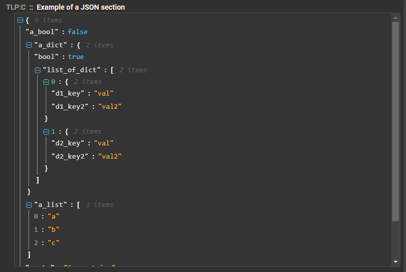
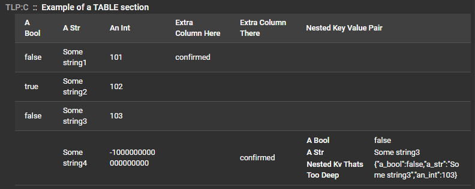

# *ResultSection* class
A `ResultSection` is bascally parts of a service result that encapsulate certain type of information that your service needs to convey to the user. For exemple, if you have a service that extract networking indicators as well as process lists, you will most likely end up putting network indicators in their own section and then the process list in another.

Result sections have the following properties:

* They have different [types](#section-types) that will display the information in a different manner
* They can attach a heuritic which will add a maliciousness score to it
* They can tag important piece of information about a file
* They can contain sub-section which is just a section inside of another section
* They can have a classification which allow the API to redact partial results from a service depending on the user

You can view the source for the class here: [ResultSection class source](https://github.com/CybercentreCanada/assemblyline-v4-service/blob/master/assemblyline_v4_service/common/result.py)

## Class variables
The `ResultSection` class includes many instance variables which can be used to shape the way the section will be shown to the user.

The following tables describes all of the variables of the `ResultSection` class.

| Variable Name | Description |
|:---|:---|
| parent | Parent `ResultSection` object (Only if the section is a child of another) |
| subsections | List of children `ResultSection` objects |
| body | Body of the section. Can take multiple form depending of the section [type](#section-types): List of strings, string, JSON blob... ) |
| classification | The classification level of the current section |
| body_format | The [types of body](#section-types) of the current section (Default: TEXT) |
| tags | Dictionary containing the different tags that have been added to the section |
| heuristic | Current heuristic assigned to the section |
| zeroize_on_tag_safe | Should the section be forced to a 0 score if all tags found in it are marked as Safelisted? (Default: False) |
| auto_collapse | Should the section be displayed in collapsed mode when first rendered in the UI? (Default: False) |
| zeroize_on_sig_safe | Should the section be forced to a 0 score if all heuristics signatures found in it are marked as Safelisted? (Default: True) |

## Class functions

### \_\_init\_\_()

The constructor of the `ResultSection` object allows you to set all the variables from the start.

Parameters:

* `title_text`: (Required) Title of the section
* `body`: Body of the section
* `classification`: Classification of the section
* `body_format`: [Type of body](#section-types)
* `heuristic`: Heuristic assigned to the section
* `tags`: Dictionary of tags assigned to the section
* `parent`: Parent of the section (either another section or the [Result](../result) object)
* `zeroize_on_tag_safe`: Should the section be forced to a 0 score if all tags found in it are marked as Safelisted?
* `auto_collapse`: Should the section be displayed in collapsed mode when first rendered in the UI?
* `zeroize_on_sig_safe`: Should the section be forced to a 0 score if all heuristics signatures found in it are marked as Safelisted?


??? Example
    Excerpt from Assemblyline Result sample service: [result_sample.py](https://github.com/CybercentreCanada/assemblyline-v4-service/blob/master/assemblyline_v4_service/common/result.py)

    ```python
    ...
    # The classification of a section can be set to any valid classification for your system
    section_color_map = ResultSection("Example of colormap result section", body_format=BODY_FORMAT.GRAPH_DATA,
                                        body=json.dumps(color_map_data), classification=cl_engine.RESTRICTED)
    result.add_section(section_color_map)
    ...
    ```

### add_line()
This function allows the service to add a line to the body of a [ResultSection](../result_section) object.

Parameters:

* `text`: A string containing the line to add to the body

??? Example
    Excerpt from Assemblyline Result sample service: [result_sample.py](https://github.com/CybercentreCanada/assemblyline-v4-service/blob/master/assemblyline_v4_service/common/result.py)

    ```python
    ...
    text_section = ResultSection('Example of a default section')
    # You can add lines to your section one at a time
    #   Here we will generate a random line
    text_section.add_line(get_random_phrase())
    ...
    ```

### add_lines()
This function allows the service to add multiple lines to the body of a [ResultSection](../result_section) object.

Parameters:

* `lines`: List of string to add as multiple lines in the body

??? Example
    Excerpt from Assemblyline Result sample service: [result_sample.py](https://github.com/CybercentreCanada/assemblyline-v4-service/blob/master/assemblyline_v4_service/common/result.py)

    ```python
    ...
    text_section = ResultSection('Example of a default section')
    ...
    # Or your can add them from a list
    #   Here we will generate random amount of random lines
    text_section.add_lines([get_random_phrase() for _ in range(random.randint(1, 5))])
    ...
    ```

### add_subsection()
This function allows the service to add a subsection to the current `ResultSection` object.

Parameters:

* `subsection`: The `ResultSection` object to add as a subsection
* `on_top`: (Optional) Boolean value to tell if the section should be on top of the others or not

??? Example
    Excerpt from Assemblyline Result sample service: [result_sample.py](https://github.com/CybercentreCanada/assemblyline-v4-service/blob/master/assemblyline_v4_service/common/result.py)

    ```python
    ...
    url_sub_section = ResultSection('Example of a url sub-section with multiple links',
                                    body=json.dumps(urls), body_format=BODY_FORMAT.URL,
                                    heuristic=url_heuristic, classification=cl_engine.RESTRICTED)
    ...
    url_sub_sub_section = ResultSection('Exemple of a two level deep sub-section',
                                        body=json.dumps(ips), body_format=BODY_FORMAT.URL)
    ...
    # Since url_sub_sub_section is a sub-section of url_sub_section
    # we will add it as a sub-section of url_sub_section not to the main result itself
    url_sub_section.add_subsection(url_sub_sub_section)
    ...
    ```

### add_tag()
This function allows the service writter to add a tag to the `ResultSection`

Parameters:

* `type`: Type of tag
* `value`: Value of the tag

??? Example
    Excerpt from Assemblyline Result sample service: [result_sample.py](https://github.com/CybercentreCanada/assemblyline-v4-service/blob/master/assemblyline_v4_service/common/result.py)

    ```python
    ...
    # You can tag data to a section, tagging is used to to quickly find defining information about a file
    text_section.add_tag("attribution.implant", "ResultSample")
    ...
    ```

### set_body()
Set the body and the body format of a section

Parameters:

* `body`: New body value
* `body_format`: (Optional) [Type of body](#section-types) - Default: TEXT

### set_heuristic()
Set a heuristic for a current section/subsection. A heuristic is required to assign a score to a result section/subsection.

Parameters:

* `heur_id`: Heuristic ID as set in the service manifest
* `attack_id`: (optional) Attack ID related to the heuristic
* `signature`: (optional) Signature Name that triggered the heuristic

??? Example
    Excerpt from Assemblyline Result sample service: [result_sample.py](https://github.com/CybercentreCanada/assemblyline-v4-service/blob/master/assemblyline_v4_service/common/result.py)

    ```python
    ...
    # If the section needs to affect the score of the file you need to set a heuristics
    #   Here we will pick one at random
    #     In addition to add a heuristic, we will associated a signature with the heuristic,
    #     we're doing this by adding the signature name to the heuristic. (Here we generating a random name)
    text_section.set_heuristic(3, signature="sig_one")
    ...
    ```

## Section types

### Text

### Memory Dump

### Graph Data

### Url

### Json

### Key/Value pair

### Process Tree

### Table

