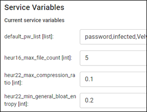

# *ServiceBase* class
All service created for Assemblyline must inherit from the `ServiceBase` class which can be imported from `assemblyline_v4_service.common.base`. In this section we will go through the different methods and variables available to you in the `ServiceBase` class.

You can view the source for the class here: [ServiceBase class source](https://github.com/CybercentreCanada/assemblyline-v4-service/blob/master/assemblyline_v4_service/common/base.py)

## Class variables
The `ServiceBase` base class includes many instance variables which can be used to access service related information.

The following tables describes all of the variables of the `ServiceBase` class.

| Variable Name | Description |
|:---|:---|
| config | Reference to the service parameters containing values updated by the user for service configuration. |
| dependencies | A dictionary containing connection details for service dependencies|
| log | Reference to the logger. |
| ontologies | A dictionary containing ontologies to get appended to a service result. |
| rules_directory | Returns the directory path which contains the current location of your rules |
| rules_hash | A hash of the files in the rules_list. Used to invalidate caching if rules change.|
| rules_list | Returns a list of directory paths which point to rule files derived from rules_directory|
| service_attributes | Service attributes from the [service manifest](../service_manifest). |
| update_time | An integer representing the epoch of when the last update occurred|
| working_directory | Returns the directory path which the service can use to temporarily store files during each task execution. |

The `config` property is a dictionary that comes from the service manifest that will contain the default values. An Assemblyline system administrator can go into the service management section of their instance `/admin/services` and change the default configuration, so you'll be able to access that configuration through `config`. An example of this is the [default password list](https://github.com/CybercentreCanada/assemblyline-service-extract/blob/master/service_manifest.yml#L24:L25) of the [Extract service](https://github.com/CybercentreCanada/assemblyline-service-extract), known as `default_pw_list`. This list can be configured by your administrator to always include "password", "infected" or the name of your organization.

{ .center }

The `working_directory` property is a temporary directory that you should use if you extract or create temporary files. That way, your different file submissions won't interfere with each other, and you won't leave files in your running container that could start bloating it.

If you need to log anything for debugging, you could use `print` or `self.log`. The advantage of `self.log` is that with the right setup, it'll be forwarded to your logging stack where you can do more analysis.

## Class functions
This is the list of all the functions that you can override in your service. They are explained in order of importance and the likelihood at which you will override them.

### execute()

!!! important "This is where your service processing code lives!"

The `execute` function is called every time the service receives a new file to scan. To this function, a single [Request](../request) object is provided as an input which provides the service all the information available about the file which was requested for scanning.

It is inside this function that you will create a [Result](../result) objects to send your scan results back to the system for storage and display in the user interface. This has to be done before the end of the function execution. Make sure you go through the [tips on writing good results](../result#tips-on-writing-good-results) before starting to built your service.

If multiple files come in around the same time, the system is optimized to reuse deployed services. The `start` function won't be called between submissions, so you need to make sure not to keep data between runs in the class variables as it can lead to wrong results.

### get_tool_version()
The purpose of the `get_tool_version` function is to the return a string indicating the version of the tools used by the service or a hash of the signatures it uses. The tool version should be updated to reflect changes in the service tools or signatures, so that Assemblyline can rescan files on the new service version if they are submitted again.

### __init__() and start()
The `__init__` and `start` functions are called when the Assemblyline service is initiated and should be used to prepare your service for task execution. The main difference between these methods is that you have access to the content provided by your updater in the `start` method.

### get_api_interface()
The purpose of the `get_api_interface` function is to give the service direct access to the [service server](../../core/infrastructure/#core-components) component to perform API request to find out if a file or a tag is meant to be safelisted.

!!! warning
    By using this function, your service will not work using the `run_service_once` command and will be completely tied to the [service server](../../core/infrastructure/#core-components) API.

### stop()
The `stop` function is called when the Assemblyline service is stopped and should be used to cleanup your service.

The following functions are used if and only if you're using a dependency that's a service updater named 'updates'. For this reason, we reserve the dependency name 'updates' to be used for service updaters.

### _load_rules()
The `_load_rules` function is called to process the rules_list in a specific way defined by the service.

### _clear_rules()
The `_clear_rules` function is optionally called to remove the current ruleset from memory. Requires implementation by the service writer for use.

### _download_rules()
The `_download_rules` function is called after each `_cleanup` call to check if there is new updates to be processed. If so, it will attempt to download and use the new ruleset otherwise it will revert to the old ruleset.

It will call on `_load_rules` and `_clear_rules` during this attempt process.

### attach_ontological_result()
The `attach_ontological_result` function is called when you want to attach an ontological result to your service result.

Refer to [Result Ontologies](/odm/models/ontology/meta/) for more information on the current set of ontological models.
