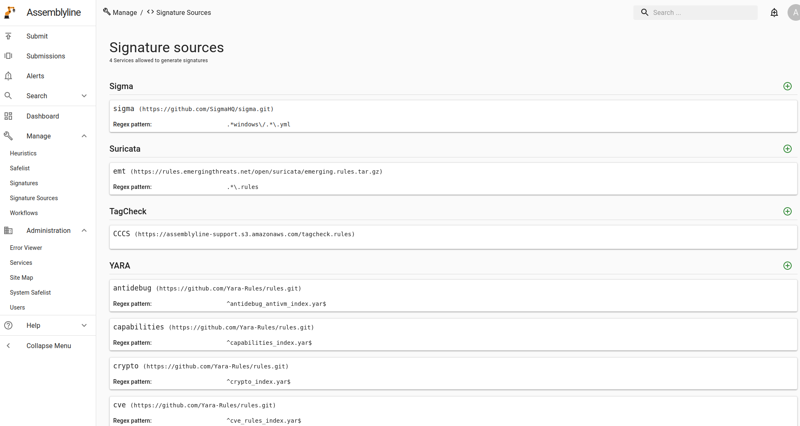
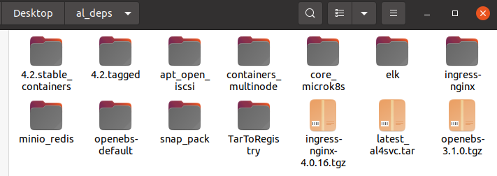
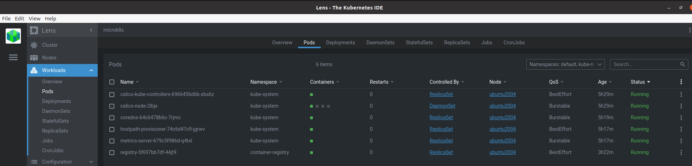
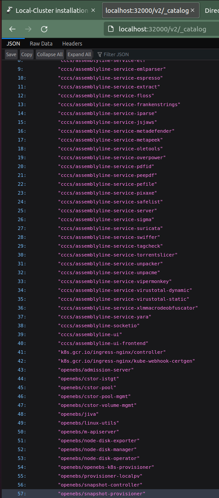
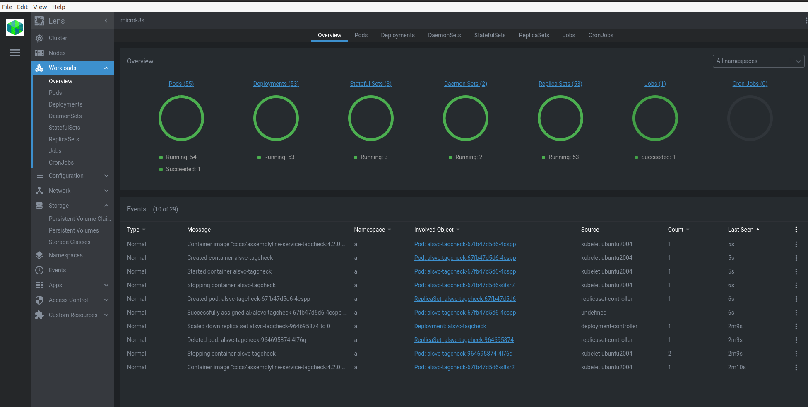

# Local-Cluster installation (Multi-Node Microk8s)

Last update support 4.2.stable deployment (Jan 2022)

{==__ All Deployment types described in this guide were tested on Ubuntu20.04 [26.1.2022]__==}

{==__ Tested VM: 24cpu, 24Gi ram, 512Gi hhd__==}

## What do we need to consider before deploying offline

	
!!! danger "Consider before processeding"
	* Needs to install python3-pip - if you cant do it for any reason, find a solution

	* Git repo! - additional infrestructure to support some AL4 services
	
		!!! questioin "Why?"
			`Sigma`
			
			`Suricata`
			
			`TaggCheck`
			
			`Yara`
			
		!!! done "They are configured to pull 2 repos + 2 files"
		



## What needs to be done


* In order to make AL work their are some options for deployment.
	
	!!! note "various value.yaml templates will be avaliable in section 4"
	
	|                    Deployment 			|    Nodes	|  Datastores	|
	| :------------------------------------------------:	| :----------:	| :----------:	| 
	| Strong Appliance					| 1		| 1 		|
	| Cluster AL 4 with 1 ES instance			| 3 		| 1		|
	| Cluster AL 4 with Cluster of ES __(Prefered)__	| 3 		| 3		|


	??? question "Why Prefered?"
		
		- [X] Elastic-Search can be scaled to No-Share architecture cluster (<B>Requires 3 nodes</B>)
		
		- [X] Load Balancing 
		
		- [X] AL4 Services can be scaled to balance our scans


1. __Download depenedencies (Infrastructure + AL4)__
2. __Setup node(s)__
3. __Setup microk8s cluster__

	!!! tldr "Master+Additional nodes"	
		
4. __Prepair AL4 Strong Appliance/Cluster helm-chart for deployment__
	
!!! warning "Caution"
	The following instructions assuming you're root user.
	Please perform:
        ```bash
        sudo su
        ```
        
!!! tldr "Desktop directory before we can deploy AL4"
	```bash
	Desktop/
	├── al_deps/
	│   ├── Python-tool   (Used to push .tar images to built-in registry)
	│   ├── Snap packages (microk8s, helm, kubectl, koneta-lens)
	│   ├── nginx-ingress (.tar)
	│   ├── OpenEBS       (.tar) (Need to update dependency helm chart)
	│   └── containers    (many .tar)/
	│       ├── registry.tar       (Used for built-in registry)
	│       ├── service_containers (AL4 services)
	│       ├── openEBS-node       (Basic OpenEBS - Required for both deployments)        
	│       ├── openEBS-multi-node (OpenEBS with java-csi addon)
	│       ├── core-microk8s      (Enables Microk8s from scratch)
	│       ├── minio-redis        (For AL4 charts)
	│       └── elk                (For AL4 charts)
	└── assemblyline-helm-chart/
	    ├── appliance/
	    │   ├── secrets.yaml
	    │   ├── values-StrongAppliance.yaml
	    │   ├── values-Cluster(1ES).yaml
	    │   └── values-Cluster(3ES).yaml
	    └── assemblyline/
		├── requirements.yaml  (offline version)
		├── charts/
		│   ├── elasticsearch-7.16.1.tgz (Need to update configurations)
		│   └── miinio-5.0.32.tgz        (Need to update configurations)
		└── templates/
		    └── updater-deployment.yaml  (Turn down replicas - 0)
	```
	
## Download depenedencies
!!! tip "In this section we'll prepare all the pre-requisites for our deployment"

### 1. Download offline dependencies (On online environment)

!!! done "If you are making a VM to deploy in offline env"
	```bash
	apt-get update -y
	```
* {==The only prerequisites needed to be installed on offline VM==}

	!!! warning "Needed on master node (Didn't find a solution to install it offline)"
		* Install python3-pip
			```bash
			apt-get install python3-pip
			```

```bash title="Directory to store all dependencies"
mkdir al_deps && cd al_deps
```

* Install helm
	```bash
	snap install helm --classic
	```

	!!! Tip "Helm charts are usefull to get updated releases of various products"
	
* Download dependencies and helm charts

	!!! Tip "Basic Best practice"
		- [X] <b>It is recomended to use latest versions of products.</b>
			
		       
	=== "Snap Packages"
		!!! warning ""
			Packages relevant <b>for each node on cluster</b>.
		Download microk8s dependencies
		```bash	
		for snap_pkg in "microk8s" "helm" "kubectl" "kontena-lens"
			do
			    sudo snap download $snap_pkg
			done
		```	
	        
        - [X] 1/4
	=== "Nginx-Ingress"
		!!! warning ""
			Package relevant <b>only for master node</b>.
		Download ingress-nginx helm-chart (for deploying ingress namespace)
		```bash
		wget https://github.com/kubernetes/ingress-nginx/releases/download/helm-chart-4.0.16/ingress-nginx-4.0.16.tgz
		```
		!!! note "[Official ingress-nginx helm-chart repo](https://github.com/kubernetes/ingress-nginx)"		
			
	
	      
        - [X] 2/4
	=== "OpenEBS"
		!!! warning ""
			Package relevant <b>only for master node</b>.
		* Pull open-ebs helm-chart (for deploying openebs namespace)
		```bash
		helm repo add openebs https://openebs.github.io/charts
		helm pull openebs/openebs
		```
		
		* Download package and dependencies of iscsi (Prerequisites for OpenEBS)
			
			!!! danger "Needs to be installed on each node of cluster(Didn't find a way to install it offline yet)"
			
			```bash
			apt-get -y install --print-uris open-iscsi | cut -d\' -f2 | grep http:// > open-iscsi.txt
			```
			
			```bash
			wget -i ./
			```			
		
		!!! note "[Official OpenEBS helm-chart repo](https://openebs.github.io/charts/)"
		        
        - [X] 3/4		
	=== "AL4 Helm-chart"
		!!! warning ""
			Package relevant <b>only for master node</b>.
		* Install git and clone AL4 helm-chart (Latest) (for deployingg al4 namespace)
		```bash
		apt install git -y
		```
		```bash
		cd .. && git clone https://github.com/CybercentreCanada/assemblyline-helm-chart
		```
		
		* Update all AL4 dependencies charts via helm
		```bash
		helm dependency update assemblyline-helm-chart/assemblyline/
		```
			        
        - [X] 4/4
        
* After you've done downloading dependencies <b>(4/4)</b> lets helm-update them
```bash
helm repo update
```
	
### 2. Download containers for offline work
* Set up dedicated directory
	```bash 
	mkdir containers && cd containers
	```
	
	=== "Registry + Python tool"
		```bash title="Download docker-registry image {==(Put in core-microk8s directory)==}"
		docker pull registry:2.7.1 && docker save registry:2.7.1 >> registry.tar
		```
	
		!!! done "Enable quick managment with images and central-registry"
			```bash title="Download python package 'dockertarpusher'"
			mkdir python_tool && cd python_tool
			apt install python3-pip -y
			```
			```bash
			pip download dockertarpusher
			```
		
		- [X] 1/7
	=== "Core-Microk8s"
		??? example "Required images list"
			```yaml
			coredns/coredns:1.8.0
			calico/cni:v3.19.1
			calico/pod2daemon-flexvol:v3.19.1	
			calico/node:v3.19.1
			clico/kube-controllers:v3.17.1
			cdkbot/hostpath-provisioner-amd64:1.0.0
			k8s.gcr.io/metrics-server/metrics-server:v0.5.2
			```
	
		```bash title="DNS services for single\multi node cluster"
		docker pull coredns/coredns:1.8.0 && docker save coredns/coredns:1.8.0 >> coredns.tar
		```
		
		```bash title="Calico containers"
		for container_image in "cni" "pod2daemon-flexvol" "node"
		do
		    docker pull calico/$container_image:v3.19.1 && docker save calico/$container_image:v3.19.1 >> calico_$container_image.tar
		done
		
		docker pull calico/kube-controllers:v3.17.3 && docker save calico/kube-controllers:v3.17.3 >> calico_kube-controllers.tar
		```
		
		```bash title="microk8s-hostpath for handling built-in registry"
		docker pull cdkbot/hostpath-provisioner-amd64:1.0.0 && docker save cdkbot/hostpath-provisioner-amd64:1.0.0 >> storage.tar
		```
		
		```bash title="metrics-server addon container"
		docker pull k8s.gcr.io/metrics-server/metrics-server:v0.5.2 && docker save k8s.gcr.io/metrics-server/metrics-server:v0.5.2 >> metrics.tar
		```
		
		```bash title="download k8s.gcr.io/pause:3.1"
		docker pull k8s.gcr.io/pause:3.1 && docker save k8s.gcr.io/pause:3.1 >> pause.tar
		```
		
		
		
		- [X] 2/7
	=== "Ingress-NGINX"	
		```bash title="Download nginx prerequists (Need to manually pull them | remove digest tag in yaml)"
		for container_image in "controller:v1.1.1" "kube-webhook-certgen:v1.1.1"
		do
		    docker pull k8s.gcr.io/ingress-nginx/$container_image && docker save k8s.gcr.io/ingress-nginx/$container_image >> $container_image.tar
		done
		```
		??? warning "Notice specific versions"
			For update go to value.yaml and search for:
			```yaml
			...
			controller:
			  name: controller
			  image: registry: k8s.gcr.io
			  image: ingress-nginx/controller
			  tag: "v1.1.1"
			...
			```
			```yaml
			...
			controller:
			  name: controller
			  image: registry: k8s.gcr.io
			  image: ingress-nginx/kube-webhook-certgen
			  tag: "v1.1.1"
			...
			```
		- [X] 3/7
	=== "ELK"
		```bash title="Download ELK images"
		ES_REG=docker.elastic.co
		ES_VER=7.16.1
		for beat in "filebeat" "metricbeat"
		do
		    docker pull $ES_REG/beats/$beat:$ES_VER && docker save $ES_REG/beats/$beat:$ES_VER >> es_$beat.tar
		done
		for es in "logstash" "kibana" "elasticsearch"
		do
		    docker pull $ES_REG/$es/$es:$ES_VER && docker save $ES_REG/$es/$es:$ES_VER >> es_$es.tar
		done
		```
		
		- [X] 4/7
	=== "MinIO + Redis"
		```bash title="MinIO"
		for minio_image in "minio:RELEASE.2022-01-08T03-11-54Z" "mc:RELEASE.2022-01-07T06-01-38Z"
		do
		    docker pull minio/$minio_image && docker save minio/$minio_image >> minio_$minio_image.tar
		done
		docker pull bskim45/helm-kubectl-jq:3.3.0 && docker save bskim45/helm-kubectl-jq:3.3.0 >> minio_helm-kubectl-jq:3.3.0.tar
		```
		??? warning "Notice specific versions"
			For update go to value.yaml and search for:
			```yaml
			...
			helmKubectlJqImage:
			  pullPolicy: IfNotPresent
			  repository: bskim45/helm-kubectl-jq
			  #tag: <old_version>
			  tag: 3.3.0 (new version)
			...
			```
			```yaml
			...
			image:
			  pullPolicy: IfNotPresent
			  repository: minio/minio
			  #tag: <old_version>
			  tag: RELEASE.2022-01-08T03-11-54Z (new version)
			...
			```
			```yaml
			...
			image:
			  pullPolicy: IfNotPresent
			  repository: minio/mc
			  #tag: <old_version>
			  tag: RELEASE.2022-01-07T06-01-38Z (new version)
			...
			```
		
		```bash title="Redis"
		docker pull redis && docker save redis >> redis.tar
		```
		
		- [X] 4/7
	=== "OpenEBS"
	
		=== "Relevant for all deployment types"
		
			!!! tldr "Enable storage for single-node IO operations"
				Relevant for {==__Non-ES Cluster__==}
				
			??? question "Where to find all dependencies for this helm chart?"
				`openebs/values.yaml`
				
			??? example "Required images+tags(openebs_list.txt)"
				```yaml
				m-apiserver:2.12.2
				openebs-k8s-provisioner:2.12.2
				provisioner-localpv:3.1.0
				snapshot-controller:2.12.2
				snapshot-provisioner:2.12.2
				node-disk-manager:1.8.0
				node-disk-operator:1.8.0
				node-disk-exporter:1.8.0
				admission-server:2.12.2
				linux-utils:3.1.0
				jiva:2.12.2
				cstor-pool:2.12.2
				cstor-pool-mgmt:2.12.2
				cstor-istgt:2.12.2
				cstor-volume-mgmt:2.12.2
				```

			```bash title="Define repo"
			REPO="openebs"
			```
			```bash title="Required images for supporting Strong appliance (Not enough for cluster)"
			for openebs_image in $(cat openebs_list.txt)
			do
			    docker pull $REPO/$openebs_image && docker save $REPO/$openebs_image >> $REPO_$openebs_image.tar
			done
			```
			```bash title="Pull cleaner image for OpenEBS" 
			docker pull bitnami/kubectl && docker save bitnami/kubectl >> bitnami_kubectl.tar
			```
			
			- [X] 5.5/7
		=== "Required: Cluster(AL4+3ES)"
			!!! tldr "Enable storage for multi-node IO operations"
				Relevant for {==__ES Cluster (Not AL4 Cluster)__==}
				
			??? question "Where to find all dependencies for this helm chart?"
				```
				/openebs/charts/jiva/value.yaml
				/openebs/charts/localpv-provisioner/value.yaml
				/openebs/charts/openebs-ndm/value.yaml
				```
				
			??? example "Required images+tags"
				```yaml
				OpenEBS Multi-Node Required:
				jiva:3.1.0
				m-exporter:3.1.0
				jiva-operator:3.1.0
				jiva-csi:3.1.0

				Jiva Required:
				csi-attacher:v3.1.0
				livenessprobe:v2.3.0
				csi-provisioner:v3.0.0
				csi-resizer:v1.2.0
				csi-node-driver-registrar:v2.3.0
				```
				
			!!! bug "Jiva required images needs to be pulled manually to our prirvate registry"
				You're welcome to find a solution so k8s.gcr.io images could be pulled
			

			```bash title="Define repos"
			REPO="openebs"
			REPO_K8S="k8s.gcr.io/sig-storage"
			```
			```bash title="Pull extra OpenEBS images" 
			for openebs_image in "jiva:3.1.0" "m-exporter:3.1.0" "jiva-operator:3.1.0" "jiva-csi:3.1.0"
			do
			    docker pull $REPO/$openebs_image && docker save $REPO/$openebs_image >> $REPO_$openebs_image.tar
			done
			```
			```bash title="Pull jiva addon images" 
			for k8s_image in "csi-attacher:v3.1.0" "livenessprobe:v2.3.0" "csi-provisioner:v3.0.0" "csi-resizer:v1.2.0" "csi-node-driver-registrar:v2.3.0"
			do
			    docker pull $REPO_K8S/$k8s_image && docker save $REPO_K8S/$k8s_image >> $k8s_image.tar
			done

			```
			```bash title="Pull cleaner image for OpenEBS" 
			docker pull bitnami/kubectl && docker save bitnami/kubectl >> bitnami_kubectl.tar
			```
			
			- [X] 6/7
		
	
	=== "AL4-services"
	
		```bash title="Define Tag"
		AL4_RELEASE=4.2.stable
		```
		
	
		```bash title="Assemblyline Core"
		for al_image in "core" "ui" "ui-frontend" "service-server" "socketio"
		do
		    docker pull cccs/assemblyline-$al_image:$AL4_RELEASE && docker save cccs/assemblyline-$al_image:$AL4_RELEASE >> al_$al_image.tar
		done
		```
	
		??? example "List of services(service_list.txt)"
			```yaml
			antivirus
			apkaye
			beaver
			characterize
			configextractor
			cuckoo
			deobfuscripter
			emlparser
			elf
			espresso
			extract
			floss
			frankenstrings
			iparse
			jsjaws
			metadefender
			metapeek
			oletools
			overpower
			pdfid
			peepdf
			pefile
			pixaxe
			safelist
			sigma
			suricata
			swiffer
			tagcheck
			torrentslicer
			unpacme
			unpacker
			vipermonkey
			virustotal-dynamic
			virustotal-static
			xlmmacrodeobfuscator 
			yara	
			```	
		
		=== "Get latest tag"
			
			!!! tldr "Those tags important to suppply {==al_svc==} with currect image:{==4.2.stable'X'==}"
			
			```bash title="Assemblyline Services"
			for alsvc_image in $(cat service_list.txt)
			do
			    TAG=$(wget -q https://registry.hub.docker.com/v1/repositories/cccs/assemblyline-service-${alsvc_image}/tags -O -  | sed -e 's/[][]//g' -e 's/"//g' -e 's/ //g' | tr '}' '\n'  | awk -F: '$3~".stable" {print $3}' | grep 4.2 | sort | tail -n 1)
			    IMAGE="cccs/assemblyline-service-${alsvc_image}:${TAG}"
			    docker pull ${IMAGE}
			    docker save ${IMAGE} -o ${alsvc_image}.tar
			done
			
			```
			!!! done "This script will download the latest 4.2.stable'X' of al4 services"
				This step is requirerd to have the image of the running service
				
			!!! bug "docker-tar-push can push an image per tar file. so we need to download each image separately"
			
		
			- [X] 6.5/7
		=== "Get stable tag"
		
			!!! tldr "Thosee tags important to supply {==install_al_svc==} with currect image:{==stable==}"
			
			```bash title="Convert to stable tag"
			for image in $(docker image ls --format {{.Repository}}:{{.Tag}} | grep :stable)
			do
			  image_name=$(cut -d ':' -f 1 <<< $image)
			  image_no_reg=$(cut -d '/' -f 2 <<< $image_name)
			  echo "[INFO]: tagging image: $image_no_reg:stable > tar"
			  docker tag $image $image_name:stable
			  docker save $image > $image_no_reg.tar
			done; 
			```
			!!! done "This script will add the images with the tag: stable"
				This step is required to have the image for bootstraping
				
			!!! bug "docker-tar-push can push an image per tar file. so we need to download each image separately"
			
			- [X] 7/7		
		
<figure markdown>
  
  <figcation></figcaption>
</figure>

??? cite "You can deploy (tested on Ubuntu 20.04) all of the dependencies in an offline environment"
	Next steps can be done in an offline environment 
		
## Microk8s setup (Including helm, kubectl)
!!! tip "In this section we'll setup most of the infrastructure - Appliance Node/Master Node(Cluster)"

### 1. Setup Kubernetes environment
```bash title="Microk8s + Deps' installation"
cd al_deps/
```

=== "Setup microk8s"
	* Microk8s is a distribution of kubernetes that can handle local cluster
	```bash title="Microk8s Install"
	snap ack microk8s_*.assert
	snap install microk8s_*.snap --classic
	```
	
	* Manually import Core-Microk8s images
	```bash title="Get to this directory"
	cd core_microk8s
	```
	```bash
	for img_name in $(ls)
	do
	    microk8s ctr images import $img_name
	done
	```
	
		!!! warning "Make sure registry image located on correct folder"
	
	* Enable relevant addons
	```bash
	microk8s enable dns ha-cluster metrics-server rbac registry:size=30Gi
	```
		
		!!! warning "Notice"
			 Default Deployment requires <b>55G</b> for storing images - maybe less.
			 
			 [Microk8s built-in Registry](https://microk8s.io/docs/registry-built-in)
	
	* Copy kubeconfig from cluster and make it accessible for kubectl/helm
	```bash
	export KUBECONFIG=$HOME/.kube/config
	```
	
	* Get ready for next steps...
	```bash
	mkdir /var/snap/microk8s/current/bin
	```
	
	- [X] 1/4

=== "Setup Helm"
	* Admin tool for deploying helm charts
	```bash title="Helm Install"
	snap ack helm_*.assert
	snap install helm_*.snap --classic
	```
	
	* link helm to microk8s
	```bash
	ln -s /snap/bin/helm /var/snap/microk8s/current/bin/helm
	```
	
	- [X] 2/4
	
=== "Setup Kubectl"
	* Admin tool for controlling kubernetes
	```bash title="Kubectl install"
	snap ack kubectl_*.assert
	snap install kubectl_*.snap --classic
	```
	
	* link kubectl to microk8s
	```bash
	ln -s /snap/bin/kubectl /var/snap/microk8s/current/bin/kubectl
	```
	
	- [X] 3/4
	
=== "Setup Lens"
	!!! danger "Relevant if node has user-interface"

	* Admin tool for examining progresses in our appliance\cluster
	```bash title="Lens install"
	snap ack kontena-lens_*.assert
	snap install kontena-lens_*.snap --classic
	```
	
	* Link microk8s to Lens
	```bash title="Updating kubectl config info"
	microk8s kubectl config view --raw
	```
	
		* In Lens: file -> Add Clusters -> Paste as text -> Paste last step output here
	
	- [X] 4/4 (Optional)
	

	
??? cite "You can export the current VM to OVF as 'Node-Template'"
	Node consists of Microk8s/Helm/Kubectl

### 2. Install Microk8s Infrastructure dependencies

!!! question "What is needed for this step?"

	- [X] Microk8s
	- [X] Helm linked to microk8s
	- [X] Kubectl linked to microk8s

How we deploy all dependencies?

* Setup our central-registry to handle our images
* Deploying helm-charts 

=== "Setup Registry"	
		 
	* Edit microk8s configuration to pull images from localhost:32000 instead of docker.io
	
		* Little change in this file:
		```bash
		gedit /var/snap/microk8s/current/args/certs.d/docker.io/hosts.toml
		```
		
		* To look like this
		```toml
		server = "http://localhost:32000"
		
		[host."http://localhost:32000"]
		  capabilities = ["pull", "resolve"]
		```
	
			!!! note "This ensure each service could access the registry on the node"
			
		* Sync changes with Microk8s
		```bash
		microk8s stop && microk8s start
		```

	* Install docker-tar-push package
		```bash
		cd ./python-tool && pip install ./dockertarpusher-0.16-py3-none-any.whl
		```
	
	* Next, we need to push the container-images we download in 1.2
	
		```bash title="Push process - pushes tars in current directory"
		for container_image in $(ls)
		do
		    docker-tar-push http://localhost:32000 $container_image
		done
		```
	
	- [X] 1/3


=== "Nginx-Ingress"
	Nginx-Ingress is used to be a load-balancer in front of our cluster
	
	* Create dedicated namespace for our ingress installation
	```bash
	microk8s helm install ingress-nginx ./ingress-nginx-*.tgz -n ingress --create-namespace \
			--set controller.hostPort.enabled=true \
			--set controllerr.image.registry="localhost:32000/k8s.gcr.io"
	```
	
	- [X] 2/3
	
=== "OpenEBS"
	* Install and enable iscsi (Prerequisites of OpenEBS)
		
		!!! todo "Optional(Cluster): Needs to be installed on each node of cluster"
		```bash
		dpkg -i *.deb
		```
		
		```bash
		systemctl enable --now iscsid
		```
			
	* OpenEBS needs to enable us using 'jiva' for multi-node datastore (3ES)
	
		=== "Appliance + Cluster(AL4+1ES)"
			!!! danger "Relevant for a Strong-Appliance OR Cluster AL4 (1 ES)"
				If you wish deploying Cluster AL43ES refer to next tab
		
			* Deploy OpenEBS helm-chart for Strong appliance (Single-node)
				```bash title="Default deployment enough for single-node"
				microk8s helm install openebs ./openebs-*.tgz --namespace openebs --create-namespace \
					--set varDirectoryPath.baseDir=/var/snap/microk8s/common/var/openebs/ \
					--set jiva.defaultStoragePath=/var/snap/microk8s/common/var/openebs/
				
				```
			- [X] 2.5/3
			
		=== "Cluster(AL4+3ES)"
		
			!!! danger "Required to create ES Multi-node datastores (3 ES)"
				If you wish deploying Strong-Appliance OR Cluster AL4 (1ES) refer to first tab
		
			* Deploy OpenEBS helm-chart for Multi-node cluster
				```bash title="We need jiva enabled for multi-node cluster"
				microk8s helm install openebs ./openebs-*.tgz --namespace openebs --create-namespace \
					--set legacy.enabled=false \
					--set varDirectoryPath.baseDir=/var/snap/microk8s/common/var/openebs/ \
					--set jiva.enabled=true \
					--set jiva.defaultStoragePath=/var/snap/microk8s/common/var/openebs/
					--set openebs-ndm.enabled=true \
					--set localpv-provisioner.enabled=true \ 
					
				```
			??? tldr "Maybe not relevant"	
				* Load k8s.gcr.io images <b>manually</b> to each node's registry on cluster
					
					??? example "tar files names:"
						```yaml
						csi-attacher:v3.1.0.tar               
						csi-node-driver-registrar:v2.3.0.tar  
						csi-provisioner:v3.0.0.tar     
						livenessprobe:v2.3.0.tar
						csi-resizer:v1.2.0.tar
						```
					```bash
					for k8s_image in "csi-attacher:v3.1.0" "livenessprobe:v2.3.0" "csi-provisioner:v3.0.0" "csi-resizer:v1.2.0" "csi-node-driver-registrar:v2.3.0"
					do
					    microk8s ctr images import $k8s_image.tar
					done
					```
		
				- [X] 3/3
				
<figure markdown>
  
  <figcation></figcaption>
</figure>

??? cite "You can export the current VM to OVF as 'MasterNode-Template' "
	Your VM is now ready to enable an AL4 deployment
	{==Strong Appliance/ Master Node for 2 kind of clusters==}
	
## Setup Node(s)
!!! tip "In this section we'll create Microk8s 3-node cluster"
	
### 1. Setup network configurations
=== "Cluster"
	=== "On each node"
		* Little change in this file:
		```bash
		gedit /var/snap/microk8s/current/args/certs.d/docker.io/hosts.toml
		```
		
		* To look like this
		```toml
		server = "http://localhost:32000"
		
		[host."http://localhost:32000"]
		  capabilities = ["pull", "resolve"]
		```
		
			!!! note "This ensure each node could access the registry on the Master"
		
		* Sync changes with Microk8s
		```bash
		microk8s stop && microk8s start
		```
			
		- [X] 1/3
		
	=== "On Master node"
		* Update hosts file
		```bash
		gedit /etc/hosts
		```
		
		* Update it to be able to resolve hostnames of extra nodes
		```file
		127.0.0.1	localhost
		127.0.1.1	ubuntu2004.linuxvmimages.local 
		
		<ip_master>	fdqn(al4 desired url) ubuntu2004
		<ip_node1>	node1
		<ip_node2>	node2
		...
		```
		- [X] 2/3

	=== "On 2nd & 3rd nodes"
		* Update hosts file
		```bash
		gedit /etc/hosts
		```
		
		* Update it to be able to resolve hostnames of extra nodes
		```file
		127.0.0.1	localhost
		127.0.1.1	ubuntu2004.linuxvmimages.local 
		
		<ip_master>	fdqn(al4 desired url) ubuntu2004
		<ip_node1>	node1
		<ip_node2>	node2
		...
		```
		* Update hostname file
		```bash
		gedit /etc/hostname
		```
		
		* Update the name according to the order of the node:
			`node1`
			`node2`
		- [X] 3/3
	!!! warning "After we done configuring nodes (3/3)"
		Reboot <b>each node</b> to make changes take effect.
		
=== "Appliance"
		
	* Update hosts file
	```bash
	gedit /etc/hosts
	```
	
		* Update it to be able to resolve single-node
		```file
		127.0.0.1	localhost
		127.0.1.1	ubuntu2004.linuxvmimages.local 
		
		<ip_master>	fdqn(al4 desired url) ubuntu2004
		...
		```
			
### 2. Combine nodes to cluster! (Optional)

!!! warning "Not relevant for Strong-Appliance"

??? tldr "This step creating our multi-node cluster for AL4"
	
	To finish this step we need to ensure:

	* <b>Master node</b>

		- [X] Microk8s & Helm/Kubectl
		- [x] Registry
		- [x] Ingress
		- [X] OpenEBS
		
	* <b>2nd\3rd nodes</b>

		- [X] Microk8s & Helm/Kubectl
		- [ ] Registry
		- [ ] Ingress
		- [X] OpenEBS - {==open-iscsi service enabled==}
		
	=== "On Master"
		* Run 'add-node' command:
			```bash
			microk8s add-node --token-ttl=6000000
			```
		* Save the relevant output command to an accessable location

	=== "On Node"
		!!! warning "Update default gateway before joining the master"
		
			Make sure it's permanent default-gateway (Change it in your network settings)
			
			```bash
			ip route add default via <master_ip>
			```
		* Run 'join' command:
			```bash title="Copy/Paste from accessible location"
			microk8s join <master_ip>:<port>/<token>
			```

		* Wait untill progress is done.
		
		* Repeat on each node you wish to join.

## Update original AL4-Helm-Chart
!!! tip "In this section we'll update what's nessecary for AL4-Cluster"

* Update `./assemblyline/requirments.yaml` with:

	??? example "[requirments[offline-version].yaml]()"
		```yaml
		# If you change the elasticsearch version, remember to also change the version at:
		#   - values.yaml: the init container image tag
		#   - logstash-deployment.yaml: It isn't launched via chart due to compatibility issues
		dependencies:
		  - name: elasticsearch
		    repository: {==<full_path_to_chart>==}/elasticsearch-7.16.1.tgz
		    version: 7.16.1
		    alias: datastore
		  - name: filebeat
		    repository: {==<full_path_to_chart>==}/filebeat-7.16.1.tgz
		    version: 7.16.1
		    alias: filebeat
		    condition: enableLogging
		  - name: metricbeat
		    repository: {==<full_path_to_chart>==}/metricbeat-7.16.1.tgz
		    version: 7.16.1
		    alias: metricbeat
		    condition: enableMetricbeat
		#  - name: elasticsearch
		#    repository: {==<full_path_to_chart>==}/elasticsearch-7.16.1.tgz
		#    version: 7.16.1
		#    alias: log-storage
		#    condition: seperateInternalELKStack
		  - name: kibana
		    repository: {==<full_path_to_chart>==}/kibana-7.16.1.tgz
		    version: 7.16.1
		    alias: kibana
		    condition: internalELKStack
		  - name: minio
		    repository: {==<full_path_to_chart>==}/minio-5.0.32.tgz
		    version: 5.0
		    alias: filestore
		    condition: internalFilestore
		```
		
* Update AL4 `./assemblyline/value.yaml` with:

	??? example "[value.yaml]()"
		```yaml
		...
		redisImage: localhost:32000/redis
		...
		
		...
		datastore:
		  ...
		  extraInitContainers: |
		    ...
		    image: {==localhost:32000/==}docker.elastic.co...
		    ...
		  ...
		...
		...
		log-storage:
		  ...
		  extraInitContainers: |
		    ...
		    image: {==localhost:32000/==}docker.elastic.co...
		    ...
		  ...
		...
		```

* Update AL4 `./appliance/value.yaml` with:

	??? example "[value-Appliance&Cluster(1ES).yaml]() Or [value-Cluster(3ES).yaml]()"

		=== "value-StrongAppliance&Cluster(1ES).yaml"

			??? example "NOT Configured to work with cluster of elasticsearch (<b>1 node enough</b>)"
				```yaml title="./assemblyline-helm-chart/appliance"
				# Set storageClasses to use OpenEBS hostpath
				## Enable us to leverage the benefits of better datastore hardware (HDD, SSD)
				redisStorageClass: openebs-hostpath
				updateStorageClass: openebs-hostpath
				persistantStorageClass: openebs-hostpath

				# Turn off replication since there is only one elastic node
				#   NOTE: If you decide to add more datastore node this should be set
				#         to 1 once there are more then 3 datastore nodes
				elasticDefaultReplicas: 0

				# Use a smaller amount of shard since there is only one node
				#elasticDefaultShards: 1
				#elasticAlertShards: 1
				#elasticEmptyResultShards: 2
				#elasticFileShards: 2
				#elasticFileScoreShards: 2
				#elasticResultShards: 9
				#elasticSafelistShards: 2
				#elasticSubmissionShards: 3

				# Turn off logs gathering to saved on processing power, you can still have access
				# to logs via kubectl or Lens
				#   NOTE: This could be turned back on if the appliance node is powerful enough
				#         If you turn it on, make sure you set internalELKStack to true as well
				enableLogging: false

				# Turn off metrics gathering to saved on processing power (This uses a lot of CPU/Memory)
				#   NOTE: This could be turned back on if the appliance node is powerful enough
				#         If you turn it on, make sure you set internalELKStack to true as well
				enableMetrics: false
				enableMetricbeat: false

				# Turn off Application performance metrics to save processing power
				#   NOTE: This could be turned back on if you need insight on the performance of the core components
				#         If you turn it on, make sure you set internalELKStack to true as well
				#         ** You will only need this if you are doing development on core components
				enableAPM: false

				# Turn off self contained ELK stack for logging and metrics
				#   NOTE: Do no forget to turn this on if you enable either logging, metrics or APM
				internalELKStack: false

				# Make sure we use the same elasticsearch DB for logging and data when
				# internal logging is turned on.
				#   NOTE: This should never be set to true for an appliance
				seperateInternalELKStack: false

				# Set kibana to use the internal ELK Stack if logging is turned on
				kibana:
				  elasticsearchHosts: http://datastore-master:9200

				# Maximum upload file size (larger than 100MB is not recommanded)
				ingressAnnotations:
				  kubernetes.io/ingress.class: "nginx"
				  nginx.ingress.kubernetes.io/proxy-body-size: 100m

				# No need to auto scaler on low resources system
				#    NOTE: If you want to turn it back on, make sure the "metrics-server" addon 
				#          is installed on your cluster
				#          > sudo microk8s enable metrics-server
				useAutoScaler: false

				# Stop reserving CPU for component
				#    NOTE: Comment those lines if you use more then 1 nodes for your appliance 
				#          and that the total # cores for all your nodes is greater or equal then 16 cores
				#defaultReqCPU: "0m"
				#alerterReqCPU: "0m"
				#apmReqCPU: "0m"
				#dispatcherReqCPU: "0m"
				#elasticHelperReqCPU: "0m"
				#esMetricsReqCPU: "0m"
				#expiryReqCPU: "0m"
				#frontendReqCPU: "0m"
				#heartbeatReqCPU: "0m"
				#installJobReqCPU: "0m"
				#internalUIReqCPU: "0m"
				#ingestUIReqCPU: "0m"
				#ingesterReqCPU: "0m"
				#logstashReqCPU: "0m"
				#metricsReqCPU: "0m"
				#plumberReqCPU: "0m"
				#redisVolatileReqCPU: "0m"
				#redisPersistentReqCPU: "0m"
				#scalerReqCPU: "0m"
				#serviceServerReqCPU: "0m"
				#socketIOReqCPU: "0m"
				#statisticsReqCPU: "0m"
				#uiReqCPU: "0m"
				#updaterReqCPU: "0m"
				#workflowReqCPU: "0m"

				# Memory reservation
				#defaultReqRam: 64Mi
				#frontendReqRam: 32Mi
				#ingestUIReqRam: 256Mi
				#internalUIReqRam: 256Mi
				#scalerReqRam: 256Mi
				#serviceServerReqRam: 256Mi
				#socketIOReqRam: 64Mi
				#uiReqRam: 256Mi

				# Internal configuration for assemblyline components. See the assemblyline
				# administration documentation for more details.
				# https://cybercentrecanada.github.io/assemblyline4_docs/
				configuration:
				  core:
				    scaler:
				      # Allow the cluster to be overallocated up to 200%
				      cpu_overallocation: 2
				      service_defaults:
					min_instances: 1
				  logging:
				    log_level: WARNING
				  services:
				    # CPU reservation as been lowered so we could squeeze more services into smaller appliance
				    #   If you are having issues with services timing out a lot under heavy load, bring it back
				    #   to its default 0.6 value.
				    #cpu_reservation: 0.1
				  ui:
				    # !! MUST CHANGE !!
				    # Replace localhost with the domain at which you will reach your cluster, this cannot be an IP. 
				    # If you do not have a domain, use an nip.io address. (e.g. 192.168.0.1.nip.io points to ip 192.168.0.1)
				    fqdn: "CHANGE_ME"

				  # Max submission size in bytes (Leave as is). Significant tweaking required to go beyond this.
				  submission:
				    max_file_size: 104857600

				# Configuration for the elasticsearch instance used for system data.
				#   NOTE: Make sure you adjust the maximum storage size to a value appropriate
				#         to your system as the default value is quite small.
				datastore:
				  replicas: 1
				  esJavaOpts: "-Xms2g -Xmx2g -Dlog4j2.formatMsgNoLookups=true"
				  resources:
				   # requests:
				    #  cpu: 250m
				     # memory: 2Gi
				  volumeClaimTemplate: 
				    #	Used for deploying cluster of elasticsearch
				    ##  Requires 3 nodes before deployment
				    # storageClassName: openebs-jiva-csi-default
				    #   Used for deploying cluster of microk8s WITHOUT cluster of elastic search
				    ##  Enable ONLY FOR strong appliance
				    storageClassName: openebs-hostpath
				    #resources:
				      #requests:
					#storage: 20Gi

				# Configuration for the file storage
				#   NOTE: Make sure you adjust the max amount of storage files can take
				#         on your system to a proper value as the default is quite small
				filestore:
				  persistence:
				    #size: 20Gi
				    StorageClass: openebs-hostpath
				  #resources:
				    #requests:
				      #memory: 512Mi
				```

		=== "value-Cluster(3ES).yaml"

			??? example "Configured to work with cluster of elasticsearch (<b>3 nodes required</b>)"
				```yaml title="./assemblyline-helm-chart/appliance"
				# Set storageClasses to use OpenEBS hostpath
				## Enable us to leverage the benefits of better datastore hardware (HDD, SSD)
				redisStorageClass: openebs-hostpath
				updateStorageClass: openebs-hostpath
				persistantStorageClass: openebs-hostpath

				# Turn off replication since there is only one elastic node
				#   NOTE: If you decide to add more datastore node this should be set
				#         to 1 once there are more then 3 datastore nodes
				elasticDefaultReplicas: 1

				# Use a smaller amount of shard since there is only one node
				#elasticDefaultShards: 1
				#elasticAlertShards: 1
				#elasticEmptyResultShards: 2
				#elasticFileShards: 2
				#elasticFileScoreShards: 2
				#elasticResultShards: 9
				#elasticSafelistShards: 2
				#elasticSubmissionShards: 3

				# Turn off logs gathering to saved on processing power, you can still have access
				# to logs via kubectl or Lens
				#   NOTE: This could be turned back on if the appliance node is powerful enough
				#         If you turn it on, make sure you set internalELKStack to true as well
				enableLogging: false

				# Turn off metrics gathering to saved on processing power (This uses a lot of CPU/Memory)
				#   NOTE: This could be turned back on if the appliance node is powerful enough
				#         If you turn it on, make sure you set internalELKStack to true as well
				enableMetrics: false
				enableMetricbeat: false

				# Turn off Application performance metrics to save processing power
				#   NOTE: This could be turned back on if you need insight on the performance of the core components
				#         If you turn it on, make sure you set internalELKStack to true as well
				#         ** You will only need this if you are doing development on core components
				enableAPM: false

				# Turn off self contained ELK stack for logging and metrics
				#   NOTE: Do no forget to turn this on if you enable either logging, metrics or APM
				internalELKStack: false

				# Make sure we use the same elasticsearch DB for logging and data when
				# internal logging is turned on.
				#   NOTE: This should never be set to true for an appliance
				seperateInternalELKStack: false

				# Set kibana to use the internal ELK Stack if logging is turned on
				kibana:
				  elasticsearchHosts: http://datastore-master:9200

				# Maximum upload file size (larger than 100MB is not recommanded)
				ingressAnnotations:
				  kubernetes.io/ingress.class: "nginx"
				  nginx.ingress.kubernetes.io/proxy-body-size: 100m

				# No need to auto scaler on low resources system
				#    NOTE: If you want to turn it back on, make sure the "metrics-server" addon 
				#          is installed on your cluster
				#          > sudo microk8s enable metrics-server
				useAutoScaler: false

				# Stop reserving CPU for component
				#    NOTE: Comment those lines if you use more then 1 nodes for your appliance 
				#          and that the total # cores for all your nodes is greater or equal then 16 cores
				#defaultReqCPU: "0m"
				#alerterReqCPU: "0m"
				#apmReqCPU: "0m"
				#dispatcherReqCPU: "0m"
				#elasticHelperReqCPU: "0m"
				#esMetricsReqCPU: "0m"
				#expiryReqCPU: "0m"
				#frontendReqCPU: "0m"
				#heartbeatReqCPU: "0m"
				#installJobReqCPU: "0m"
				#internalUIReqCPU: "0m"
				#ingestUIReqCPU: "0m"
				#ingesterReqCPU: "0m"
				#logstashReqCPU: "0m"
				#metricsReqCPU: "0m"
				#plumberReqCPU: "0m"
				#redisVolatileReqCPU: "0m"
				#redisPersistentReqCPU: "0m"
				#scalerReqCPU: "0m"
				#serviceServerReqCPU: "0m"
				#socketIOReqCPU: "0m"
				#statisticsReqCPU: "0m"
				#uiReqCPU: "0m"
				#updaterReqCPU: "0m"
				#workflowReqCPU: "0m"

				# Memory reservation
				#defaultReqRam: 64Mi
				#frontendReqRam: 32Mi
				#ingestUIReqRam: 256Mi
				#internalUIReqRam: 256Mi
				#scalerReqRam: 256Mi
				#serviceServerReqRam: 256Mi
				#socketIOReqRam: 64Mi
				#uiReqRam: 256Mi

				# Internal configuration for assemblyline components. See the assemblyline
				# administration documentation for more details.
				# https://cybercentrecanada.github.io/assemblyline4_docs/
				configuration:
				  core:
				    scaler:
				      # Allow the cluster to be overallocated up to 200%
				      cpu_overallocation: 2
				      service_defaults:
					min_instances: 1
				  logging:
				    log_level: WARNING
				  services:
				    # CPU reservation as been lowered so we could squeeze more services into smaller appliance
				    #   If you are having issues with services timing out a lot under heavy load, bring it back
				    #   to its default 0.6 value.
				    #cpu_reservation: 0.1
				  ui:
				    # !! MUST CHANGE !!
				    # Replace localhost with the domain at which you will reach your cluster, this cannot be an IP. 
				    # If you do not have a domain, use an nip.io address. (e.g. 192.168.0.1.nip.io points to ip 192.168.0.1)
				    fqdn: "CHANGE_ME"

				  # Max submission size in bytes (Leave as is). Significant tweaking required to go beyond this.
				  submission:
				    max_file_size: 104857600

				# Configuration for the elasticsearch instance used for system data.
				#   NOTE: Make sure you adjust the maximum storage size to a value appropriate
				#         to your system as the default value is quite small.
				datastore:
				  #replicas: 1
				  #esJavaOpts: "-Xms2g -Xmx2g -Dlog4j2.formatMsgNoLookups=true"
				  #resources:
				   # requests:
				    #  cpu: 250m
				     # memory: 2Gi
				  #volumeClaimTemplate: 
				    #	Used for deploying cluster of elasticsearch
				    ##  Requires 3 nodes before deployment
				    storageClassName: openebs-jiva-csi-default
				    #   Used for deploying cluster of microk8s WITHOUT cluster of elastic search
				    ##  Enable ONLY FOR strong appliance
				    #storageClassName: openebs-hostpath
				    #resources:
				      #requests:
					#storage: 20Gi

				# Configuration for the file storage
				#   NOTE: Make sure you adjust the max amount of storage files can take
				#         on your system to a proper value as the default is quite small
				filestore:
				  persistence:
				    #size: 20Gi
				    StorageClass: openebs-hostpath
				  #resources:
				    #requests:
				      #memory: 512Mi
				```
	
				
* Update Minio `./charts/minio-5.0.32.tgz value.yaml` with:

	??? example "[value.yaml]()"
		```yaml
		...
		persistence:
		  VolumeName: ""
		  accessMode: "ReadWriteOnce"
		  ..
		  storageClass: {=="openebs-hostpath"==} #For some reason we need to update this on local chart files
		  ..
		...
		```
			
* Update ES `./charts/elasticsearch-7.16.1.tgz value.yaml` with:

	??? example "[value.yaml]()"
		```yaml
		...
		image: "{==localhost:32000/==}docker.elastic.co..."
		...
		```
		
* Update OpenEBS - Jiva addon `./charts/elasticsearch-7.16.1.tgz value.yaml` with:
	
	!!! warning "Relevant only for Cluster(3ES)"
	
	??? example "[value.yaml]()"
		```yaml
		...
		csiController:
		  ...
		  attacher:
		    ...
		    image:
		      registry: {==localhost:32000/==}k8s.gcr.io/
		    ...
		  livenessprobe:
		    ...
		    image:
		      registry: {==localhost:32000/==}k8s.gcr.io/
		    ...
		  provisioner:
		    ...
		    image:
		      registry: {==localhost:32000/==}k8s.gcr.io/
		    ...
		  resizer:
		    ...
		    image:
		      registry: {==localhost:32000/==}k8s.gcr.io/
		    ...    
		...
		csiNode:
		  ...
		  driverRegister:
		    ...
		    image:
		      registry: {==localhost:32000/==}k8s.gcr.io/
		    ...
		  livenessprobe:
		    ...
		    image:
		      registry: {==localhost:32000/==}k8s.gcr.io/
		    ...
		```
		
* To stop updater service from being deployed

	??? example "[value.yaml]()"
	
		```yaml title=./assemblyline/templates/updater-deployment.yaml
		...
		spec:
		  replicas: {==0==}
		  ...
		...
		```
		
	
		

## Installation

### 1. Create the assemblyline namespace

* When deploying an Assemblyline instance using our chart, it must be in its own namespace.

	``` bash title="We will use the `al` namespace"
	microk8s kubectl create namespace al
	```

### 2. Setup secrets

!!! fail "Wrost-Practice: Default Passwords!"
	{==__Please change it in your custom deployment__==}

??? example "The secrets.yaml file should have the following format"

    ``` yaml title="./appliance/secrets.yaml"
    apiVersion: v1
    kind: Secret
    metadata:
      name: assemblyline-system-passwords
    type: Opaque
    stringData:
      datastore-password:
      logging-password:
        # If this is the password for backends like azure blob storage, the password may need to be URL-encoded
        # if it includes non-alphanumeric characters
      filestore-password:
      initial-admin-password:
    ```

!!! tip
    Here is an example of [secrets.yaml](https://github.com/CybercentreCanada/assemblyline-helm-chart/blob/master/appliance/secrets.yaml) file used for default deployments.

* When you're done setting the different passwords in your `secrets.yaml` file, upload it to your namespace:
	```bash
	microk8s kubectl apply -f ./appliance/secret.yaml --namespace=al
	```

!!! danger
    From this point on, you will not need the `secret.yaml` file anymore. You should delete it.
    
    ```bash
    rm ./appliance/secrets.yaml
    ```


### 3. Configure your deployment

!!! done "Did it in Section 4!"

### 4. Deploy your current configuration

* Now that you've fully configured your `values.yaml` file.

	???+ example "Options:"
		```bash
		StrongAppliance\&Cluster\(1ES\).yaml
		```
		```bash
		Cluster\(3ES\).yaml
		```
		
	```bash
	microk8s helm install assemblyline ./assemblyline/ -f ./appliance/values-<What_ever_deployment_you_wish>.yaml -n al
	```
	
	```bash title="Updating all deployments to stop searching for images when they already pulled"
	microk8s kubectl get deployments -o name | sed -e 's/.*\///g' | xargs -I {} kubectl patch deployment {} --type=json -p='[{"op": "replace", "path": "/spec/template/spec/containers/0/imagePullPolicy", "value": "IfNotPresent"}]'
	```

!!! question "Whats now?"
    After you've ran the `helm install` command, the system has a lot of setting up to do (Creating database indexes, loading service, setting up default accounts, loading signatures ...). Don't expect it to be fully operational for at least the next 15 minutes.
    
!!! bug "If datastores keep CrashingLoopBack try to delete their pods"




## Update your deployment

Once you have your Assemblyline chart deployed through helm, you can change any values in the `values.yaml` file and upgrade your deployment with the following command:

```shell
helm upgrade assemblyline <assemblyline-helm-chart>/assemblyline -f <deployment_directory>/values.yaml -n al
```
