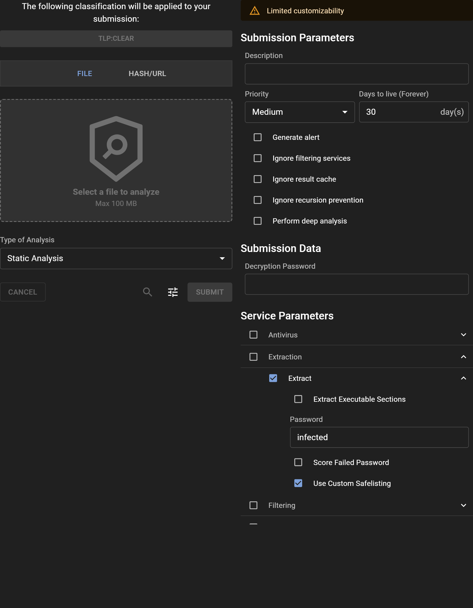

# Submission section

The submission configuration section (`submission:`) of the configuration file allows you to modify the parameters off how submissions are handled in the system.

Since this section is quite simple, we will list the default configuration at the same time as we describe the different values.

???+ example "Submission section configuration example"
    ```yaml
    ...
    submission:
      # Maximum amount of extracted files for a submission
      default_max_extracted: 500

      # Maximum amount of supplementary files for a submission
      default_max_supplementary: 500

      # Default amount of days submissions live in the system
      dtl: 30

      # Maximum amount of days submissions live in the system
      max_dtl: 0

      # Maximum extraction depth service can go
      max_extraction_depth: 6

      # Maximum file size allowed in the system
      max_file_size: 104857600

      # Maximum size of each metadata entry
      max_metadata_length: 4096

      # Types of tags to be included in the submission summary in
      # the attribution, behaviour and ioc sectiona.
      tag_types:
        attribution:
        - attribution.actor
        - attribution.campaign
        - attribution.exploit
        - attribution.implant
        - attribution.family
        - attribution.network
        - av.virus_name
        - file.config
        - technique.obfuscation
        behavior:
        - file.behavior
        ioc:
        - network.email.address
        - network.static.ip
        - network.static.domain
        - network.static.uri
        - network.dynamic.ip
        - network.dynamic.domain
        - network.dynamic.uri
    ...
    ```

!!! tip
    Refer to the [changing the configuration file](../config_file/#changing-the-configuration-file) documentation for more detail on where and how to change the configuration of the system.

## Submission Profiles

You can configure the system to share pre-configured submission parameters to your users. This is useful for onboarding new users to the system because they would only need to specify the profile they'd like to use and provide a file or resource for analysis.


The system out-of-the-box includes three submission profiles to select from but these can be overridden by using the `submission.profiles` configuration.

!!! note "The "Custom Analysis" profile is reserved to users that have the `submission_customize` role."
This role allows users to customize their submission as they see fit. Without that role, you're restricted based on the profile configurations set by the administrator.


### Can I use profiles to enforce certain parameters to be set?

Yes! As an administrator, you can specify exactly what parameters are preset for users and you can specify what parameters are allowed to be changed. This can be useful if you want to impose restrictions on certain users from making problematic submissions based on their parameters.

For example, based on the following profile configuration:

```yaml
submission:
  ...
  profiles:
    # Only perform static analysis
    - name: "static"
      description: "Analyze files using static analysis techniques and extract information from the file without executing it, such as metadata, strings, and structural information."
      display_name: "Static Analysis"
      classification: "TLP:CLEAR//REL TO GROUPA"
      restricted_params:
        submission: ["classification"]
        Extract: ["continue_after_extract"]
      params:
        services:
          selected: ["Static Analysis", "Extract"]
          excluded: ["Dynamic Analysis"]
        service_spec:
          Extract:
            password: infected
```

There is exactly one profile specified for the entire system and only members of `GROUPA` should have access to that profile.

Within that profile, the members that don't have the `submission_customize` role aren't able to configure the submission's classification and provide a password to the Extract service but the service selection is fixed to the services in the "Static Analysis" category along with the Extract service (which sets `continue_after_extract: false` by default on all submissions under this profile).

!!! question "What happens with service parameters that are not specified in the profile?"
Any service parameters that aren't declared in the profile will default to values set by system administrators. These can be found by navigating to the Services menu and looking at the "User Specified Parameters" within the "Parameters" tab of a service you've selected.

What this would look like in the UI for a limited user is:
!!! note "The following is based on the above example configuration"
    - The "Dynamic Analysis" category is omitted from Service Selection
    - `continue_after_extract` parameter for the Extract service has been removed
    - `password` parameter for the Extract service has a custom default set for the profile
    - The classification picker is disabled because it's explicitly a restricted parameter that the user can't change within that profile.


## Metadata Validation

You can configure the system to enforce metadata validation and presence when performing ingestion and archiving. This is a useful feature if you're looking to harmonize the metadata from different sources under a common scheme.

A lot of the configuration is around the parameters of the [ODM fields](https://github.com/CybercentreCanada/assemblyline-base/blob/master/assemblyline/odm/base.py) that Assemblyline uses internally for it's own data validation, so an example of configuring a field using a regex pattern would look like:

```yaml
validation_type: regex
validation_params:
  validation_regex: ^blee
```

So if you wanted to enforce the presence of a metadata field named `bloo` on submission and the value has to match that pattern, the configuration would be:

```yaml
submission:
  metadata:
    submit:
      bloo: # Field name
        validation_type: regex
        validation_params:
          validation_regex: ^blee
        required: true # Mandatory field to be set on submission
```

The configuration also supports applying strict metadata enforcement, which means a submitter can't add new metadata that the system isn't aware of relative to the scheme:

```yaml
submission:
  metadata:
    ingest:
      INGEST: # "type" parameter when using Ingest API (default: INGEST)
        epoch:
          validation_type: int
        name:
          validation_type: text
    submit:
      name:
        validation_type: text
  strict_schemes: ["INGEST"]
```

In the above example, if you're ingesting files under the `INGEST` type, then you can only set the `epoch` or `name` metadata. If there are any additional fields other than those two then the API will return an error. However, you are able to add additional metadata fields when using the Submit API but the `name` field still has to be a string/text type.

A configuration that's specific to the Ingest API is the use of a `submission.metadata.ingest._default`. This configuration is used to apply baseline validation rules across anyone using the Ingest API, including those who might have their own validation scheme based on ingest type.

For example, in the following:

```yaml
submission:
  metadata:
    ingest:
      _default:
        owner:
          validation_type: text
          required: true
      INGEST: # "type" parameter when using Ingest API (default: INGEST)
        epoch:
          validation_type: int
        name:
          validation_type: text
```

Someone who submits with `type: INGEST` has to have an `owner` field in their metadata of type `text` and can optionally provide an `epoch` and `name` meta which needs to be of the specified type. However, someone who submits with `type: TEST` only has to provide an `owner` field in the metadata for the validation to pass and for their submission to proceed to analysis.

### Can I combine this with Submission Profiles?

Yes! As the administrator of the system, you can configure profiles to have a fixed `type` parameter for submissions made over the Ingest API. This allows you to configure a set of profiles for an ingester and should the ingester choose a profile that performs metadata validation, they're forced to abide to the scheme you've set for them.

For example, you may have the configuration:

```yaml
submission:
  metadata:
    ingest:
      _default:
        owner:
          validation_type: text
          required: true
      data_collection:
        authorization:
          validation_type: text
          required: true
  profiles:
    - name: "data_collection_profile"
      description: "Profile used for data collection that is tied to metadata validation where "authorization" must be provided in the metadata."
      display_name: "Data Collection"
      classification: "TLP:CLEAR//REL TO COLLECTORS"
      params:
        type: "data_collection"
```

This configuration indicates that you've shared a profile called "Data Collection" to members of the `COLLECTORS` group which presets the `type` parameter of their submissions to `data_collection` which is associated to a metadata validation scheme that you have configured.

From the perspective of the user, if they're submitting using that profile they have to provide the necessary metadata (along with the resource to perform analysis) otherwise their submission will be rejected.
