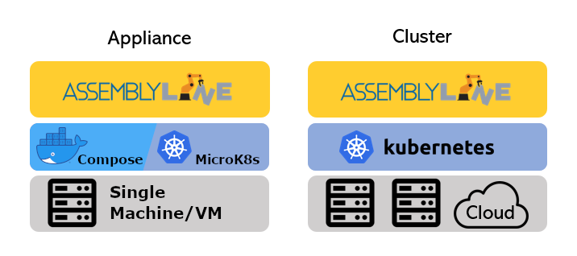

# Choose your deployment type

Assemblyline has two distinctive deployment types:

**Appliance**: Single host deployment

**Cluster**: Multi-host deployment

!!! warning
    Keep in mind that you will need extra hosts for running external resources such as anti-virus products, or sandboxes (such as [CAPE Sandbox](https://capev2.readthedocs.io/en/latest/)). These complementary products are not mandatory but will greatly complement the static analysis and file extraction performed by Assemblyline.

## Features

Both deployments are the same in terms of analysis capabilities however a cluster deployment can be scaled to scan multiple millions of files per day and offer redundancy and failover. If you are deploying in the cloud, a cluster will be easier to deploy (using cloud Kubernetes offerings). However, in a lab or to support an incident response team, any powerful computer with an appliance deployment will be able to process thousands of files a day.

!!! tip
    If you choose to deploy a MicroK8s appliance, you will be able to scaled it up to a small cluster using multiple machines (nodes) if need be.

### Deployment Feature Comparison

|                                           | Appliance (Docker)                     | Appliance (MicroK8s)                   | Cluster                                |
| ----------------------------------------- | -------------------------------------- | -------------------------------------- | -------------------------------------- |
| Support all analysis capabilities         | :material-checkbox-marked-outline: Yes | :material-checkbox-marked-outline: Yes | :material-checkbox-marked-outline: Yes |
| Single host installation                  | :material-checkbox-marked-outline: Yes | :material-checkbox-marked-outline: Yes | :material-checkbox-blank-outline: No   |
| Easy step by step installation            | :material-checkbox-marked-outline: Yes | :material-checkbox-marked-outline: Yes | :material-checkbox-blank-outline: No   |
| Simple to deploy and manage               | :material-checkbox-marked-outline: Yes | :material-checkbox-blank-outline: No   | :material-checkbox-blank-outline: No   |
| Multiple host installation                | :material-checkbox-blank-outline: No   | :material-minus-box-outline: Optional  | :material-checkbox-marked-outline: Yes |
| Auto-scaling of core components           | :material-checkbox-blank-outline: No   | :material-minus-box-outline: Optional  | :material-checkbox-marked-outline: Yes |
| High volume throughput                    | :material-checkbox-blank-outline: No   | :material-checkbox-blank-outline: No   | :material-checkbox-marked-outline: Yes |
| Cloud provider support (AKS, EKS, GKE...) | :material-checkbox-blank-outline: No   | :material-checkbox-blank-outline: No   | :material-checkbox-marked-outline: Yes |
| Redundancy / Failover support             | :material-checkbox-blank-outline: No   | :material-checkbox-blank-outline: No   | :material-checkbox-marked-outline: Yes |
| Internal TLS/SSL support                  | :material-checkbox-blank-outline: No   | :material-checkbox-marked-outline: Yes | :material-checkbox-marked-outline: Yes |

## Installation stack

Both clustered and MicroK8s deployments use a very similar stack in the background which allows them to share the same Helm chart. Only small changes in the values.yml file are required to differentiate them.

As for the Docker compose appliance deployment, it uses a simpler stack which is easier to maintain and reset but offer less features to scale to high capacity.

{: .center }

## Installation instructions

Now that you know the difference between the two types of deployment, you can refer to their respective installation instruction to get you started.

- [Appliance installation (Docker)](../appliance/docker)
- [Appliance installation (Microk8s)](../appliance/kubernetes-microk8s)
- [Cluster installation](../cluster)

!!! tip
    Consider reading the [configuration](../configuration/config_file/) section of the documentation before jumping into the installation instruction. This will help you understand all the different options you can modify during the installation process.

## Our current biggest deployment

Kibana cluster overview dashboard of the number of files ingested, completed, skipped, duplicates, etc. on our biggest deployment:

- Auto-scalable 12–72 nodes cluster (16 cores/64 GB RAM per node)
- Deployed in the cloud
- Receives up to 3.5M+ unique submissions a day (Avg. 1.5M)
- Plenty of downtime during the night
- Rarely uses the full node capacity
- Interacts with sandbox and antivirus systems outside of Assemblyline infrastructure
- A mix of file types, a mix of static and dynamic analysis
- Datastore consists of 12 x 1TB nodes

Number of nodes required on a typical day for our biggest deployment:

### Sandbox infrastructure (both Cuckoo and CAPE)
Nest: 16 CPUs / 64 GB RAM, 200 GB storage

Victims: 4 CPUs / 14 GB RAM, 64 GB storage

### Antivirus infrastructure
- 6 antivirus products
- ~5 servers per product (~30 servers)
- 8 CPUs / 16 GB RAM, 32 GB storage
