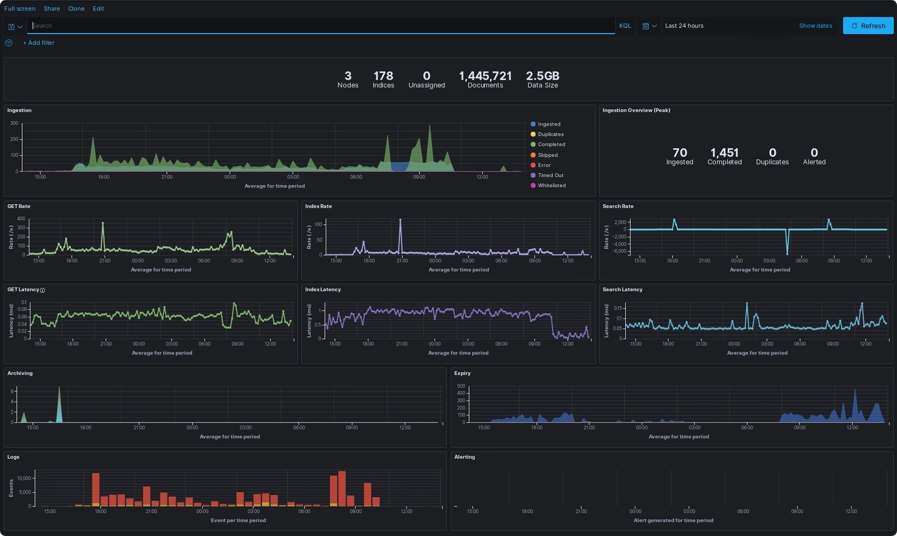

# Monitoring with ELK

The Assemblyline helm chart gives you the option of pointing logs to an existing ELK stack or having Assemblyline create its own internal ELK for logging and metrics.



## Elk Stack configuration

In the `values.yaml` file of your deployment, you can edit the following parameters to configure Assemblyline to send metrics and logs to a specific ELK stack. 

Choose the type of ELK stack deployment that corresponds the best to your setup: 

=== "Appliance Internal ELK stack"

    !!! example "Partial values.yaml config for an Appliance internal ELK stack"
        ```yaml
        ...
        # Have Assemblyline send logs to the configured ELK stack
        enableLogging: true

        # Have Assemblyline send metrics to the configured ELK stack
        enableMetrics: true

        # This would have Assemblyline send APM metrics to the
        #  configured ELK stack as well but it is very costly in 
        #  terms of resources so only turn it on if you really
        #  need insight on API response time and core components
        #  operation timing.
        enableAPM: false

        # We are setting up an internal ELK stack so we can turn that on
        internalELKStack: true
        
        # Because this is an appliance, we will reuse the same elastic
        #  database used for data to store logs as well
        seperateInternalELKStack: false

        # The internal ELK stack use elastic as its base username and
        #  does not verify TLS
        loggingUsername: elastic
        loggingTLSVerify: none
        ...
        ```

=== "Cluster Internal ELK stack" 

    !!! example "Partial values.yaml config for a cluster internal ELK stack"
        ```yaml
        ...
        # Have Assemblyline send logs to the configured ELK stack
        enableLogging: true

        # Have Assemblyline send metrics to the configured ELK stack
        enableMetrics: true

        # This would have Assemblyline send APM metrics to the
        #  configured ELK stack as well but it is very costly in 
        #  terms of resources so only turn it on if you really
        #  need insight on API response time and core components
        #  operation timing.
        enableAPM: false

        # We are setting up an internal ELK stack so we can turn that on
        internalELKStack: true
        
        # Because this is a cluster, we will have Assemblyline spin up 
        #  a completely different elastic database so the logging does not 
        #  interfere with the performance of the data
        seperateInternalELKStack: true

        # The internal ELK stack use elastic as its base username and
        #  does not verify TLS
        loggingUsername: elastic
        loggingTLSVerify: none
        ...
        ```

=== "External ELK stack"

    !!! example "Partial values.yaml config for external ELK stack"
        ```yaml
        ...
        # Have Assemblyline send logs to the configured ELK stack
        enableLogging: true

        # Have Assemblyline send metrics to the configured ELK stack
        enableMetrics: true

        # This would have Assemblyline send APM metrics to the
        #  configured ELK stack as well but it is very costly in 
        #  terms of resources so only turn it on if you really
        #  need insight on API response time and core components
        #  operation timing.
        enableAPM: false

        # We are setting up an external ELK stack so we will disable 
        #  those settings
        internalELKStack: false
        seperateInternalELKStack: false

        # -- EXTERNAL ELK Stack config -- 
        # Elastic host where the logs will be shipped to
        loggingHost: https://<ELK_HOST>:443/

        # Kibana dashboard location
        kibanaHost: https://<ELK_HOST>:443/kibana

        # Username that will be used to login to the elastic on your 
        #  ELK stack
        loggingUsername: <YOUR_ELK_USERNAME>

        # Should you verify TLS on your ELK stack? 
        loggingTLSVerify: "full"

        # Finally configure al_metrics to save metrics to your stack
        configuration:
          core:
            metrics:
              elasticsearch:
                hosts: ["https://${LOGGING_USERNAME}:${LOGGING_PASSWORD}@<ELK_HOST>:443"]
                # If you're using HTTPS and don't want certificate failures you can put 
                # your CA here
                host_certificates: |
                  -----BEGIN CERTIFICATE-----
                  ...
                  -----END CERTIFICATE-----

        ...
        ```

Finally update your deployment using `helm upgrade command`:

=== "Appliance"

    ```shell
    sudo microk8s helm upgrade assemblyline ~/git/assemblyline-helm-chart/assemblyline -f ~/git/deployment/values.yaml -n al
    ```

=== "Cluster"

    ```shell
    helm upgrade assemblyline <assemblyline-helm-chart>/assemblyline -f <deployment_directory>/values.yaml -n al
    ```

## Logstash Pipelines
You can write [custom pipelines](https://www.elastic.co/guide/en/logstash/current/pipeline.html) to help enrich your data when passed through Logstash. 

You can set your custom Logstash pipeline under `customLogstashPipeline` in your `values.yaml` file of your deployment.

!!! example "Partial values.yaml to add a simple Logstash pipeline"
    ```yaml
    ...
    # Turn on Logstash support 
    useLogstash: true
    customLogstashPipeline: |
      input {
        beats {
          port => 5044
          codec => "json"
        }
      }

      filter{
        mutate { add_field => {"sent_to_logstash" => "True"} }
      }

      output {
          elasticsearch{
            hosts => "http://elasticsearch:9200"
            index => "assemblyline-logs"
            codec => "json" 
        }
      }
    ...
    ```

## Kibana Dashboards
Within Kibana, there is the ability to use dashboards to visualize your data into one consolidated view to make it easier for monitoring, like a hub.

You can get our latest exported dashboards directly from the [assemblyline-base](https://github.com/CybercentreCanada/assemblyline-base/tree/master/kibana) source and then use Kibana import features to use them in your ELK Stack.

### Creation
[Dashboards](https://www.elastic.co/guide/en/kibana/current/dashboard.html) are made up of visualizations, and these can come in different forms: graphs, metrics, gauges, tables, maps, etc. 

Each visualization requires an index pattern to get the data from and setting a date range, this throws all relevant data within the specified timeframe into a bucket to be used by the visualization.

Dashboards can also be imported/exported for use across different ELKs **but** require dependencies like index patterns for them to function out of the box, otherwise requires editing the dashboard file.

### Navigation
All dashboards give you the ability to filter your data, like what you will find under the Discover tab of Kibana. This will allow you to filter a certain dashboard based on a query you give.

If you want more info about using Kibana's filtering and navigation feature, check the [explore your data](https://www.elastic.co/guide/en/kibana/current/discover.html) documentation.
