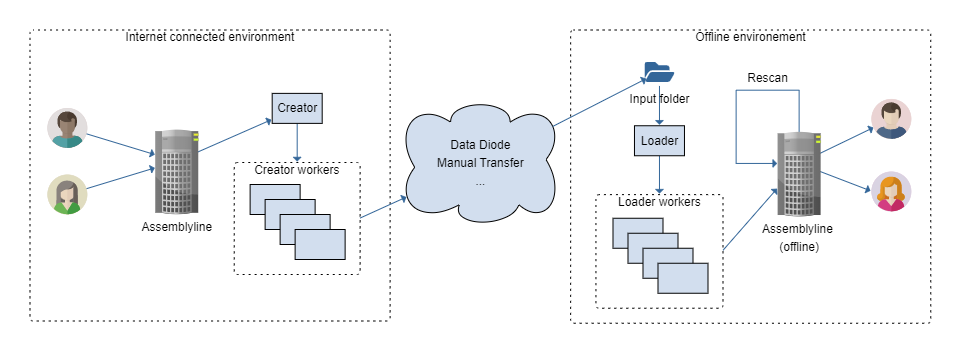

# Syncing Instances (Replay)

Replay is a new feature of Assemblyline that allows you to bridge the gap between online and offline deployments of Assemblyline. You will be able to start a scan on your online deployment, bundle the results, ship them to your offline enclave and continue the scans in the offline enclave.

## How it works

Replay has two main components:

* Replay Creator
* Replay Loader

The `Replay Creator` component will monitor either the alerts, the submissions or both and bundle them once they are completed including all their results, errors, files, etc. Those bundles will have to be transfered with the method of your choice to your offline enclave where the `Replay Loader` component will monitor a directory loading the bundles into your offline instance. Once these bundles are transferred onto your target system, the loader will be able to tell your offline instance to resume the scan and rescan the files with your offline services if you tell it to.



## Replay configuration file

Replay has its own configuration file that is seperate from the usual `config.yml` file found in an Assemblyline instance because it can run in an `API` mode which does not require a full Assemblyline config. In all cases, Replay will load its configuration file from `/etc/assemblyline/replay.yml` by default or from the file path specified in the `REPLAY_CONFIG_PATH` environment variable.

If you are using our helm chart to deploy Replay you will be able to simply put the content of your `replay.yml` file in the `replay:` section of the `values.yml` file but if you are using Replay in container or simple script mode you will have to create your own Replay config file and mount it at the right place. The examples below will show you how to do this.

In the meantime, here's a fully descriptive example of the Replay config file.

!!! example "Default replay.yml file"
    ```yaml
    ####################################
    # Replay Creator configuration block
    ####################################
    creator:
      # -------------------------------
      # Alert input configuration block
      # -------------------------------
      alert_input:
        # Is creator monitoring alerts for changes?
        enabled: true
        # Which queries are performed to tell if an alert is ready for Replay?
        #  DEFAULT:
        #     - The alert is not performing an extended scan
        #     - All workflows on this system have executed on the alert
        filter_queries:
          - NOT extended_scan:submitted
          - workflows_completed:true
        # Number of concurrent worker threads the Replay workers will use to
        # process alerts
        threads: 6

      # ------------------------------------
      # Submission input configuration block
      # ------------------------------------
      submission_input:
        # Is creator monitoring submissions for changes?
        enabled: true
        # Which queries are performed to tell if a submission is ready for Replay?
        #  DEFAULT:
        #     - There was a manual request for the submission to be replayed in
        #       the metadata
        filter_queries:
          - metadata.replay:requested
        # Number of concurrent worker threads the Replay workers will use to
        # process submissions
        threads: 6

      # ------------------------------------
      # Replay client configuration block (How Replay will connect to AL)
      # ------------------------------------
      client:
        # Type of connection (direct or api )
        type: direct
        # Options for the connection (only applies to api mode)
        options:
          # API Key that will be used to connect
          #  NOTE: creator needs READ privilege only
          apikey: devkey:devpass
          # Url to your Assemblyline server
          host: https://localhost:443
          # User that will connect via the API
          user: admin
          # Should the SSL connection be verified ?
          verify: true

      # Amount of time to lookback when checking for new alert/submission
      # NOTE: This is a datemath lucene value (examples: *, now-1d, now-1h, ...)
      lookback_time: '*'
      # Assemblyline filestore object where the bundle files will be created
      #  NOTE: This is similar to the urls found in the filestore configuration of the
      #        config.yml file. Supported types are: S3, Azure Blob, FTP, local and sftp
      output_filestore: file:///tmp/replay/output
      # Working directory for the creator and creator_worker processes
      working_directory: /tmp/replay/work


    ####################################
    # Replay Loader configuration block
    ####################################
    loader:
      # ------------------------------------
      # Replay client configuration block (How Replay will connect to AL)
      # ------------------------------------
      client:
        # Type of connection (direct or api )
        type: direct
        # Options for the connection (only applies to api mode)
        options:
          # API Key that will be used to connect
          #  NOTE: loader needs WRITE privilege only
          apikey: devkey:devpass
          # Url to your Assemblyline server
          host: https://localhost:443
          # User that will connect via the API
          user: admin
          # Should the SSL connection be verified ?
          verify: true

      # Directory where bundles that failed to load will be copied to
      failed_directory: /tmp/replay/failed
      # Directory from which we will monitor new files and load them in
      # the target instance. This will probably be an external directory
      # like an NFS mount...
      input_directory: /tmp/replay/input
      # Number of concurrent worker threads the loader worker will use
      # to load the bundle in the target instance
      input_threads: 6
      # Minimum classification that will be applied to each loaded bundle
      # regardless of their original classification
      min_classification: null
      # List of services that you which to rescan after the bundle is done importing
      # NOTE: If for example you have a different set of Yara rules on the source and
      #       target systems you could set that value to ['YARA']
      rescan: []
      # Working directory for the loader and loader_worker processes
      working_directory: /tmp/replay/work
    ```

## Helm Deployment

There are multiple ways to configure Replay so unfortunately there is no one size fits all configuration. The easiest setup by far is to use the different flags that we have pre-configured in our helm chart. Make sure you pull our latest helm chart to be able to benefit of this easy setup.

The helm chart deployment of Replay will automatically scale the worker components if there are too many bundles to create or load.

### Configure the source instance

The source instance is the one that will run the Replay Creator components. These components will have to write the alert and submission bundle somewhere. Conveniently, Replay uses the filestore feature of Assemblyline so you can use any type of storage that it supports to save your files.

* S3
* Azure blob
* FTP
* SFTP

When you know where your files are going to be saved to, edit the `values.yml` file of your helm deployment and add the following lines:

!!! example "Partial values.yaml config for Replay creator setup"
    ```yaml
    ...

    # Turn on Replay
    useReplay: true

    # Set Replay mode to creator
    replayMode: "creator"

    # Set the output folder for the creator worker
    replay:
      creator:
        output_filestore: <AN ASSEMBLYLINE FILESTORE LINK - SEE REPLAY CONFIGURATION FILE>

    ...
    ```

When this is done you can just perform an Helm upgrade to apply the changes to your instance.

### Configure the target instance

The target instance is the one that will run the Replay Loader components. These components will have to have direct access to a directory where the files transfered over are dropped. This limits what can be use so `NFS` is our recommended way for now.

Edit the `values.yml` file of your helm deployment and add the following lines:
!!! example "Partial values.yaml config for Replay loader setup"
    ```yaml
    ...

    # Turn on Replay
    useReplay: true

    # Set Replay mode to loader
    replayMode: "loader"

    # Make sure input folder is accessible
    replayLivenessCommand: "ls /tmp/replay/input"

    # Load input folder
    replayLoaderVolume:
      - name: replay-data
        nfs:
          server: localhost
          path: /path/to/folder

    ...
    ```

When this is done you can just perform an Helm upgrade to apply the changes to your instance.

## Alternate Deployment

If you are not using our helm chart to deploy Assemblyline, perhaps you are using a docker-compose deployment, there are alternatives on how to run the different Replay components

=== "Virtual Env using API"

    If you are using the API mode to launch Replay, you do not have to launch Replay in a container and can just use a normal python process in a virtual environment if you choose so.

    !!! important

        * You will need python 3.9+ to run the Assemblyline code, if you don't have it, use the container mode.
        * The user using the Replay creator needs an API Key with read access where as the user using the Replay loader needs an API Key with write access.
        * Because you are launching Replay directly as a process the replay.yml configuration has to be in `/etc/assemblyline/` folder.

    First of all, create your virtual environment and install the pre-requisite packages:
    ```shell
    python3.9 -m venv ~/replay_venv
    ~/replay_venv/bin/pip3.9 install assemblyline assemblyline-core assemblyline_client
    ```

    Then you can create your `/etc/assemblyline/replay.yml` configuration file and tell Replay to use the API mode:

    !!! example "Partial replay.yml configuration"
        ```yaml
        creator:
          client:
            type: api
            options:
              host: "https://<YOUR SOURCE SERVER DOMAIN/IP>:443",
              apikey: "<PASTE YOUR SOURCE API KEY>"
              user: <YOUR SOURCE USERNAME>
              verify: false
        loader:
          client:
            type: api
            options:
              host: "https://<YOUR SOURCE SERVER DOMAIN/IP>:443",
              apikey: "<PASTE YOUR SOURCE API KEY>"
              user: <YOUR SOURCE USERNAME>
              verify: false
        ```

    Finally, just run whichever components are relevant depending on the Assemblyline instance you are on:

    === "Source Assemblyline instance"

        Run the creator:
        ```shell
        ~/replay_venv/bin/python3.9 -m assemblyline_core.replay.creator.run
        ```
        And its worker:
        ```shell
        ~/replay_venv/bin/python3.9 -m assemblyline_core.replay.creator.run_worker
        ```

    === "Target Assemblyline instance"

        Run the loader:
        ```shell
        ~/replay_venv/bin/python3.9 -m assemblyline_core.replay.loader.run
        ```
        And its worker:
        ```shell
        ~/replay_venv/bin/python3.9 -m assemblyline_core.replay.loader.run_worker
        ```

=== "Docker container using API"

    If you are using the API mode to launch Replay, you will not be able to use the already existing Assemblyline containers to use Replay, you will have to build your own.

    !!! important

        * The user using the Replay creator needs an API Key with read access where as the user using the Replay loader needs an API Key with write access.
        * We will assume the configuration files for Replay are in a `replay_config` folder in you home directory.

    With the following Dockerfile in `~/replay_config/Dockerfile`:

    ```Dockerfile
    FROM cccs/assemblyline-core:stable

    pip install --no-cache-dir --user assemblyline_client
    ```

    Build your Replay container:

    ```shell
    (cd ~/replay_config/ && docker build --no-cache -t cccs/assemblyline-replay .)
    ```

    Then you can create your `~/replay_config/replay.yml` configuration file and tell Replay to use the API mode:

    !!! example "Partial replay.yml configuration"
        ```yaml
        creator:
          client:
            type: api
            options:
              host: "https://<YOUR SOURCE SERVER DOMAIN/IP>:443",
              apikey: "<PASTE YOUR SOURCE API KEY>"
              user: <YOUR SOURCE USERNAME>
              verify: false
        loader:
          client:
            type: api
            options:
              host: "https://<YOUR SOURCE SERVER DOMAIN/IP>:443",
              apikey: "<PASTE YOUR SOURCE API KEY>"
              user: <YOUR SOURCE USERNAME>
              verify: false
        ```

    Finally, just run which ever components are relevant depending on the Assemblyline instance you are on:

    === "Source Assemblyline instance"

        Run the creator:
        ```shell
        docker run --rm \
        --name assemblyline-replay-creator \
        -v ~/replay_config/replay.yml:/etc/assemblyline/replay.yml:ro \
        -v /tmp/replay/files:/tmp/replay/output \
        -v /tmp/replay/creator:/tmp/replay/work \
        cccs/assemblyline-core:stable \
        python -m assemblyline_core.replay.creator.run
        ```
        And its worker:
        ```shell
        docker run --rm \
        --name assemblyline-replay-creator-worker \
        -v ~/replay_config/replay.yml:/etc/assemblyline/replay.yml:ro \
        -v /tmp/replay/files:/tmp/replay/output \
        -v /tmp/replay/creator:/tmp/replay/work \
        cccs/assemblyline-core:stable \
        python -m assemblyline_core.replay.creator.run_worker
        ```

    === "Target Assemblyline instance"

        Run the loader:
        ```shell
        docker run --rm \
        --name assemblyline-replay-loader \
        -v ~/replay_config/replay.yml:/etc/assemblyline/replay.yml:ro \
        -v /tmp/replay/files:/tmp/replay/output \
        -v /tmp/replay/creator:/tmp/replay/work \
        cccs/assemblyline-core:stable \
        python -m assemblyline_core.replay.loader.run
        ```
        And its worker:
        ```shell
        docker run --rm \
        --name assemblyline-replay-loader-worker \
        -v ~/replay_config/replay.yml:/etc/assemblyline/replay.yml:ro \
        -v /tmp/replay/files:/tmp/replay/output \
        -v /tmp/replay/creator:/tmp/replay/work \
        cccs/assemblyline-core:stable \
        python -m assemblyline_core.replay.loader.run_worker
        ```

=== "Docker container direct DB Access"

    This scenario is mainly going to be used if you have a docker-compose appliance of Assemblyline so you can just run a couple extra containers to get Replay going. Since you have direct access to Assemblyline's Database and queues you do not have to create a special container and can just use the core container.

    !!! important
        We will assume that all you are running an appliance out of you home folder (`~/appliance/`). You should adjust the paths correctly to fit your installation.

    First of all, you will need to create your `replay.yml` file in your `~/appliance/config` directory:

    !!! example "Partial replay.yml configuration"
        ```yaml
        creator:
          client:
            type: direct
        loader:
          client:
            type: direct
        ```

    Then you can just run which ever components are relevant depending on the Assemblyline instance you are on:

    === "Source Assemblyline instance"

        Run the creator:
        ```shell
        docker run --rm \
        --name assemblyline-replay-creator \
        -v ~/appliance/config/classification.yml:/etc/assemblyline/classification.yml:ro \
        -v ~/appliance/config/config.yml:/etc/assemblyline/config.yml:ro \
        -v ~/appliance/config/replay.yml:/etc/assemblyline/replay.yml:ro \
        -v /tmp/replay/files:/tmp/replay/output \
        -v /tmp/replay/creator:/tmp/replay/work \
        cccs/assemblyline-core:stable \
        python -m assemblyline_core.replay.creator.run
        ```
        And its worker:
        ```shell
        docker run --rm \
        --name assemblyline-replay-creator-worker \
        -v ~/appliance/config/classification.yml:/etc/assemblyline/classification.yml:ro \
        -v ~/appliance/config/config.yml:/etc/assemblyline/config.yml:ro \
        -v ~/appliance/config/replay.yml:/etc/assemblyline/replay.yml:ro \
        -v /tmp/replay/files:/tmp/replay/output \
        -v /tmp/replay/creator:/tmp/replay/work \
        cccs/assemblyline-core:stable \
        python -m assemblyline_core.replay.creator.run_worker
        ```

    === "Target Assemblyline instance"

        Run the loader:
        ```shell
        docker run --rm \
        --name assemblyline-replay-loader \
        -v ~/appliance/config/classification.yml:/etc/assemblyline/classification.yml:ro \
        -v ~/appliance/config/config.yml:/etc/assemblyline/config.yml:ro \
        -v ~/appliance/config/replay.yml:/etc/assemblyline/replay.yml:ro \
        -v /tmp/replay/files:/tmp/replay/output \
        -v /tmp/replay/creator:/tmp/replay/work \
        cccs/assemblyline-core:stable \
        python -m assemblyline_core.replay.loader.run
        ```
        And its worker:
        ```shell
        docker run --rm \
        --name assemblyline-replay-loader-worker \
        -v ~/appliance/config/classification.yml:/etc/assemblyline/classification.yml:ro \
        -v ~/appliance/config/config.yml:/etc/assemblyline/config.yml:ro \
        -v ~/appliance/config/replay.yml:/etc/assemblyline/replay.yml:ro \
        -v /tmp/replay/files:/tmp/replay/output \
        -v /tmp/replay/creator:/tmp/replay/work \
        cccs/assemblyline-core:stable \
        python -m assemblyline_core.replay.loader.run_worker
        ```
