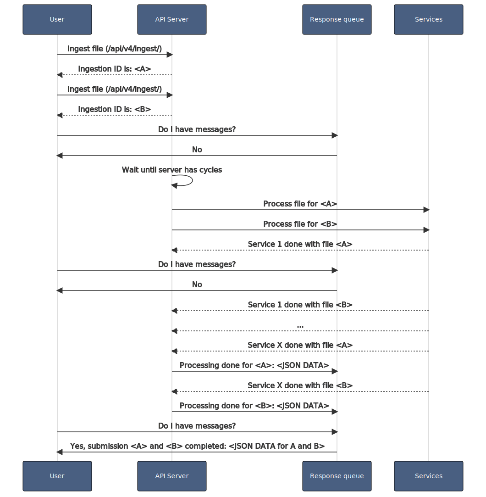
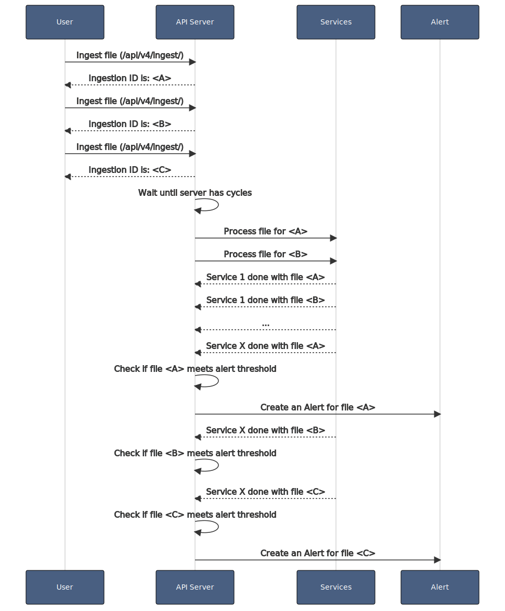
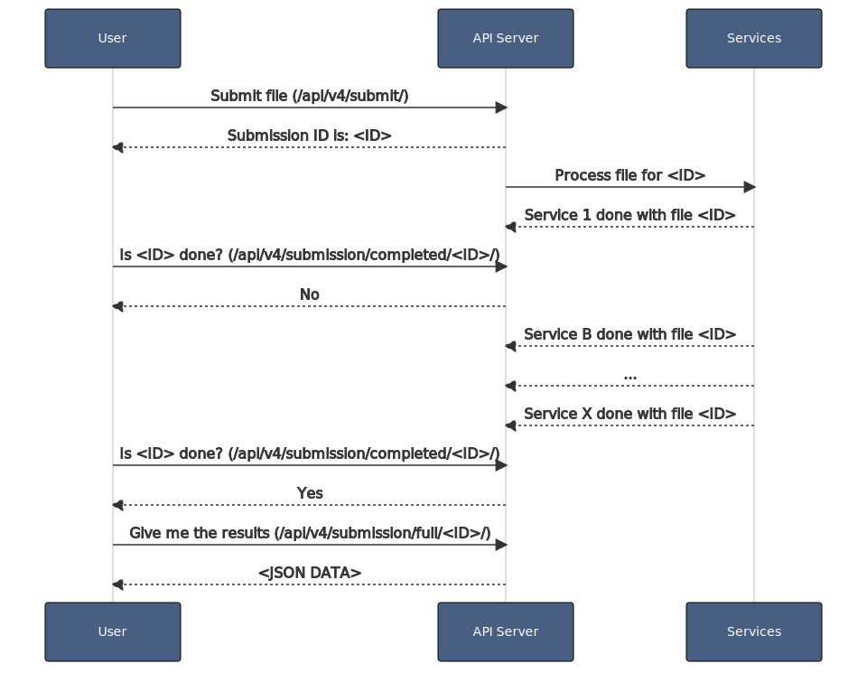

# Choosing your ingestion method

While integrating Assemblyline with other systems, the first thing you will need to do is to pick an ingestion method.

Assemblyline gives you two options:

1. Asynchronous (Using the Ingest API: **/api/v4/ingest/**)
2. Synchronous (Using the Submit API: **/api/v4/submit/**)

We will give you here a rundown of the different particularities of each method so you can pick the one that fits your needs the best.

## Asynchronous ingestion

This is the preferred ingestion method for use with Assemblyline. In this mode, Assemblyline will queue your submission based on priority and will process them when the services have empty processing cycles. For each submission in this mode, you will get assigned an ingestion ID and you can be notified via a completion queue when your file has completed scanning. Alternatively, you can use the alerting page in the Assemblyline UI if you want to only view asynchronous submissions that Assemblyline deems highly suspicious.

The asynchronous model was built to sustain a large sample set of files and to help analysts focus on what is important.

### Benefits and Drawbacks

!!! success "Benefits"

    - [x] Support large volume of files for processing
    - [x] Not subjected to quota limits
    - [x] Allows for alerting functionality to be used
    - [x] Will resort to data sampling if it gets overwhelmed with too many files
    - [x] Does submission-level caching if the same file is submitted twice with the same parameters, for performance optimization

!!! Failure "Drawbacks"

    - [ ] Submissions may sit in the queue a long time if the system is busy
    - [ ] Submissions may be skipped if the system is overwhelmed
    - [ ] Metadata is not searchable for all submissions since the system does not create a submission entry for cache submissions

### Typical use cases

Here are the typical use cases that users encounter while using the asynchronous submission mode in the system.

??? example "Using the Ingest API while reading a message from the notification queue"

    1. The user submits all its files and receives ingestion IDs for its files
        * API: **/api/v4/ingest/**
    2. The user asks the notification for messages until it receives a confirmation message for all its files
        * API: **/api/v4/ingest/get_message_list/**

    This is how this works in the backend:
    {: .center }

??? example "Using the Ingest API ignoring the notification queue but using the alert perspective"

    1. The user submits all its files and ignores the returned ingestion IDs
        * API: **/api/v4/ingest/**
    2. The user then monitors the UI alerting perspective for newly created alerts
        * UI: **/alerts**

    This is how this works in the backend:
    {: .center }

## Synchronous ingestion

In this mode, Assemblyline will start the scanning of your file right away and will return you the ID of your submission. You will be able to use this ID to ask the system if the submission is complete and to pull the results when all the services are done reporting results for that submission.

This is more suited for a small volume of files and manual analysis. Files submitted via the User interface are using the synchronous mode.

### Benefits and Drawbacks

!!! success "Benefits"

    - [x] Instant scanning
    - [x] Higher priority than asynchronous
    - [x] Submission guaranteed to be processed (no data sampling)
    - [x] Metadata searchable for all submissions

!!! Failure "Drawbacks"

    - [ ] Subjected to quota (Default: 5 concurrent submissions)
    - [ ] Not suited for large volume of files
    - [ ] No submission-level caching
    - [ ] Alerting not available

### Typical use cases

Here are the typical use cases that user's encounter while using the synchronous submission mode in the system.

??? example "Using the Submit API waiting for the submission to be done"

    1. The user sends its file for processing and receives an ID for its submission
        * API: **/api/v4/submit/**
    2. The user queries the `is completed` API until the system says the submission is completed
        * API: **/api/v4/submission/is_completed/<ID>/**
    3. The user pulls the results for the submission
        * API: **/api/v4/submission/full/<ID>/**

    This is how this works in the backend:
    {: .center }

## Mass Submission Toolkit
The [Assemblyline Incident Manager](https://github.com/CybercentreCanada/assemblyline-incident-manager) can assist you with submitting a large amount of files, such as every file on a hard drive for example. It utilizes the ingest API that we just talked about.

The Cyber Centre uses this tool when we are in a pinch and need to ingest millions of files to Assemblyline without learning how to use the APIs.

One key consideration for submitting a large volume of files in a burst is the `default sampling values` in the [Ingester Configuration](../../odm/models/config/#ingester).

You must keep your ingestion flow at a rate such that the size of the priority ingestion queue remains lower than the corresponding priority queue `sampling_at` values, otherwise, Assemblyline will skip files.
