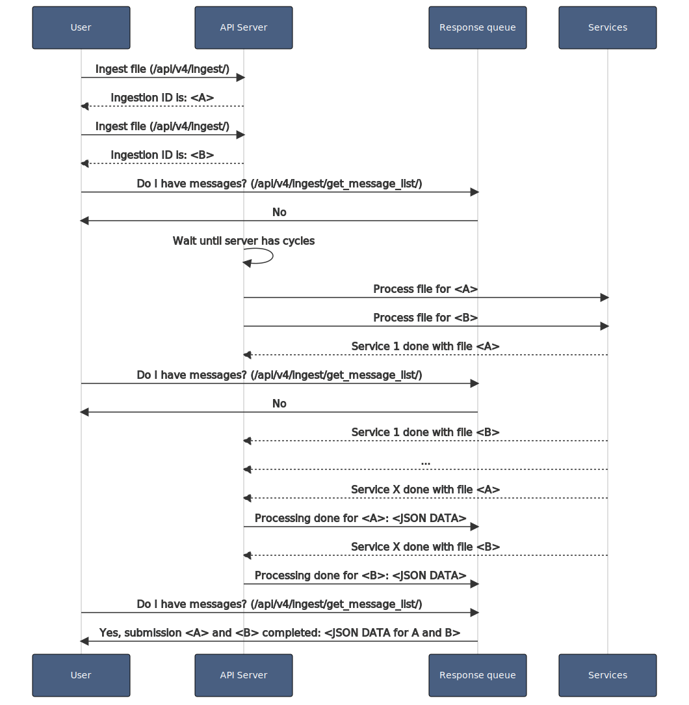

# Choosing your ingestion method

While integrating Assemblyline with other systems, the first thing you will need to do is to pick an ingestion method. 

Assemblyline give you two options:

1. Synchroneous (Using the Submit API)
2. Asynchroneous (Using the Ingest API)

We will give you here a run down of the different particularities of each method so you can pick the one that fits your needs the best.

## Synchroneous ingestion

In this mode, Assemblyline will start scanning of your file right away and will return you the ID of your submission. You will be able to use thid ID to ask the system if the submission is complete and to pull the results when all the services are done reporting result for that submission.

This is more suited for very small volume of files and for manual analysis. Files submitted via the User interface are using the synchroneous mode.

### Benefits and Drawbacks 

!!! success "Benefits"

    - [x] Instant scanning
    - [x] Higher priority then Asynchroneous
    - [x] Submission garanteed to be processed 
    - [x] Metadata searchable for all submissions

!!! Failure "Drawbacks"

    - [ ] Subjected to quota (Default: 5 concurrent submission)
    - [ ] No suited for high load 
    - [ ] No submission level caching
    - [ ] Alerting not available

### Typical use cases

Here are the typical use cases that user's encounter while using the Synchroneous submission mode in the system.

??? example "Using the Submit API waiting for the submission to be done"
    
    1. The user sends its file for processing and receives and ID for its submission
    2. The user queries the `is completed` API until the system says the submission is completed
    3. The user pull the results for the submission

    This is how this works in the backend: 
    {: .center }

## Asynchroneous ingestion

In this mode, Assemblyline will queue your submission based on priority and will process them when the services have empty processing cycles. For each submissions in this mode, you will get assigned a ingestion ID and you can be notified via a completion queue when your file has completed scanning. Alternatively, you can use the alerting page in the Assemblyline UI if you want to only view Asynchroneous submission that Assemblyline deems highly suspicious. 

Asynchroneous mode was built to sustain a very large sampleset of files and to help analyst focus on what is really important.

### Benefits and Drawbacks 

!!! success "Benefits"

    - [x] Support very large volume of files
    - [x] No subjected to any quota
    - [x] Will resort to data sampling if it get overwhelmed with too many files
    - [x] Allow for alerting perspective to be used 
    - [x] Does submission level caching if the same file is submitted twice with the same parameters

!!! Failure "Drawbacks"

    - [ ] Submissions may sit in the queue a long time if system is very busy
    - [ ] Submissions may be skipped if system is overwhelmed
    - [ ] Metadata is not searchable for all submissions since the system does not create a submission entry for cache submissions

### Typical use cases

Here are the typical use cases that user's encounter while using the Asynchroneous submission mode in the system.

??? example "Using the Ingest API while reading message from the notification queue"
    
    1. The user submits all its files and receives ingestion IDs for its files
    2. The user asks the notification for messages until it receives a confirmation message for all its files

    This is how this works in the backend: 
    {: .center }

??? example "Using the Ingest API ignoring the notification queue but using the alert perspective"
    
    1. The user submits all its files and ignores the returned ingestion IDs
    2. The user then monitors the UI alerting perspective for newly created alers
    
    This is how this works in the backend: 
    {: .center }

