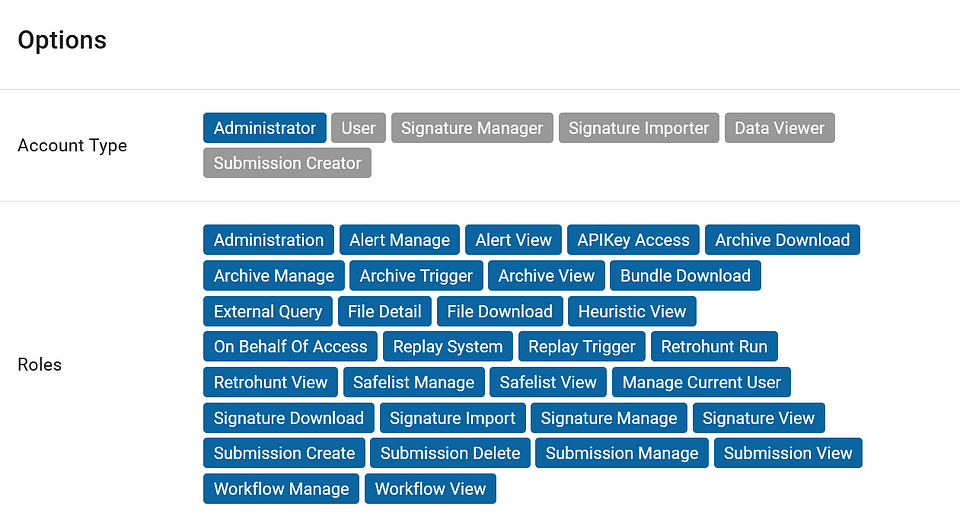
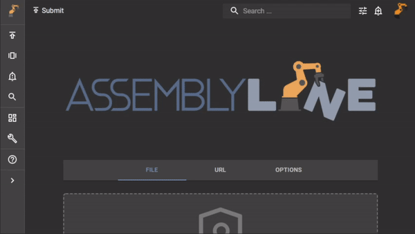

# Generating an API key

While integrating Assemblyline to another system, you should not save your username and password into another app. Instead, you should create an API Key with only the appropriate requirements for that specific integration.

## Role-based Access Controls

All APIs have role-based access controls (RBAC) and require users to be authenticated to use those APIs through basic authentication like username and password, API keys, certificates, etc.

API keys can be defined to have specific restraints that are less than or equal to those imposed on the owner.

The APIs also drive whether information should be made accessible to a user by comparing the classification of the requester against the data asked to retrieve.

## Create an API key

Here is how to do this:

{: .center }

- [x] Login to Assemblyline's user interface with the user that will perform API requests
- [x] Click on your avatar in the top-right corner of the Assemblyline UI and select "Manage Account"
- [x] Scroll down to the bottom to the "Security" section and select "Manage API Keys"
- [x] Add the API Key name, select access privileges then click the "Add" button.
- [x] The API KEY will only be displayed once and can't be recovered. Copy it somewhere safe so that you can use it later.
- [x] Click the "Done" button.
