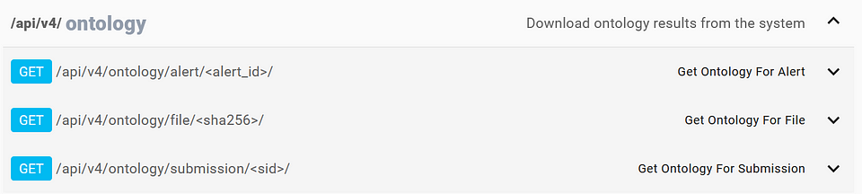

# Ontology

The data returned for standard APIs is structured in a way that is tailored for the frontend of Assemblyline, because the frontend relies on these APIs for its data also.

Using the Ontology APIs, it's easier to export analysis results from Assemblyline to feed into other systems without having to parse data intended to be rendered in the UI for human consumption.

For machine-to-machine parsing, we recommend the use of the Ontology APIs.

At the Cyber Centre, we are currently using the Ontology APIs to export submission results to a [Superset](https://superset.apache.org/) deployment for data visualization and big-data analytics.

For more details regarding the Ontology output, see [here](../../odm/models/ontology/ontology).
