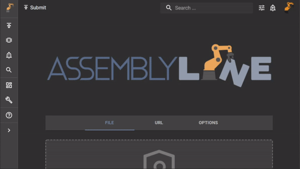

# RESTful API

When it is impossible to integrate your application using the dedicated Python or Java clients, you can use Assemblyline's RESTful API to perform any task that you can think of.

## API documentation

Each instance of Assemblyline comes with its internal API documentation which can be viewed by browsing to [https://yourdomain/help/api](https://yourdomain/help/api)

{: .center }

## Connecting to the API

For easy integration, it is recommended that you generate an [API key](../key_generation) for the user who will perform RESTful queries. Otherwise, you will have to build yourself a library that will handle session cookies and XSRF tokens and you probably want something simpler.

### Using the API key

To use your newly created [API key](../key_generation) you can simply add the `X-USER` and `X-APIKEY` headers to your request and the system will identify you with that key at each request instead of relying on a session cookie.

!!! example "Simple api call"

    Let's use a hypothetical [API key](../key_generation) to ask the system who we are. (Using the `/api/v4/user/whoami/` API)


    === "CURL"
        ``` shell
        curl -X GET "https://yourdomain/api/v4/user/whoami/" \
            -H 'x-user: <your_user_id>' \
            -H 'x-apikey: <key_name:randomly_generated_password>' \
            -H 'accept: application/json'
        ```

    === "Javascript (fetch)"
        ``` javascript
        fetch(
        "https://yourdomain/api/v4/user/whoami/",
        {
            "headers": {
            "accept": "application/json",
            "x-apikey": "<key_name:randomly_generated_password>",
            "x-user": "<your_user_id>"
            },
            "method": "GET"
        }
        );
        ```

    === "Python (requests)"
        ``` python
        import requests
        requests.get(
            "https://yourdomain/api/v4/user/whoami/",
            headers={
                "x-user": "<your_user_id>",
                "x-apikey": "<key_name:randomly_generated_password>",
                "accept": "application/json"
            }
        )
        ```

!!! example "Submit a file to the API"

    !!! tip "Submit API was used here but you can use the ingest API with the same parameters."

    Now if we were to reuse that same [API key](../key_generation) to submit a file to the system, not only you need to pass the
    `X-USER`, `X-APIKEY` and `ACCEPT` headers, you also need to pass at least one of the two multipart sections:

    - `json` (optional): This is a JSON dictionary with 3 possible keys
        - `name` (optional): Name of the file, otherwise `bin.filename` is used
        - `params` (optional): Changes to the default submission parameters for the user
        - `metadata` (optional): Metadata to be added to the submission
    - `bin` (required): the actual file to be scanned

    === "CURL"
        ```shell
        curl -X POST https://yourdomain/api/v4/submit/ \
            -H 'x-user: <your_user_id>' \
            -H 'x-apikey: <key_name:randomly_generated_password>' \
            -H 'accept: application/json' \
            -F 'json={"params": {"description": "My CURL test"}, "metadata": {"any_key": "any_value"}}' \
            -F 'bin=@myfile.txt'
        ```

    === "Python (requests)"
        ``` python
        import requests
        import json

        requests.post(
            "https://yourdomain/api/v4/submit/",
            headers={
                "x-user": "<your_user_id>",
                "x-apikey": "<key_name:randomly_generated_password>",
                "accept": "application/json",
                "content-type": None
            },
            files={'bin': open('myfile.txt', 'rb')},
            data={'json': json.dumps({'params': {'description': 'My CURL test'}, 'metadata': {'any_key': 'any_value'}})}
        )
        ```

## API Gotcha!

!!! tip "Here is a list of the most common issues users are facing while using the API"

### Wrong content type

All Assemblyline APIs are built around receiving and returning JSON data. Do not forget to set your `Content-Type` and `Accept` headers to `"application/json"` or you might encounter some issues.

### Trailing forward slash

All Assemblyline APIs end with a trailing forward slash `"/"`. Make sure that the API URL has it at the end of the URL otherwise you may get a `"Method not allowed"` error and you'll have issues figuring out why.
