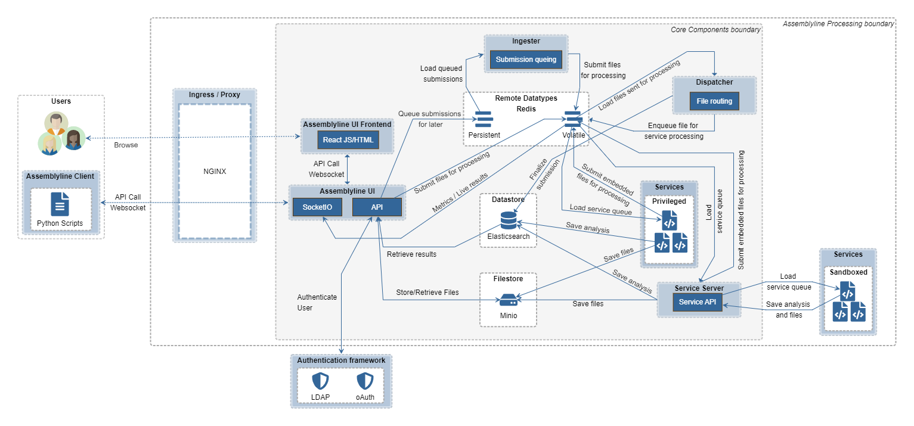

# System Architecture

Assemblyline architecture is somewhat complex to understand because there are many moving pieces. In this section, we will describe every single component of Assemblyline and will give you visual examples on how the different components interact with each other. We will do that by first setting the scene by describing a scenario done in Assemblyline then describing all the components in that scenario.

## Submitting files to Assemblyline

Here's how submitting files to Assemblyline takes place. The user browses to the UI Frontend and submits a file through the web interface. The frontend takes that file and hands it off to the API Server. Alternatively, the user uses the Assemblyline client to connect directly to the API server. Once the API server receives the file, it saves the file to the filestore and creates a tasking message in Redis (volatile) for the Dispatcher to pick up.

Dispatcher will be notified by Redis that a new task has come in, will identify the file and will route that file to the appropriate service by pushing a new message for the service in its service queue.

Services long poll the Service Server API, when a new task enters their queue, they will get the file from Service Server and start processing it. Once they are done, they will send their analysis results to Service Server along with any embedded or supplementary file they have collected during analysis. The analysis results will be saved into the database by Service Server and the new embedded files will be sent back to the Dispatcher via Redis so that it can dispatch them to a new set of services for reprocessing.

Once all associated files are done, Dispatcher will mark the submission as complete in the database.

### Alternate submission method

If the ingestion API is used instead of the submit API, an alternate asynchroneous process is kick off. Instead of going directly to Dispatcher, the Submission will be queued in Redis (persistent). The Ingester process will monitor that queue and will slowly feed Dispatcher. This alternate method is for a high volume of submissions. Instead of having a million files processed at the same time in the system, they are queued and processed in batches by priority. This ensures the system can survive giant bursts of files at the same time without falling over.

### Alternate service process

Some services may run in privileged mode. This means that they are allowed to bypass Service Server (which makes them much faster) and that they can pull their tasks directly from Redis, save their analysis results directly into the datastore, and save their embedded and supplementary files directly into the filestore.

!!! tip "Running in privilege mode is only recommended for services that do not execute the files because these services have complete access to all core components instead of only having access to Service Server."

### Components part of the file submission process

#### UI Frontend

This is the component that, as a user, you will be the most familiar with. This component provides the User Interface (UI) of Assemblyline. This is the first thing that you see once you deploy Assemblyline and the component you interact with the most. Assemblyline's frontend is built using [React](https://reactjs.org/) with a [Material UI](https://v4.mui.com/getting-started/installation/) theme sitting of top of it. It supports light and dark themes as well as internationalization.

#### UI

!!! tip "The UI component used to provide the User Interface and API to Assemblyline but does not provide the User Interface anymore. The User Interface code was moved to the UI Frontend component when the interface switched to React."

Nowadays, the UI component provides the user-facing API server of Assemblyline as well as a SocketIO Server for live messaging. The API Server is responsible to identify the user either using an internal list of users or by communicating with your LDAP or oAuth server. It keeps track of the user sessions to make sure users only get access to the APIs they are allowed to. It also does document-level access control to make sure that the data returned by the APIs is in fact data that the user is allowed to see.

#### Dispatcher

Dispatcher is the core tasking component of the system. It checks the type of file submitted to the system and routes each file to the appropriate service depending on service availability and file type. It keeps track of children for a given file (zip extraction, etc.) and ensures that a submission is not completed until all the children have been processed and all files have been sent to the appropriate services. Dispatcher keeps track of errors in the system and re-queues jobs if it detects a failure that is recoverable. It is the Dispatcher’s job to mark a submission as completed when all work is done. Dispatcher does all its queuing using non-persistent Redis queues. If the Dispatcher is restarted, all inflight submissions are restarted from the beginning. This is usually not a problem because Assemblyline has service-level caching.

Dispatcher also keeps metrics on how many files are being completed in the system over a given interval.

#### Ingester

Ingester is Assemblyline’s high volume ingestion component. It takes all submissions created using the
ingest API and sorts them into different priority queues (Critical, High, Medium, and Low). It then fills half of the Dispatcher's maximum inflight queue with submissions starting with the highest priority queues and continuing until all queues are exhausted.

!!! tip "The priority queues are starving queues. All critical submissions are processed before starting high submissions and so on..."

Ingester can also deal with impossible-to-finish backlogs. When the queues reach a certain threshold,
Ingester will start sampling the queues using a method that is increasingly aggressive in proportion with the size of the backlog to randomly remove submissions from the priority queues to ensure that the queues don't keep growing forever.

Ingester also ensures that work isn’t duplicated by deduplicating submissions before it sends them to the
Dispatcher. If provided, it also applies safelisting regular expressions to the metadata of the submissions.

Metrics are reported on the number of duplicate, ingested, safelisted, and completed files as well as the
number of bytes ingested and completed.

<!--
## Exerpt from Assemblyline 3 user manual

EXPIRY / EXPIRY WORKERS
Expiry takes care of data deletion by cleaning up every piece of information that has reached its Time To Live
2
(TTL). Every single piece of information in Assemblyline is tagged with an __expiry_ts__ field, which dictates
the time at which this information will disappear from the system. Expiry uses SOLR indexing and searches for
expired data. It then queues the items of data for the expiry workers to delete from the system
As part of system optimization, one of the data buckets (emptyresult) does not use search to expire the data.
Instead, we use journal files and avoid having to index a large amount of data that we only use for caching. This
is explained in more detail later in the data layout section.
Data is expired from the system because Assemblyline is not designed to be a Knowledge Base. Default TTL for
the data is 15 days.
JOURNALIST
Journalist is an expiry system optimization, it takes care of writing journal files for emptyresult items. It reads
those items from Redis queues and writes them to time stamped files for expiry to process later.
ALERTER
Alerter is the component responsible for generating alerts. It receives a notification from Ingester for all
submissions where an alert was requested and the submission’s score reaches the system’s alert threshold.
When creating an alert, alerter gathers the features (Tags) the system has extracted for the submission and
generates an alert based on the mix of these features and the metadata that was part of the original
submission.
Even though submissions are deduped at the Ingester level, Ingester keeps track of these duplicates and,
in the case of an alert, sends a notification for each duplicate to alerter. Alerter then creates one individual
alert for every file ingested. This way, if one file was seen a 100 times we will have a 100 alerts and the
associated metadata for each individual alert. The data can then be used to create a threat profile and more
easily mitigate the problem.
ALERT ACTIONS
Alert actions is used to make sure two actions taken on a specific alert happen one after the other and not at
the same time. All API calls or workflow actions to labels, priority, ownership, or status of an alert are placed in
a Redis queue and dispatched to an internal alert action instance using a deterministic feature of the alert. This
ensures the actions are processed sequentially but are still distributed to multiple processes for speed. Alert
actions also report metrics on the number of alerts created.

WORKFLOW FILTERS
On the alert page of the system, analysts can build and save search queries that can then be used for labelling,
changing the priority, or changing the status of an alert. Workflow filter runs those queries on newly inserted
alerts and sends messages to alert actions to apply the action described to all alerts matching the query.
SYSTEM METRICS
System metrics is in charge of gathering CPU, memory, load, network and many other metrics and shipping
those directly to the ElasticSearch database on the Logger server. It also gathers Riak and SOLR specific metrics.
This component is only installed when a Logger server is defined in the seed.
METRICSD
The Metricsd component aggregates Assemblyline specific counters reported by Ingester, dispatcher,
alerter, and hostagent over one minute intervals and stores these aggregated counters in the ElasticSearch
database on the Logger server. This component is only installed when a Logger server is defined in the seed.
CONTROLLER
Controller is an extremely lightweight component that runs on the workers. Controller’s only responsibility is to
start, stop, and restart the hostagent component. This functionality is used by the host management page so
we can restart the hostagent in batch without having to log in to the individual boxes.
HOSTAGENT
Hostagent is the component responsible for reading the worker’s profile from the datastore and loading the
number of services and VMs as described in that profile. It keeps track of each service and VM that it launches
and makes sure that they stay alive. It is also responsible for providing heartbeats to the system to let the UI
and the dispatcher know that the different services are alive and are ready to receive tasks. When the
hostagent tries to instantiate a VM, it will make sure that it actually has the VM disks on the worker host and
download them if they are missing.
Hostagents report metrics on the effectiveness of the service caching.
QUOTASNIPER
QuotaSniper is the component that makes sure that the different quotas and sessions for each user expire at
the right time.
Assemblyline is made of many different components with each have a different purpos -->
