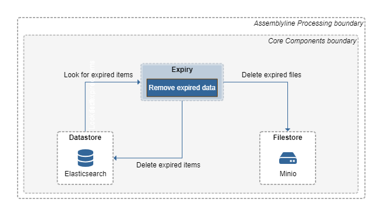

# System Architecture

The Assemblyline system architecture is somewhat complex to understand because there are many moving pieces. In this section, we will describe every component of Assemblyline and will give you visual examples of how the different components interact with each other. We will do that by first setting the scene by describing a scenario done in Assemblyline and then describing all the components in that scenario.

## Submitting files to Assemblyline

Here's how submitting files to Assemblyline takes place. The user browses to the User Interface (UI) Frontend and submits a file through the web interface. The frontend takes that file and hands it off to the API Server. Alternatively, the user uses the Assemblyline client to connect directly to the API server and submits a file via the client. Once the API server receives the file, it saves the file to the filestore and creates a tasking message in Redis (volatile) for the Dispatcher to pick up.

The Dispatcher will be notified by Redis that a new task has come in, will identify the file, and will route that file to the appropriate services by pushing a new message for the services in its service queue.

Services long poll the Service Server API, and when a new task enters their queue, they will get the file from the Service Server and start processing it. Once they are done, they will send their analysis results to the Service Server along with any embedded or supplementary files they have collected during analysis. The analysis results will be saved into the database by the Service Server and the new embedded files will be sent back to the Dispatcher via Redis so that it can dispatch them to a new set of services for reprocessing.

Once all associated files are done processing, the Dispatcher will mark the submission as complete in the database.

### Alternate submission method

If the ingestion API is used instead of the submit API, an asynchronous process is started. Instead of going directly to the Dispatcher, the Submission will be queued in Redis (persistent). The Ingester process will monitor that queue and will slowly feed the Dispatcher. This alternate method is for a high volume of submissions. Instead of having a million files processed at the same time in the system, they are queued and processed in batches by priority. This ensures the system can survive giant bursts of files at the same time without falling over.

### Alternate service process

Some services may run in "privileged" mode. This means that they are allowed to bypass the Service Server (which makes them much faster) and pull their tasks directly from Redis. Privileged services can also save their analysis results directly into the datastore and save their embedded and supplementary files directly into the filestore.

!!! tip "Running in privilege mode is only recommended for services that do not execute the files directly on their containers because these services have complete access to all core components instead of only having access to the Service Server."

### File submission components

#### UI Frontend

This is the component that, as a user, you will be the most familiar with. This component provides the UI of Assemblyline. This is the first thing that you see once you deploy Assemblyline and the component that you interact with the most. Assemblyline's frontend is built using [React](https://reactjs.org/) with a [Material UI](https://v4.mui.com/getting-started/installation/) theme sitting on top of it. It supports light and dark themes as well as internationalization.

#### UI

!!! tip "A previous iteration of the UI component provided both the User Interface and API to Assemblyline. The current iteration of the UI component does not provide the User Interface anymore. The User Interface code was moved to the UI Frontend component when the interface switched to React."

Nowadays, the UI component provides the user-facing API server of Assemblyline as well as a SocketIO Server for live messaging. The API Server is responsible for identifying the user either with an internal list of users or by communicating with your LDAP or OAuth server. It keeps track of the user sessions to make sure users only get access to the APIs they are allowed to. It also does document-level access control to make sure that the data returned by the APIs is in fact data that the user is allowed to see.

#### Dispatcher

The Dispatcher is the core tasking component of the system. It checks the type of each file submitted to the system and routes each file to the appropriate service depending on service availability and file type. It keeps track of children for a given file (zip extraction, etc.) and ensures that a submission is not completed until all the children have been processed and all files have been sent to the appropriate services. The Dispatcher keeps track of errors in the system and re-queues jobs if it detects a recoverable failure. It is the Dispatcher’s job to mark a submission as completed when all work is done. The Dispatcher does all its queuing using non-persistent Redis queues. If the Dispatcher is restarted, all inflight submissions are restarted from the beginning. This is usually not a problem because Assemblyline has service-level caching.

The Dispatcher also keeps metrics on how many files are being completed in the system over a given interval.

#### Ingester

The Ingester is Assemblyline’s high-volume ingestion component. It takes all submissions created using the
ingest API and sorts them into different priority queues (Critical, High, Medium, and Low). It then fills half of the Dispatcher's maximum inflight queue with submissions starting with the highest priority queues and continuing until all queues are exhausted.

!!! tip "The priority queues are starving queues. All critical submissions are processed before starting high submissions and so on..."

The Ingester can also deal with impossible-to-finish backlogs. When the queues reach a certain threshold, the Ingester will start sampling the queues using a method that is increasingly aggressive in proportion to the size of the backlog to randomly remove submissions from the priority queues to ensure that the queues don't keep growing forever.

The Ingester also ensures that work isn’t duplicated by deduplicating submissions before it sends them to the Dispatcher. If provided, it can also apply regular expressions to the metadata of the submissions that perform safelisting.

Metrics are reported on the number of duplicates, ingested, safelisted, and completed files as well as the number of bytes ingested and completed.

#### Service Server

The Service Server has been introduced to Assemblyline 4 to isolate the services from the core infrastructure. It includes APIs that the service TaskHandler uses to get tasks, publish results, download files for analysis, publish embedded and supplementary files and get access to the system safelist. Everything that a service needs to process the file properly without knowing anything about the infrastructure. The Service Server APIs are only accessible by the services and nothing else in the system.

#### Remote Datatypes

Assemblyline uses a bunch of containers running on different hosts that need live access to shared data structures. This is where the remote datatypes come into play, these are essentially data structures stored in Redis that are available to all processes in Assemblyline.

Assemblyline instantiates connections to two different Redis instances:

* ***Redis persistent***: Journal file backed up database on a persistent drive, even if the system crashes or reboot, the content of this Redis version is always available.
* ***Redis volatile***: In-memory instance is much faster to interface with but if the Redis volatile container crashes or restarts, all its content is lost.

We have a various range of supported data types to account for various scenarios:

* **Counters**: Metrics gathering
* **Event dispatcher/handlers**: Register callback function for events that happen system-wide
* **Hash**: Store currently processed items
* **Global Locks**: Concurrency locks
* **Sets**: Service and submission priority-based queues
* **Quota trackers**: Track user's submission and API quotas
* **Queues (Pub-Sub/FIFO/Priority)**: Messaging between components

#### Datastore

The Assemblyline Datastore component is essentially the database where we store analysis results. While datastore was originally built as generic as possible, it nowadays pretty much only works with Elasticsearch since we've tied into a lot of Elasticsearch-specific features to make it faster. That said it could be made to work on projects derived from Elasticsearch like OpenSearch for example.

The Datastore is there to ensure stable connection to the Elasticsearch backend with auto keep alive and retries, easy index management, and sync with the code as well as support for all the basic features like `get`, `put`, `update`, `search`, `facet`, `stats`, `histogram` ...

#### Filestore

Assemblyline's filestore is where all files are stored. The filestore implementation allows for multiple types of filestore to be used:

* HTTP (read-only)
* FTP/SFTP
* Amazon S3 / Minio
* Azure Blob storage
* Local storage

It also has the concept of a multi-level filestore so the files can be written to multiple locations at the same time.

By default, Assemblyline uses Minio, which is an Amazon S3-compatible file storage engine.

## Generating Alerts

On top of analysing files to report on their maliciousness level, Assemblyline can also work as a triage environment. In this scenario, all files are sent to AL and analysts only look at the analysis results if an alert is generated for said files. Using Post-Processing actions, you can define the rules of what constitutes an alert (default: file with a score over 500).

While the Dispatcher is writing the result for a submission, it will use those rules to determine if an alert should be written then write a message to Redis' persistent DB so an Alert can be generated for the submission. Alerter will then receive this submission and write associated Alerts into the Datastore. As the last step, Workflow will check every newly created Alert and will automatically apply labels, priority, and/or status to all new Alerts matching the workflow queries.

### New Components part of the alerting process

#### Alerter

Alerter monitors Redis' persistent alert input queue and transforms the related submission and all its results into an Alert. It then saves the related Alert into the datastore. An alert may be derived from another one and sent for reprocessing with an alternate list of services if certain criteria are met. These criteria are defined in the Post-Processing actions.

An alert is made of:

* The list of specific import tags with their type and verdict
* The list of all heuristics triggered
* The Att&ck matrix categories and patterns associated with the alert
* The metadata associated with the submission
* The file information of the main file (hashes, size, type, name...)
* Some Alert specific info (Timestamps, verdicts, owner, labels, priority, status)

#### Workflow

The workflow process runs all created workflows on freshly created alerts. If alerts are matching a specific workflow, all labels, the priority, and the status associated with said workflow will be applied to the alert in the datastore.

## Housekeeping

Assemblyline also includes a bunch of housekeeping processes that perform different tasks in the system that are not immediately related to the file processing and alerting process.

These processes perform tasks like:

* Remove data where TTL has expired
* Gather the system metrics
* Scale service to process the current load
* Update services
* Generate statistics on signatures and heuristics

We'll describe all these housekeeping processes and show how they relate to the different infrastructure components.

### Expiry

The Expiry process is tasked to monitor documents that have past their expiry date and removing them from the system. It does this by searching in that datastore for documents that have their expiry date (expiry_ts) bigger than the current date then deletes the associated records from the datastore. If there are also associated files to the document in the filestore, Expiry will also delete those files.

### Heartbeat and Metrics

All core components in Assemblyline generate some sort of metrics so we can track their performance and see if the system is alive and well. Those metrics are sent to a message queue in Redis volatile which is then read by the metrics and heartbeat container. The Heartbeat container will aggregate those metrics and send them back to the SocketIO server for immediate consumption in the Frontend and the Metrics container will aggregate those metrics as well but will store them in the logging ELK stack for consumption by admins after the fact.

### Scaler

Looks at the busyness level and a service's queue of items to process in Redis Volatile, check the available resources in Kubernetes then determine the optimal amount of each service that should run right now to get through the current load of files to process. Instruct Kubernetes orchestrator to load or unload service containers accordingly.

### Statistics

Every hour, the statistics container runs facet queries in the datastore to find out how many times heuristics/signatures were used and save those stats into the respective signatures/heuristics in the datastore.

### Updating the system

To keep the system up to date, two critical components come into play:

* The Updater: to update the different containers in the system
* Service update container: to update the different signature sets of a given service

#### Updater

The Updater checks external docker registries for new containers (ACR, Docker Hub... ). When new containers are found, it launches the new container in Kubernetes to register the service. Then it notifies the Scaler via Redis volatile that a new service version is available. The Scaler instructs Kubernetes to replace all old service versions with the new service versions by re-creating the service containers.

#### Service updater

Each service that updates the signatures or safelist has its own updater. Only one update is launched for all associated services. The service updater fetches updates from external links defined in its configuration (`git`, `http` ...). It then saves the updated signature/safelist to the database via the `internal-ui` container. The `internal-ui` container is an API server dedicated to processing requests for core components.

When the services launch, they pull their signature set from the service updater which in turn asks the `internal-ui` for the signatures.

