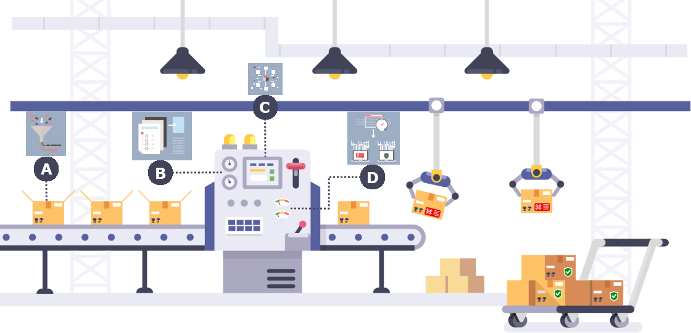

# How it works

Assemblyline minimizes the number of harmless files that IT practitioners are required to inspect every day, allowing them to collaborate with other users to customize and improve the platform in the process.

**A)** Assemblyline works very much like a conveyor belt: files arrive in the system and are triaged in a certain sequence.

**B)** Assemblyline generates information about each file and assigns a unique identifier that travels with the file as it flows through the system.

**C)** Users can add their own analytics, which we refer to as services, to Assemblyline.

**D)** The services selected by the user in Assemblyline then analyze the files, looking for indications of maliciousness and/or extracting features for further analysis.

* The system generates alerts about a malicious file at any point during the analysis and assigns the file a score.
* The system can also trigger automated defensive systems.
* Malicious indicators generated by the system can be distributed to other defense systems.
