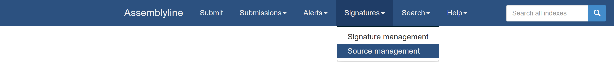
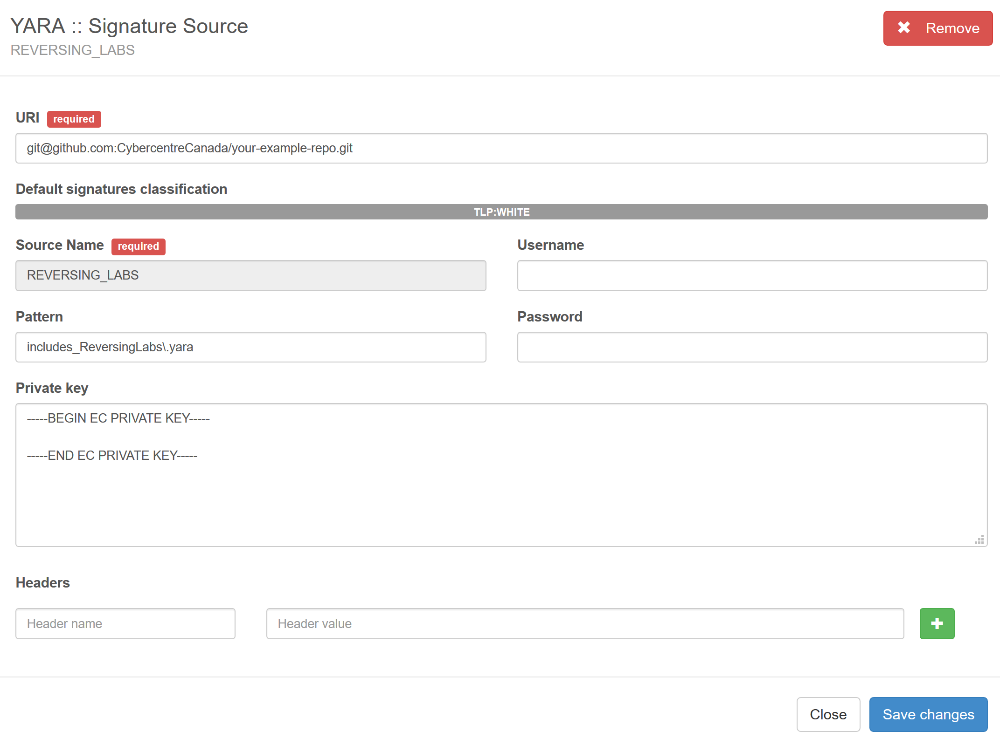
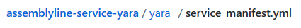
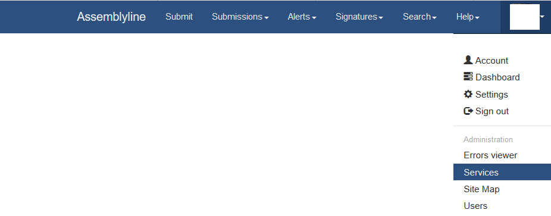
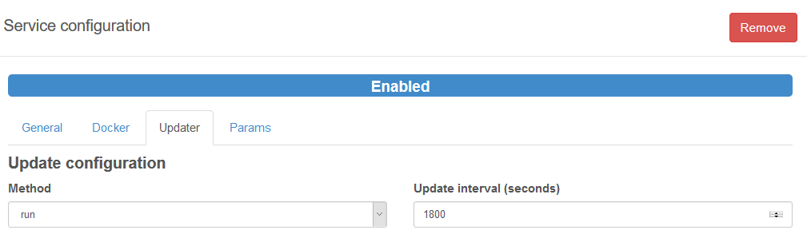
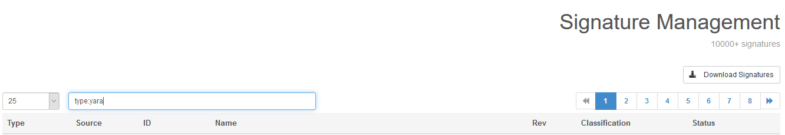
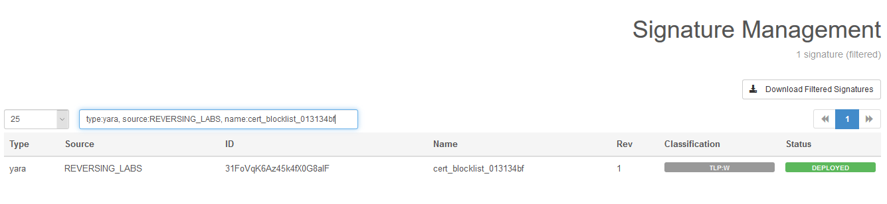
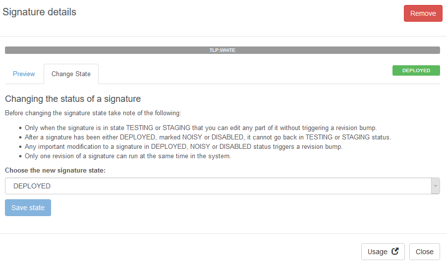

# Source Management:
Adding signature sources to support analysis is very simple and can be done directly through the Assemblyline WebUI.

First, navigate to “Source management” through the navbar:

#### 

## **Adding a source:**
Then, to add a signature source, click on the green icon along the right side of the window:


This will bring the user to the window below:

#### 

### **Required input**

The following sections are <ins>required</ins> in order to add a signature source to Assemlyline:
-	**URI** 
    - This is the path to your sources. In this case, we will use a github repository.
    - The URI section also accepts HTTP URLs as input.
-	**Source Name**
    - This can be labelled at the user’s discretion. For this example, we have used REVERSING_LABS.
    - Please note that input for "Source Name" **must not** have any spaces.
    
### **Optional input**

-   **Pattern**
    - The user may add a regex pattern to pull certain file types for a particular service. In this example,
    only `.yara` or `.yar` files will be added as signatures.
-   **Username / Password**
    - This is the username and password for the URL or git repo you are targeting.
-   **Private Key**
    - If using SSH to connect to Github, you must generate a private SSH key and add it to this section.
-   **Headers**
    - Header name and Header value are for special HTTP headers that may be passed to the HTTP server, such as 
    passing an api key.

## **Updating signature sources**

The user may set the frequency with which signature sources are updated in two ways:
-    Prior to loading the service into Assemblyline; and/or
-    Once the service has been loaded into Assemblyline
    
#### **Option 1 - prior to loading the service**

-   The updater can be configured through the service_manifest.yml, which is located in the root directory of each service.
#### 
-   The following is an example of the update configuration section of the service_manifest.yml file

```
update:config
    generates_signatures: true
    method: run
    run_options:
        allow_internet_access: true
        command: ["python", "-m", "yara_.yara_updater"]
        image: ${REGISTRY}cccs/assemblyline-service-yara:$SERVICE_TAG
    sources:
        - name: cve
          pattern: ^cve_rules_index.yar$
          uri: https://github.com/Yara-Rules/rules.git
    update_interval_seconds: 86400
    wait_for_update: true
```
-   Click [here](https://cybercentrecanada.github.io/assemblyline4_docs/docs/developer_manual/services/service_manifest.html#update-config) to find explanations for each relevant parameter.
-   In this example, the service will pull any signatures from the source that have been updated in the last 86400 seconds.
   
#### **Option 2 - once the service has been loaded into Assemblyline**

-   First navigate to User/Administration/Services through the navbar:
#### 
-   Click on the relevant service you wish to update.
-   Navigate to the "updater" tab.
-   Input your preferred frequency (in seconds) into the "Update interval" textbox (as seen below).
#### 
-   In this example, the service will pull any signatures from the source that have been updated in the last 1800 seconds. 

## **Rule Searching**

Assemblyline allows the user to search for signatures in a variety of ways, for example:
-   Using the navbar, select signature management.
#### 
-   search for the type of signature you are looking for.

**Note:** although the search categories (i.e. type, source, etc) are not case sensitive, the search parameters are
and must match the spelling of the specific signature you are searching for.
#### 
-   You may also search for the signature Name, Source, ID, Revision, Classification, and Status in the same manner.
          Furthermore, multiple search parameters may be submitted at the same time, for example:
#### 

## **Scoring**

-   Scoring is based on the CCCS YARA specifications for rule metadata, which were created 
to define and validate the style and format of YARA rule metadata. Assemblyline supports this specification
natively and will leverage it to provide more context around YARA signature hits. The CCCS YARA specifications 
for rule metadata categorize samples into 5 different categories, each with their own
associated score:
-   | malware = 1000 | exploit & tool = 500 | technique = 100 | info = 0 |
-   To learn more about this format, please [click here](https://github.com/CybercentreCanada/CCCS-Yara)   


## **Signature state**

There are three different signature states: Deployed, Noisy, and Disabled

-   **Deployed**:
    -   Deployed rules score according to their rule "type" or "group", as referenced in the Scoring section.
-   **Noisy**:
    -   Noisy rules are reported in the results but do not influence the score of the submission.
-   **Disabled**:
    -   Are not run against samples that are submitted.
    
#### **Changing a signature's state:**

-   Navigate to signature management as referenced in the Rule Searching section.
-   Search for the applicable rule.
-   Click on the specific rule, select the "Change State" tab, and choose a new signature state from the drop-down menu./
#### 


