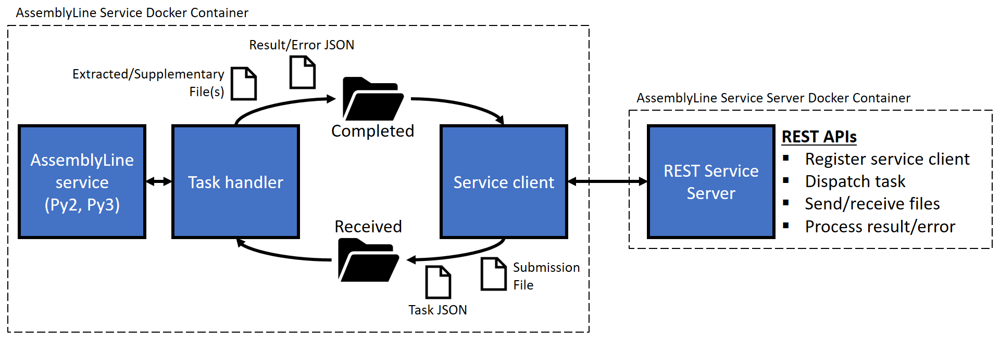

# Services architecture
{: .no_toc }

---

In AssemblyLine v4, services are designed in a container architecture. The individual service containers are clients
which interact with the AssemblyLine core, through REST APIs on the service server. A diagram displaying the architecture
between service containers and the service server is show below.

## Service server
The REST APIs on the service server allow services to interact with the AssemblyLine core to perform operations required
by the service for task execution. There are REST APIs to perform the following functions:
- Register service client with service information
- Request service task
- Send and receive files related to the service task from the filestore
- Send and receive results and errors related to the service task

Detailed information on the REST APIs can be found [here](services/service_server_rest_apis.md).

## Service client
The purpose of the service client is to be the middleman and create a link between the service server and the service itself.
The service client performs the REST API calls to allow the service to perform tasks. The service client communicates with
the service task handler through named pipes and passes information about what the service should be doing. And vice versa,
the service communicates its results and status through a named pipe to the service client.

The general procedure that a new service follows is as below:
1. Service container launches:
    - For the first time: The service client registers the service using data from the service manifest file and receives a
    response signal to shutdown. The scaler will then re-launch the service container with the required parameters and CPU/RAM usage limits.
    - For subsequent launches: The service client registers the service using the data from the service manifest file and
    receives signal to stay alive.
2. The service is ready and waiting to receive tasks. A recurring long-polling call (timeout of 30 seconds) is made to
the service server until a task is available.
3. Once a task is received by the service client, the task information is saved into a JSON file and the file to be
processed is downloaded (if required by the service). A message containing the folder path of the task json and the received file
is sent to the service task handler. This initiates the service to execute the task.
4. Once the service has processed the task, the resulting output of results or error is saved to a directory along with
any extracted and supplementary files. A message is sent to the service client about the completion of the task, which 
then starts the process of sending the result or error to service server. If the task was successfully completed and
there were extracted or supplementary files, the service server requests the service client to send any files that 
weren't already located in the filestore. 