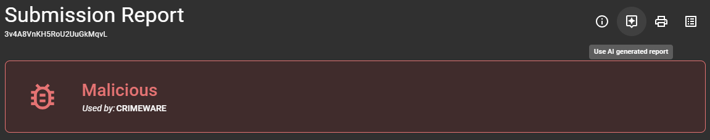
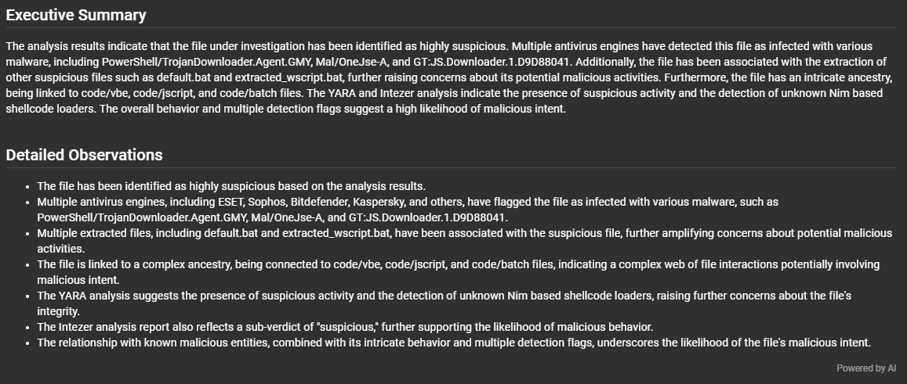
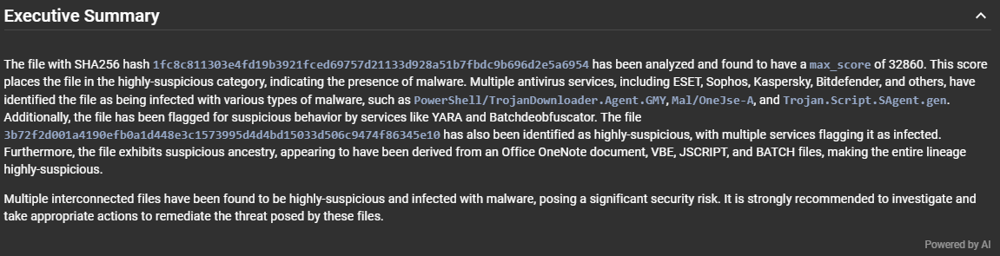
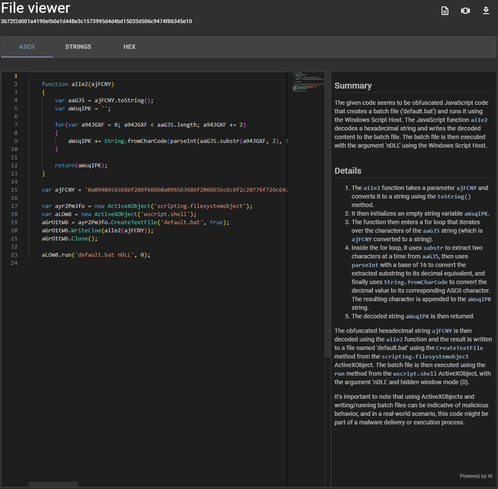
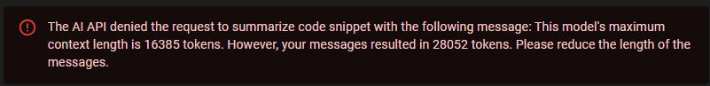

# Intégration OpenAI

Assemblyline prend maintenant en charge l'intégration LLM à l'aide de l'[API OpenAI Chat Completions](https://platform.openai.com/docs/guides/text).

## Fonctionnalités actuelles de l'intégration IA

Dans son état actuel, elle permet aux utilisateurs d'Assemblyline de faire exécuter les actions suivantes par le LLM :

- Créer un rapport hybride où le résumé des conclusions et l'analyse détaillée sont générés par le LLM, tandis que les IOC associés et les fichiers extraits sont récupérés statiquement à partir de l'API
- Créer un résumé exécutif de l'analyse détaillée d'une soumission ou d'un fichier
- Analyser du code et fournir un résumé ainsi qu'une analyse détaillée de ce que fait ce code

### Rapports hybrides

Désormais, dans la vue de rapport d'Assemblyline, un bouton a été ajouté en haut pour vous permettre d'utiliser le rapport généré par le LLM.



En cliquant sur le bouton, Assemblyline regroupera le rapport Assemblyline dans un format compact et demandera au LLM de créer un résumé exécutif suivi d'une analyse détaillée de la soumission. À la fin de l'analyse détaillée, vous trouverez un filigrane "**Powered by AI**" indiquant que cette section a été générée par le LLM.



### Résumés exécutifs

Lorsque vous affichez les détails d'une soumission ou d'un fichier, si l'intégration IA est activée, le système demandera automatiquement au LLM de générer des résumés exécutifs de la soumission ou du fichier que vous consultez.

Ces résumés exécutifs apparaîtront dans leur propre section et seront suivis du même filigrane "**Powered by AI**" que celui du rapport, afin que vous puissiez facilement identifier que ces données ne sont pas générées par Assemblyline.



### Analyse de code

Dans la visionneuse de fichiers Assemblyline, si vous consultez un fichier de type `code/*`, Assemblyline vous proposera un bouton pour analyser le code. Lorsque vous cliquez dessus, le code complet sera envoyé au LLM, qui générera un résumé de ce que fait le code ainsi que davantage de détails sur des parties spécifiques de celui-ci.

La section d'analyse de code sera également suivie du même filigrane "**Powered by AI**" que le résumé exécutif et le rapport hybride.



## Implémentation

### Format de rapport spécial

Pour obtenir le meilleur résultat possible du LLM, une version spéciale du rapport Assemblyline a été créée, dans laquelle tous les champs peu importants pour le LLM sont supprimés. Le modèle ODM (Object Data Model) utilisé par Assemblyline possède désormais un commutateur `ai` pour chacun de ses champs ; lorsqu'il est défini à `False`, ce champ est omis dans la sortie spéciale destinée au LLM.

Ce format spécial générera également le rapport Assemblyline en `YAML` plutôt qu'en `JSON`, car cela réduit le nombre de jetons à analyser par le LLM, ce qui permet de traiter des sorties Assemblyline plus volumineuses.

### Mise en cache de la sortie

Afin de réduire de façon optimale le coût d'exploitation de l'intégration LLM, Assemblyline met en cache le résultat du LLM à la fois au niveau de l'API Assemblyline et de l'interface utilisateur. Ainsi, si quelqu'un a déjà demandé le même résumé exécutif, rapport hybride ou analyse de code que vous, la réponse sera instantanée puisque vous obtiendrez la version en cache.

Si vous n'êtes pas satisfait du résultat obtenu via le LLM, vous pouvez toujours cliquer sur le filigrane "**Powered by AI**" situé au bas de chaque section générée par l'IA, ce qui vous permettra de régénérer la sortie du LLM en ignorant le cache.

### Limitations

Il existe quelques limitations à comprendre concernant l'implémentation actuelle de l'intégration IA :

  1.  La sortie générée par le LLM est totalement imprévisible : vous obtiendrez un résultat différent à chaque nouvelle demande. La couche de cache réduit un peu ce caractère aléatoire, mais uniquement tant que la sortie reste en cache.
  2.  Certaines sorties Assemblyline et certains fichiers de code sont simplement trop volumineux pour être traités par le LLM, et nous n'avons pas encore de mécanisme de découpage des rapports/code au moment de la rédaction pour traiter ces éléments en plusieurs segments. Vous pouvez donc obtenir de temps en temps des erreurs de jetons indiquant que votre message dépasse la longueur maximale de contexte du modèle.
  
  3.  La vitesse de réponse du LLM à votre requête dépend du modèle utilisé et de la taille des données envoyées au modèle. Par défaut, AL utilise le modèle `GPT3.5-turbo` car c'est celui qui répondait le plus vite pour nous tout en fournissant des résultats jugés suffisants pour nos besoins.
  4.  La qualité de la réponse obtenue du LLM est directement liée à la qualité de l'invite envoyée au modèle ainsi qu'au modèle utilisé. Vous pouvez modifier les invites envoyées au modèle dans votre fichier `config.yml`, ainsi que le modèle choisi si vous n'êtes pas satisfait des résultats. Nous estimons que la configuration par défaut est suffisante pour l'instant, mais il y a toujours une marge d'amélioration.

## Activer et configurer l'intégration IA

L'intégration IA peut être activée facilement en modifiant la section de configuration IA dans votre fichier `config.yml` afin d'activer l'intégration et de définir votre clé API.

???+ example "Bloc de configuration IA minimal"
    ```yaml
    ...

    ui:
      ai_backends:
        enabled: True
        api_connections:
          - headers:
              Authorization: Bearer <OPENAI_APIKEY>

    ...
    ```

Le bloc de configuration `ai` vous permet également de spécifier les autres paramètres envoyés à l'API OpenAI. Voici un exemple de ce à quoi ressemble la configuration de l'intégration IA :

???+ example "Bloc de configuration IA complet"
    ```yaml
    ...

    ui:
      ai_backends:
        # Activation/désactivation de l'intégration IA
        enabled: true

        # Liste des définitions d'API utilisées dans le pool d'API. Plusieurs connexions peuvent être spécifiées dans l'ordre de la liste (par ex. connexion principale, connexion de secours)
        api_connections:

          # URL de l'API OpenAI de chat completion. Vous pouvez la modifier si vous n'utilisez pas les points de terminaison OpenAI par défaut.
          - chat_url: "https://api.openai.com/v1/chat/completions"
            # Type d'API de chat avec laquelle nous communiquons (par ex. openai, cohere)
            api_type: "openai"
            # En-têtes envoyés à l'API
            headers:
              Authorization: Bearer <OPENAI_APIKEY>
              Content-Type: "application/json"
            # Modèle utilisé pour l'intégration IA
            model_name: "gpt-3.5-turbo"
            # Le certificat SSL du point de terminaison API doit-il être vérifié ?
            verify: true

        # Définition de chaque paramètre utilisé dans les différentes fonctions IA
        function_params:

          # Configuration de la fonctionnalité assistant d'Assemblyline
          assistant:
            # Message système envoyé à l'API IA, décrivant comment l'IA doit interpréter les messages reçus
            system_message: "...",
            # Description de la tâche envoyée à l'API IA
            task: "..."
            # Nombre maximal de jetons renvoyés dans une réponse par l'API IA
            max_tokens: 512,
            # Autres paramètres facultatifs envoyés à l'API
            options:
              frequency_penalty: 0,
              presence_penalty: 0,
              temperature: 0,
              top_p: 1

          # Configuration de la fonctionnalité d'analyse de code
          #     Même type de bloc de configuration que l'assistant
          code:

          # Configuration de l'analyse détaillée du rapport AL (utilisée dans les rapports hybrides)
          #     Même type de bloc de configuration que l'assistant
          detailed_report:

          # Configuration de l'analyse du résumé exécutif (utilisée dans les vues de détails de soumission et de fichier)
          #     Même type de bloc de configuration que l'assistant
          executive_summary:

    ...
    ```

## Contribuer

L'équipe Assemblyline ne compte pas d'experts en IA. Si vous avez des suggestions sur ce que nous pourrions ajuster dans notre configuration par défaut pour obtenir de meilleurs résultats du LLM, n'hésitez pas à nous contacter sur [Discord](https://discord.gg/GUAy9wErNu) afin que nous puissions proposer une meilleure configuration par défaut à tous.
