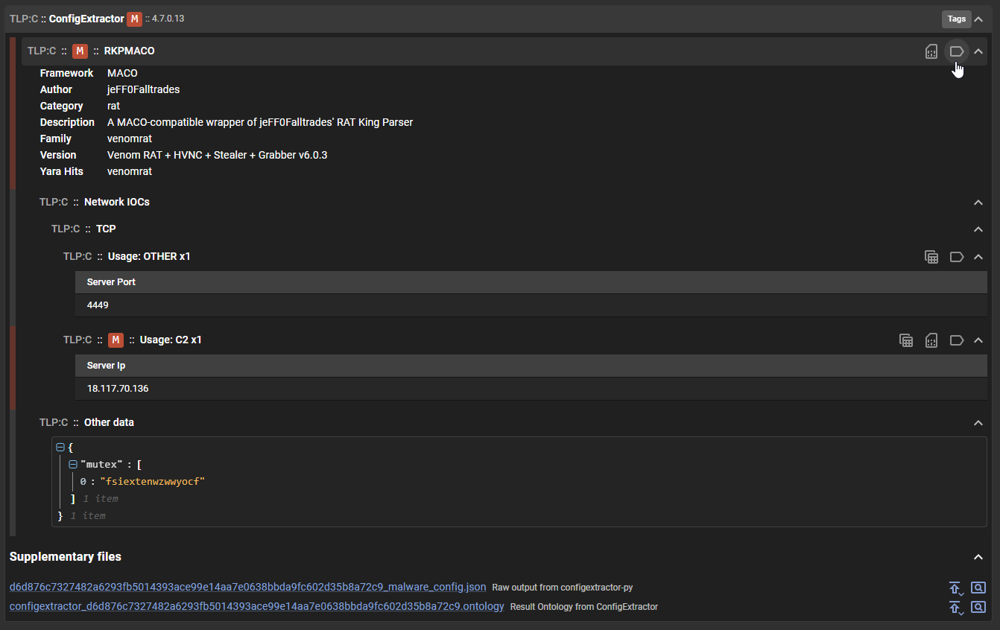
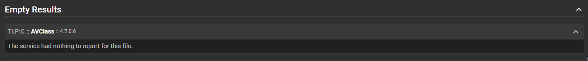
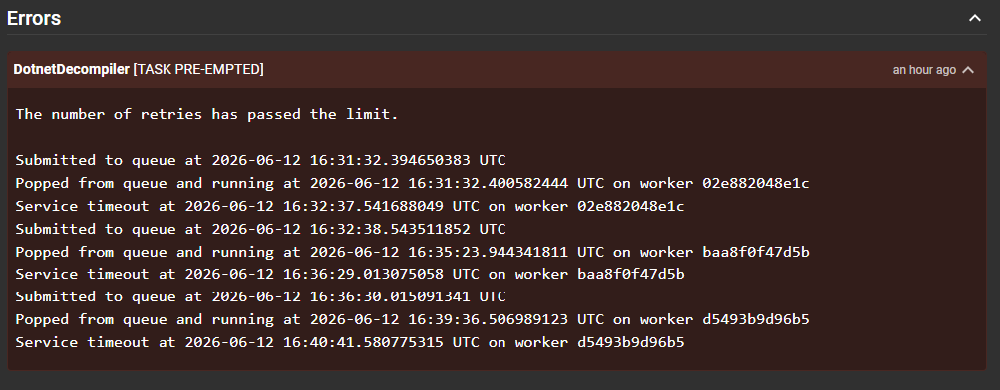

# File Analysis

When selecting a file for review, the UI will open a drawer containing a detailed view of the analysis results for that file.

<video controls src="../assets/file_detail.mp4" title="File analysis"autoplay loop></video>

## File Actions

The top-right corner of the file detail view contains a series of action buttons:

| Action | Description |
|---|---|
| Related Submissions | Find all submissions that include this file |
| Download | Download the file. By default it is packaged in the [CaRT format](https://pypi.org/project/cart/) to prevent accidental execution |
| File Viewer | Open the built-in viewer (ASCII, Strings, Hex) |
| Resubmit | Resubmit the file for a fresh analysis |
| Safelist | Add the file to the system safelist |

### File Viewer

The UI has a built-in file viewer that supports a wide variety of different formats, allowing you to review the contents of the file directly within the UI without needing to download it and open it with an external application.

This allows you to inspect the file contents along with reviewing the analysis results which can help you understand the context of the generated data and make informed decisions based on the analysis results.

<video controls src="../assets/file_viewer.mp4" title="File viewer"autoplay loop></video>

## File Frequency

The File Frequency section shows how many times this file has been seen in the system, along with first and last seen timestamps. These values are affected by the data retention period configured on the system.

## Generated Tags & Heuristics

This section is similar to the "Tags" and "Heuristics" section in the submission, but it focuses specifically on the data that were generated as a result of the analysis of the file being observed.

Clicking on a tag will highlight which service it originated from, making it easy to trace where a specific indicator was extracted.

## Service Results

This is where you can review the results from each service that analyzed the file. The services are listed in alphabetical order, and you can expand each service to see the details of its analysis results.

There are three possible outcomes for a service that analyzed the file: empty results, error results, or generated results.

### Generated Results

Every service result is a composition of sections and subsections that organize the data generated by the service. The structure of these sections can vary greatly between services, as each service is designed to analyze different aspects of the file and generate different types of data.

When a service is updated, cached results from a previous version are no longer used. If multiple result versions are available for a service, a dropdown will appear allowing you to compare results from older analysis runs.

### Empty Results

This section indicates that the service did not generate any results for the file. This could be because the service did not find anything of interest in the file.

### Error Results

This section indicates that there was an error during the analysis of the file by the service. This could be due to various reasons such as a timeout, an issue with the service itself, or a problem with the file that caused the service to fail.

This section can also contain warnings raised by the service, which are not necessarily errors but are important to take note of when reviewing the analysis results. An example of such a warning could be related to tagging such as tagging "abc.com" as a "IP" which the system's internal validation would raise a warning for since "abc.com" is not a valid IP address.

