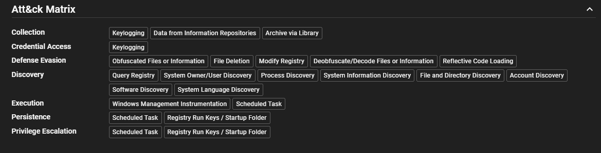
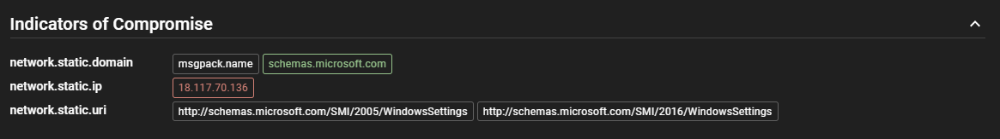
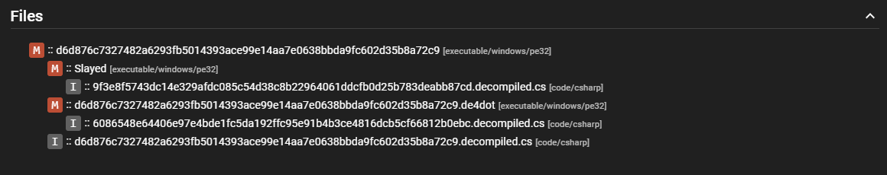

# Submission Analysis

After a file is submitted for analysis and processed, you can review the results in the UI.

!!! note
    The screenshots shown in this section are based on the analysis of [this sample from MalwareBazaar](https://bazaar.abuse.ch/sample/d6d876c7327482a6293fb5014393ace99e14aa7e0638bbda9fc602d35b8a72c9/) using Assemblyline out of the box. Your analysis results may vary based on your system's configuration, services you have enabled, and imported rulesets.

## Score & Verdict

Each file receives a numeric score that summarizes the risk determined by the services that analyzed it. The score of a submission is determined by the **highest score of any file** extracted during the analysis process.

For example, consider a `zip` archive that scores 0 by itself. If it contains two children files that score 100 and 500 respectively, the submission's overall score will be **500**. You can drill down into the file tree to understand exactly what contributed to each score.

The score maps to a text verdict as follows:

| Score | Verdict |
|---|---|
| -1000 | Safe |
| 0 – 299 | Informative |
| 300 – 699 | Suspicious |
| 700 – 999 | Highly Suspicious |
| ≥ 1000 | Malicious |

For more details, see [Assemblyline Verdicts](../verdicts.md).

## Report View

Assemblyline provides a summarized view of the analysis focusing on the most important information about the file. This includes the file's metadata, such as its name, size, type, and hashes, as well as a high-level overview of the analysis results, such as the verdict, score, and attribution.

This view is only accessible if the analysis has been completed, otherwise the site will redirect you to the Detailed View where you can monitor the progress of the analysis in real-time.

!!! tip "Save as PDF"
    You can print or save the report as a PDF using the printer icon button in the top right corner of the report.

<video controls src="../assets/submission_report_view.mp4" title="Report View"autoplay loop></video>

## Detailed View

For a more in-depth look at the analysis, you can access the detailed view. This view provides comprehensive information about the file, including all the metadata, the results from each service that analyzed the file, and any additional information or context that may be relevant to understanding the analysis results.

<video controls src="../assets/submission_detail_view.mp4" title="Detailed View"autoplay loop></video>

### Submission Information

This section keeps a record of the submission details such as the time of submission, the user who submitted the file, and the parameters used for the analysis.

<video controls src="../assets/submission_submission_information.mp4" title="Submission Information"autoplay loop></video>

### Analysis Information

??? tip "Interactive Analysis Supported"
    Some elements support interactions such as left-clicking to highlight all occurences of the data across the analysis results, and right-clicking to access a context menu with options to search for the data across the system or copy data to your clipboard.

    <video controls src="./assets/submission_interactive_data.mp4" title="Interactive elements"autoplay loop></video>

#### Attribution

Attribution represents the associations that the system can make between the file and known entities such as malware families, threat actors, or campaigns, which we use the ATT&CK framework to help categorize. Attribution is sourced from YARA signatures (when the actor tag is provided in the rule's metadata) and anti-virus vendor names.

!!! note
    Assemblyline uses the [CCCS YARA standard](https://github.com/CybercentreCanada/CCCS-Yara). For best attribution results, follow the CCCS standard when writing YARA rules.

#### Heuristics

Heuristics represent patterns or behaviors that a service will raise to draw attention to specific aspects of the file. For example, a heuristic could be raised if a file is packed or obfuscated, which are common techniques used by malware authors to evade detection.

Heuristics can have a score assigned which represents the severity of the heuristic. The higher the score, the more severe the heuristic is considered to be. This can help analysts prioritize which heuristics to investigate first when reviewing the analysis results.

<video controls src="../assets/submission_heuristics.mp4" title="Heuristics"autoplay loop></video>

#### Tags / Indicators of Compromise (IOCs)

Tags represent pieces of information that are extracted from the file and can be used for searching, filtering, and correlation. For example, a tag could be an IP address that was extracted from the file, which could then be used to search for other files that have the same IP address.

#### File Tree

The file tree allows you to navigate through the contents of the root file and it's children and review the analysis results for each individual file.

This is particularly useful for analyzing files that are packed or obfuscated, which provides a clear trace of the analysis process through the unpacking or deobfuscation stages.

