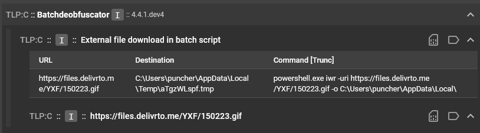
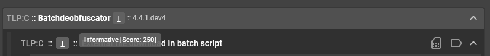
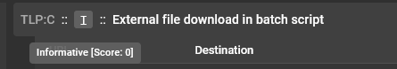
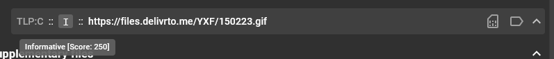
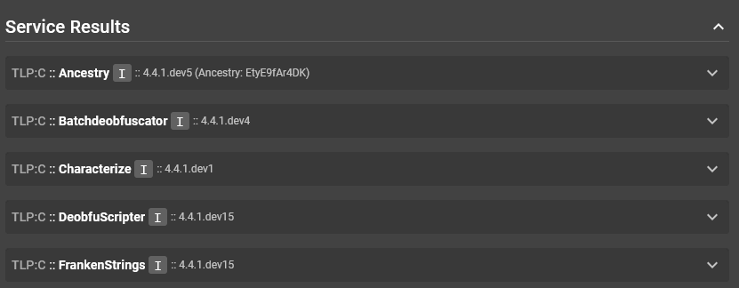
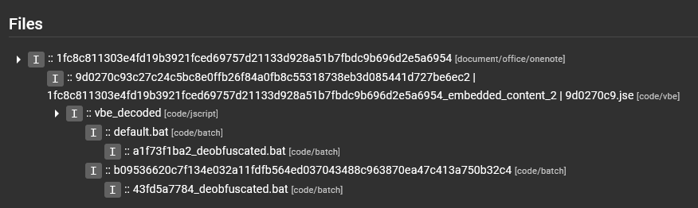
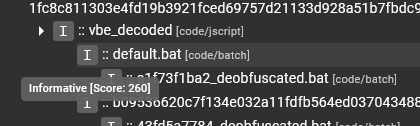
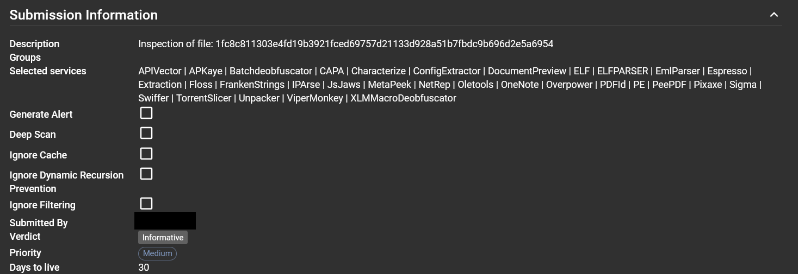
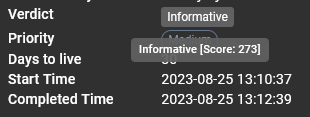
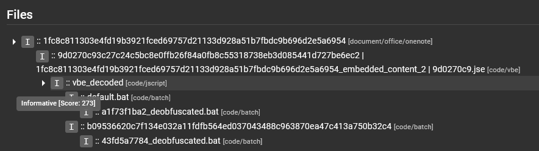

# Bienvenue dans le manuel utilisateur d'Assemblyline

Cette documentation est conçue pour vous aider à démarrer avec Assemblyline 4, ainsi que pour fournir des informations détaillées sur ses fonctionnalités et ses capacités.

## Concepts clés

Voici quelques concepts clés qui vous aideront à naviguer dans la documentation :

### Classification et partage

!!! note "Si l'application de la classification n'est pas activée, vous pouvez ignorer cette étape car vous ne verrez pas le sélecteur mentionné ci-dessous."

Si votre système est configuré avec un schéma de classification, tel que TLP, vous pouvez sélectionner le niveau de classification approprié pour votre analyse. Cela permet de s'assurer que les résultats d'analyse sont partagés avec le public approprié et que les informations sensibles sont traitées correctement.

Il s'agit d'une partie intégrante du processus de soumission, car cela vous permet de contrôler la visibilité et le partage des résultats d'analyse en fonction de la sensibilité des données analysées.

<video controls src="../../../user_manual/assets/params_classification.mp4" title="Profils de soumission" autoplay></video>

### Score et verdict

Chaque fichier reçoit un score numérique qui résume le risque déterminé par les services qui l'ont analysé. Le score d'une soumission est déterminé par le **score le plus élevé de n'importe quel fichier** extrait pendant le processus d'analyse.

Par exemple, prenons une archive `zip` qui obtient un score de 0 à elle seule. Si elle contient deux fichiers enfants qui obtiennent respectivement 100 et 500, le score global de la soumission sera **500**. Vous pouvez explorer l'arborescence des fichiers pour comprendre exactement ce qui a contribué à chaque score.

Le score correspond à un verdict textuel comme suit :

| Score | Verdict |
|---|---|
| -1000 | Sûr |
| 0 - 299 | Informatif |
| 300 - 699 | Suspect |
| 700 - 999 | Hautement suspect |
| ≥ 1000 | Malveillant |

#### Comment les scores sont calculés

Les scores sont générés par les heuristiques déclenchées par un service. Pour voir le score d'un résultat spécifique dans votre soumission Assemblyline, survolez le "bouton" de verdict correspondant dans la section des résultats de service. Ces boutons affichent soit un "I" gris, un "S" jaune, soit un "M" rouge pour représenter leurs verdicts respectifs.

Par exemple, voici le résultat du service Batchdeobfuscator :

Vous pouvez voir qu'il y a trois boutons carrés différents avec un "I" dans cette vue. Ces boutons représentent des verdicts ("I" signifie "Informative"), mais pour des éléments différents. Le bouton le plus haut, à côté du nom du service, représente le score du service, qui est la somme de tous les scores heuristiques de toutes les heuristiques du résultat de service.

En survolant ce bouton "I", on voit que le score du service est 250 :

Ensuite, nous survolons chacun des boutons "I" des sections de résultat à l'intérieur du résultat. La première section de résultat a un score de 0 :

{: .center }

Et la deuxième section de résultat a un score de 250 :

Ces deux scores sont additionnés pour obtenir le score de service affiché à côté du nom du service.

Ensuite, nous prenons du recul et examinons tous les résultats de service pour ce fichier particulier, y compris le résultat Batchdeobfuscator :

Vous pouvez survoler ces boutons "I" et voir que le seul autre service ayant un score supérieur à 0 est DeobfuScripter, avec un score de 10 :

Les scores des services pour un même fichier sont additionnés pour créer le score total de ce fichier.

En prenant encore plus de recul, dans la section "Files" de la soumission globale :

Nous examinions les résultats de service du fichier `default.bat`, et d'après ce que nous venons de voir, nous nous attendons à un score de 260. En survolant le bouton "I" à côté du nom du fichier, on confirme que c'est bien le cas :

{: .center }

La zone suivante où les scores sont appliqués concerne la soumission globale. La soumission examine tous les scores de tous les fichiers de la section "Files", puis retient le score maximal comme score représentatif de la soumission. Le verdict de soumission est affiché dans la section "Submission Information" de la page "Submission Details".

On peut survoler le bouton de verdict pour voir le score qui a produit ce verdict :

{: .center }

Intéressant, on dirait que le fichier `default.bat` qui avait un score de 260 n'était pas le fichier au score le plus élevé de la section "Files".

En survolant les autres fichiers de la section, on voit que le fichier `vbe_decoded` a en fait le score le plus élevé, avec un score de 273 :

Puisque c'est le fichier au score le plus élevé de la soumission, le score global de la soumission est défini sur ce score.

#### Comment les scores heuristiques sont attribués

Les heuristiques d'un service reçoivent un score arbitraire défini par l'auteur du service.
Si le score d'une heuristique est inférieur à 500 (ce qui signalerait le fichier comme suspect), alors l'intention de l'auteur du service est que ce score heuristique soit combiné avec les scores d'autres heuristiques du résultat de service avant que le verdict du fichier ne soit considéré comme suspect ou pire.

Si le score heuristique est de 1000 ou plus, alors cette heuristique est une heuristique à forte confiance qui peut être utilisée pour signaler un fichier comme malveillant avec peu ou pas de faux positifs. On trouve ce type d'heuristiques dans des services basés sur des signatures comme AntiVirus, Intezer, ConfigExtractor, VirusTotal et Yara, entre autres.

Si le score heuristique est compris entre 500 et 1000, alors l'auteur du service est relativement confiant que ce fichier présente une caractéristique suspecte voire hautement suspecte, sans pouvoir confirmer qu'il est définitivement malveillant.

#### Interpréter le verdict

Maintenant que nous avons couvert les bases du scoring et l'origine des verdicts, passons à la raison de votre présence ici :

> "À L'AIDE, J'AI UN FICHIER QU'ASSEMBLYLINE DIT MALVEILLANT ! J'AI ÉTÉ COMPROMIS ! NOOOOOOOOOOOOOO"

1. Avant tout, gardez votre calme. Assemblyline a déjà produit des faux positifs par le passé, et cela pourrait en être un exemple.
2. Plongez dans les détails de la soumission. Quel fichier obtient le score le plus élevé dans la section "Files" ?
3. Allez plus loin dans les résultats d'analyse de ce fichier. Quels services obtiennent les scores les plus élevés ? N'oubliez pas que ces scores sont ensuite additionnés.
4. Allez encore plus loin dans les services qui obtiennent les scores les plus élevés. Quelles heuristiques ont les scores les plus élevés ? D'après leurs scores et sachant qu'ils sont attribués arbitrairement par les auteurs de service, pensez-vous qu'ils sont pertinents ?

Après avoir effectué les étapes ci-dessus, êtes-vous confiant que le fichier est un vrai positif ou un faux positif ? Si c'est un faux positif, veuillez le signaler aux auteurs des services concernés afin qu'ils puissent ajuster les scores heuristiques ou améliorer le service pour éviter cela.

### Services

Les services sont les composants centraux d'Assemblyline qui effectuent l'analyse des fichiers soumis. Chaque service est conçu pour analyser des aspects spécifiques du fichier, comme ses métadonnées, son comportement ou son contenu. Les services peuvent être classés en différents types selon leur fonctionnalité, comme l'analyse statique, l'analyse dynamique, les vérifications de réputation, etc.

### Heuristiques

Les heuristiques représentent des motifs ou des comportements qu'un service peut signaler afin d'attirer l'attention sur des aspects spécifiques du fichier. Par exemple, une heuristique peut être déclenchée si un fichier est packé ou obfusqué, techniques couramment utilisées par les auteurs de malwares pour contourner la détection.

Un score peut être attribué aux heuristiques pour représenter leur gravité. Plus le score est élevé, plus l'heuristique est considérée comme grave. Cela peut aider les analystes à prioriser les heuristiques à investiguer en premier lors de l'examen des résultats d'analyse.

<video controls src="../../../user_manual/assets/submission_heuristics.mp4" title="Heuristiques" autoplay></video>

### Tags / Indicateurs de compromission (IOC)

Les tags représentent des informations extraites du fichier qui peuvent être utilisées pour la recherche, le filtrage et la corrélation. Par exemple, un tag peut être une adresse IP extraite du fichier, qui peut ensuite être utilisée pour rechercher d'autres fichiers contenant cette même adresse IP.

