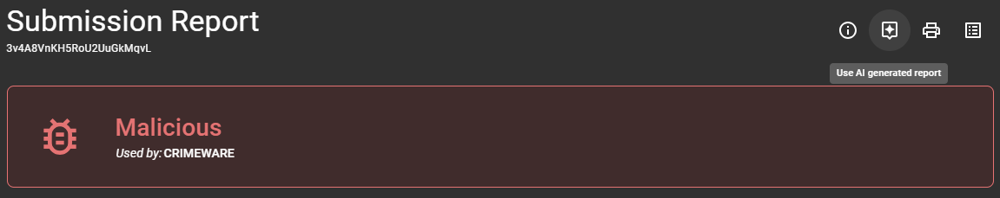
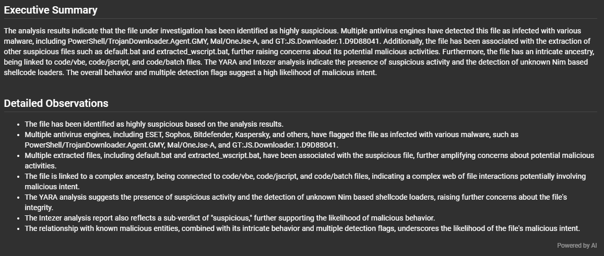
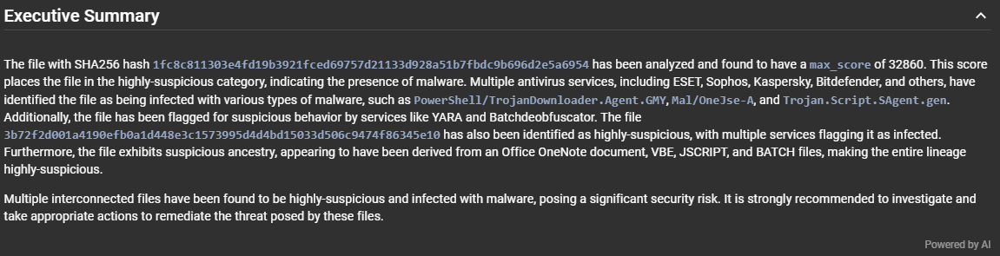
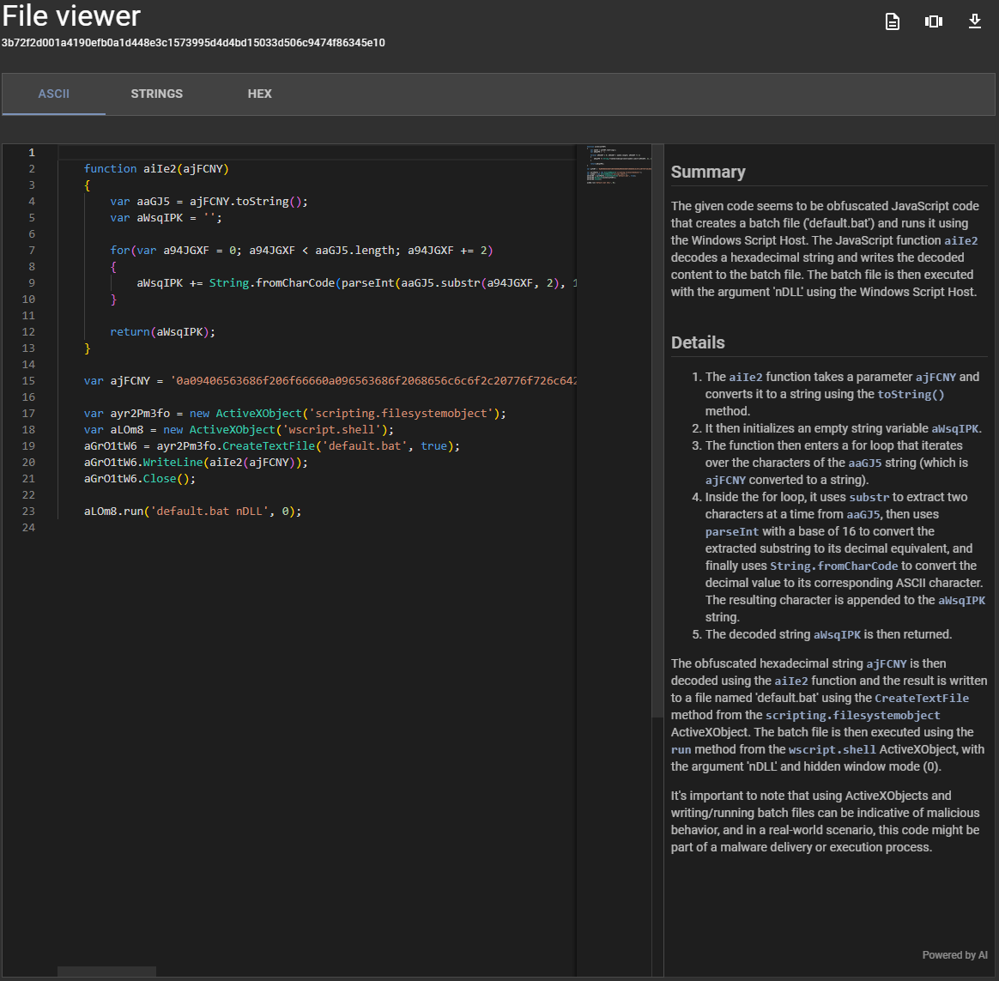
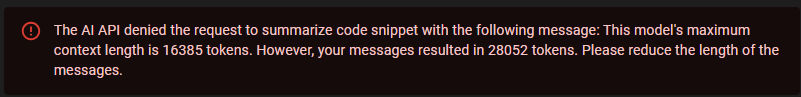

# OpenAI Integration

Assemblyline now supports LLM integration using the [OpenAI Chat Completions API](https://platform.openai.com/docs/guides/text-generation/chat-completions-api).

## Current Features of the AI Integration

In its current state, it will allow Assemblyline users to have the LLM perform the following:

  - Create an hybrid report where the summary of the findings and detailed analysis is generated by the LLM and the associated IOCs and extracted files are statically extracted from the API
  - Create an executive summary of the detailed analysis of a submission or a file
  - Analyze code and provide a summary and detailed analysis of what that code does

### Hybrid reports

Now as part of the report view of Assemblyline, a button was added at the top that lets you use the LLM-generated report.



By clicking the button, Assemblyline will bundle the Assemblyline report in a compact format and ask the LLM to create an executive summary followed by a detailed analysis of the submission. At the end of the detailed analysis, you will find a "**Powered by AI**" watermark that indicates that this section was generated by the LLM.



### Executive Summaries

While viewing either the details of a submission or the details of a file, when the AI Integration is turned on, the system will automatically ask the LLM to generate executive summaries of the submission or file that you are currently viewing.

These executive summaries will be in their own section and will be followed by the same "**Powered by AI**" watermark found in the report so that you can easily spot that this data is not generated by Assemblyline.



### Code Analysis

While in the Assemblyline file viewer, if you are viewing a file of type `code/*`, Assembyline will present you with a button to analyze the code and, when clicked, the full code will be sent to the LLM which will generate a summary of what the code does as well as more detail on specific parts of the code.

The code analysis section will also be followed by the same "**Powered by AI**" watermark as the executive summary and the hybrid report.




## Implementation

### Special report format

To get the best result possible out of the LLM, a special version of the Assemblyline report was created where all of the fields that are not very important to the LLM are stripped out. The Object Data Model (ODM) used by Assemblyline now has an `ai` switch for all of its fields that when set to `False` will omit that field for the special LLM output.

This special format will also generate the Assemblyline report as `YAML` instead of `JSON` because this creates less tokens for the LLM to parse which allow us to analyze larger Assemblyline outputs.

### Caching of output

To optimally reduce the cost of operation of the LLM integration, Assemblyline caches the result of the LLM both at the Assemblyline API level and at the user interface, this way if someone has asked for the same executive summary, hybrid report or code analysis that you are requesting, the response will be instant as you will get the cached version.

If you are unhappy with the result you have got from the LLM you can always click the "**Powered by AI**" watermark found at the button of each AI-generated sections which will let you regenerate the LLM output by skipping the cache.

### Limitations

There are a few limitations to understand about the current implementation of the AI integration:

  1. The output generated by the LLM is absolutely unpredictable, you will get a different result each time you ask for new output. The caching layer will help remove a little bit of randomness but only for the time that the output remains in the cache.
  2. Some Assemblyline output and some code files are just too big to be processed by the LLM and we have no report/code-splitting in place as of this writing to be able to process these in multiple chunks. This means that you may get token errors from time-to-time saying that your message exceeded the model's maximum context length.
  
  3. The speed at which the LLM responds to the your query depends on which model you use and how big the data you are sending to the model. By default, AL uses the `GPT3.5-turbo` model as this is the one that was responding the fastest for us and was giving results that are good enough for what we were expecting.
  4. The quality of the response you will get from the LLM is directly linked with the quality of the prompt that you sent to the model and which model you use. You can edit the prompts sent to the model in your `config.yml` file as well as which model you want to use if you are not happy with the results. We feel like what we have as default is good enough for now but there is always room for improvements.

## Enabling and configuring the AI Integration

The AI integration can easily be turned on by editing the AI configuration section in your `config.yml` file to enable the integration and set your API Key.

???+ example "Minimal AI configuration block"
    ```yaml
    ...

    ui:
      ai:
        enabled: True
        headers:
          Api-Key: <OPENAI_APIKEY>

    ...
    ```

The `ai` configuration block will also let you specify the other parameters sent to the OpenAI API. Here is an example of what the configuration of the AI integration looks like:

???+ example "Full AI configuration block"
    ```yaml
    ...

    ui:
      ai:
        # URL to the chat completion API, you can change this to your own if you are not using the default
        #  OpenAI endpoints.
        chat_url: https://api.openai.com/v1/chat/completions,

        # Configuration of the code analysis feature
        code:
          # System message sent to the OpenAI API describing how OpenAI should interpret the messages received
          system_message: "...",
          # Maximum number of tokens returned as a response by the OpenAI API
          max_tokens: 512,
          # Other optional parameters sent to the API
          options:
            frequency_penalty: 0,
            presence_penalty: 0,
            temperature: 1,
            top_p: 1

        # Configuration of the Detailed AL report analysis (used in hybrid reporting)
        #     Same type of configuration block as the code analysis
        detailed_report: {...},

        # Configuration of the Executive Summary analysis (used in submission and file detail views)
        #     Same type of configuration block as the code analysis
        executive_summary: {...},

        # Enabled/disabled AI integration
        enabled: False,

        # Headers sent to the OpenAI API
        headers:
            Content-Type: "application/json"

        # Model used for the AI Integration
        model_name: "gpt-3.5-turbo",

        # Should the SSL cert to the OpenAI API endpoint be verified?
        verify: True

    ...
    ```

## Contributing

The Assemblyline team does not have any AI experts so if you have any insight on what we can tweak in our default configuration to get better results out of the LLM do not hesitate to reach out to us on discord so we can provide a better default configuration for others.
