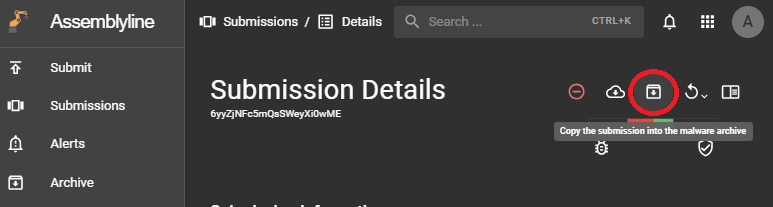
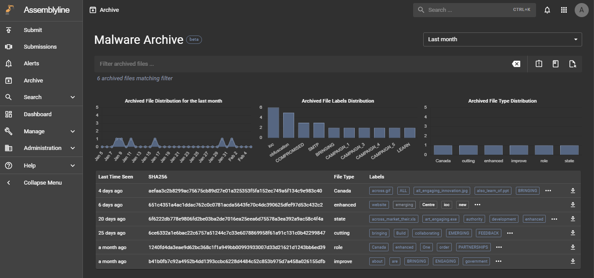
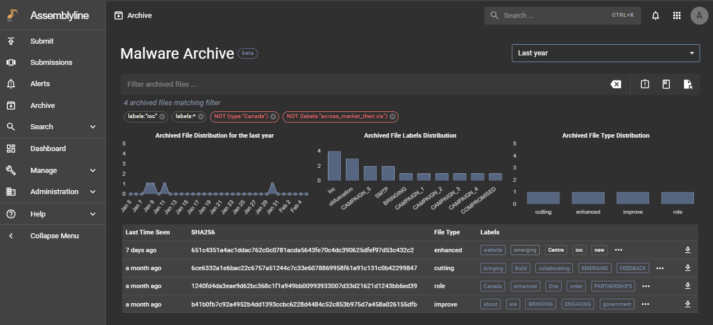
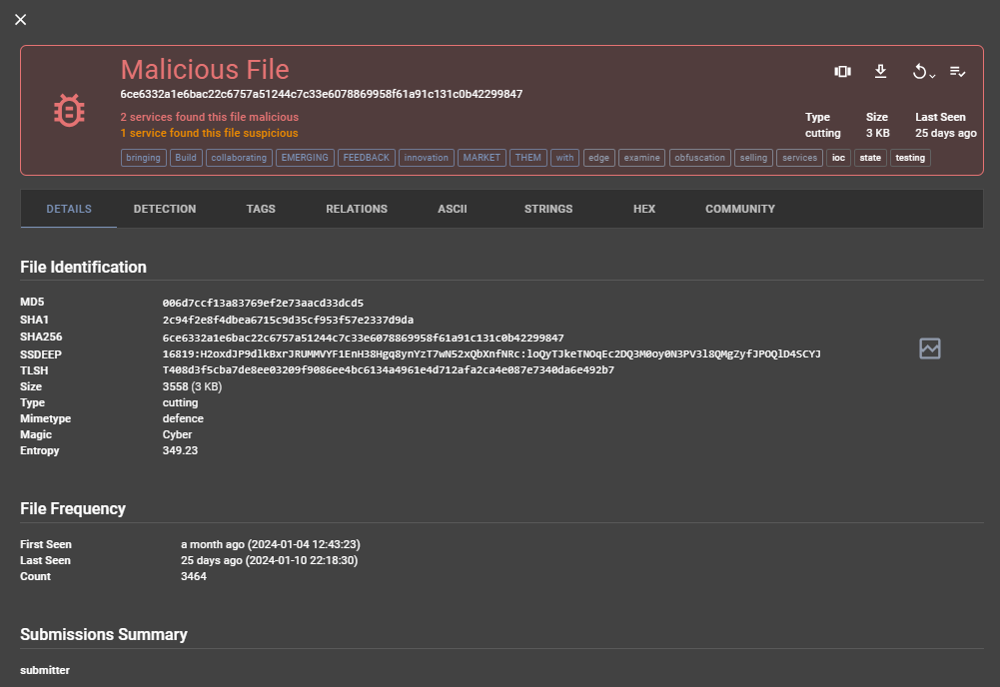

# Utiliser Malware Archive

## Vue d'ensemble

La fonctionnalité Malware Archive permet aux utilisateurs de conserver indéfiniment des informations importantes de soumission. La plupart des documents dans Assemblyline sont soumis au processus d'expiration qui les supprime lorsqu'ils atteignent leur date d'expiration. Cela permet d'éviter d'encombrer le système avec des données peu importantes. Cependant, si un utilisateur souhaite conserver une soumission pertinente pour une utilisation future, il peut l'archiver pour la conserver pour toujours.

Pour commencer à utiliser Malware Archive, assurez-vous d'avoir la [configuration](../installation/configuration/malware_archive.md) appropriée.

Si vous souhaitez comprendre le fonctionnement de Malware Archive, une description détaillée est disponible dans [l'architecture du système](../../administration/architecture#keeping-files-forever-malware-archive)

## Archiver une soumission

Pour archiver une soumission, allez sur sa page de détails et cliquez sur le bouton "Archive" pour envoyer une demande d'archivage de cette soumission. Si la fonctionnalité d'archivage est activée et fonctionne correctement, vous devriez voir apparaître un message de confirmation en bas de l'écran.

## Voir les fichiers archivés

L'étape suivante consiste à accéder à la page Malware Archive à l'aide de la barre de navigation de gauche. Cette interface est basée sur les fichiers plutôt que sur les soumissions. Par conséquent, tous les fichiers faisant partie de la soumission, y compris les fichiers supplémentaires générés pendant l'analyse, seront archivés et accessibles dans cette interface de recherche.

## Rechercher parmi les fichiers archivés

Cette interface de recherche offre des méthodes pour filtrer rapidement et permettre aux utilisateurs de trouver les fichiers pertinents. Des actions telles que cliquer sur les trois boutons d'action rapide à droite de la barre de recherche, sur un élément du graphique ou sur une étiquette dans le tableau ajouteront une puce de filtre sous la barre de recherche. Vous pouvez cliquer sur cette puce pour obtenir l'effet inverse indiqué en rouge.

## Analyser un fichier archivé

Cliquer sur un fichier dans le tableau ouvrira sa page de détails archivée. Pour rendre cela plus pratique, nous avons inclus des sections familières et de nouvelles sections nécessaires pour analyser ce fichier :

- Détails : Cette section résume les informations du fichier.
- Détections : Cette section contient les résultats détaillés de l'analyse de ce fichier par Assemblyline.
- Tags : Cette section affiche toutes les heuristiques et tous les tags sous forme de tableau. Ce tableau permet aux utilisateurs de trier et filtrer les données à l'aide des en-têtes. Cliquer sur une ligne envoie une requête pour trouver des résultats partageant ce type et cette valeur de tag.
- Relations : L'objectif de cette section est de trouver des résultats similaires partageant des propriétés similaires.
- ASCII, Strings, Hex : Au lieu de naviguer vers une autre page, nous avons intégré les visionneuses de fichiers dans ces sections.
- Community : Cette section contient toutes les actions fournies par les utilisateurs, comme l'étiquetage de ce fichier et l'ajout de commentaires. Notez que les étiquettes et commentaires sont aussi des paramètres de recherche.

