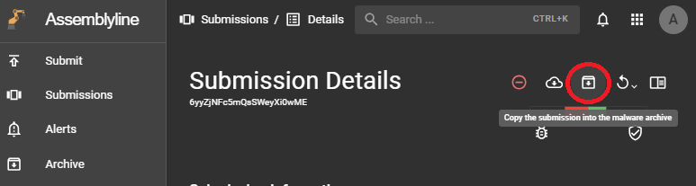
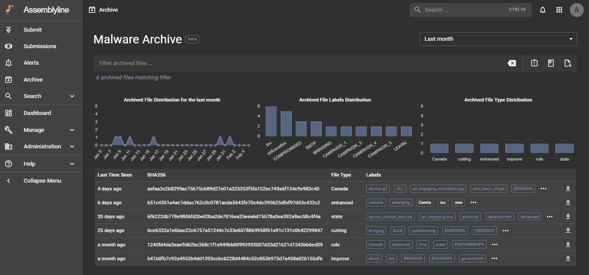
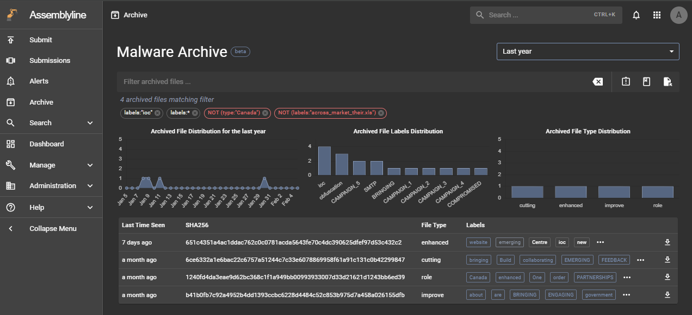
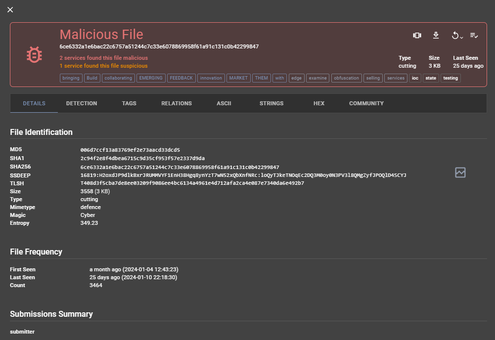

# Using Malware Archive

## Overview

The Malware Archive feature allows users to preserve important submission information indefinitely. Most documents in Assemblyline are subjected to the Expiry process which will delete them after they reach their expiry date. This is done to avoid bloating the system with unimportant data. However, if a user wants to preserve a relevant submission for future use, they can archive it to keep it forever!

To start using Malware Archive, make sure you have the correct [configuration](../installation/configuration/malware_archive.md).

If you want to understand how Malware Archive works, a detailed description can be found in the [System Architecture](../overview/architecture.md#keeping-files-forever-malware-archive)

## Archiving a submission

To archive a submission, go to its detail page and click on the “Archive” button to submit a request to archive this submission. If the archive functionality is enabled and working properly, you should see a successful snackbar message appear from the bottom.

## View archived files

The next step is to navigate to the Malware Archive page using the left navbar. This interface is based around files instead of submissions. Therefore, all the files that are part of the submission, including supplementary files, generated during the analysis will be archived and be found in this search interface.

## Searching through the archived files

This search interface offers methods to quickly filter and allow users to find the relevant files. Actions such as clicking on the three quick action buttons on the right side of the search bar, on a graph element, or a label in the table, will add a filter chip below the search bar. You can click on that chip to get the opposite effect marked in red.

## Analysing an archived file

Clicking on a file in the table will open its archived detail page. To make this more convenient, we have included familiar and new sections needed to analyze this file:

- Details: This section summarize the file's information.
- Detections: This section contains the detailed results of this file's analysis by Assemblyline.
- Tags: This section displays all the heuristics and tags in a tabular format. This table allows users to sort and filter the data using the headers. Clicking on a row submits a request to find results sharing this tag type and value.
- Relations: The goal of this section is to find similar results sharing similar properties.
- ASCII, Strings, Hex: Instead of navigating to another page, we have included the file viewers in these sections.
- Community: This section contains all the user-provided actions such as labelling this file and adding comments. Note that labels and comments are also search parameters.

