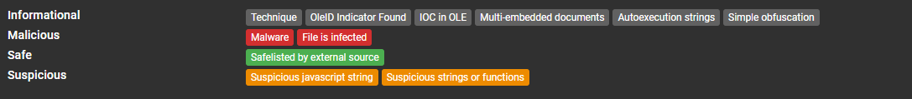
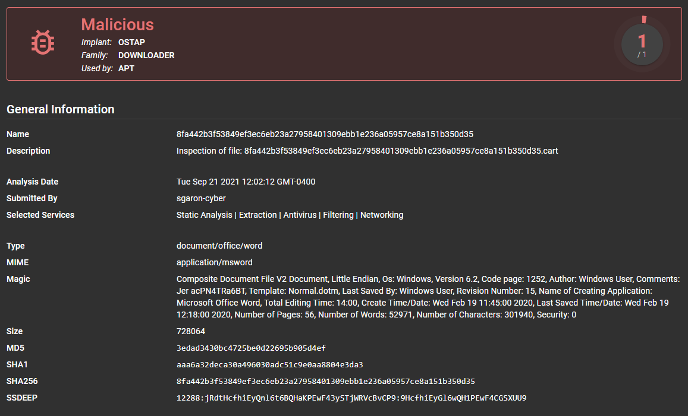
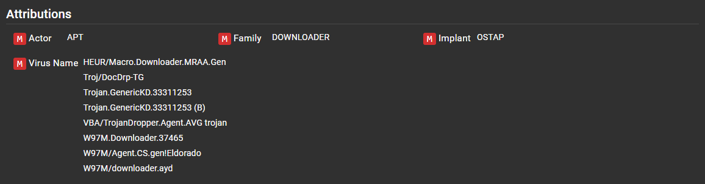
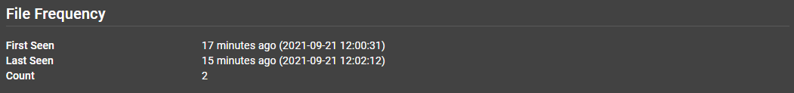
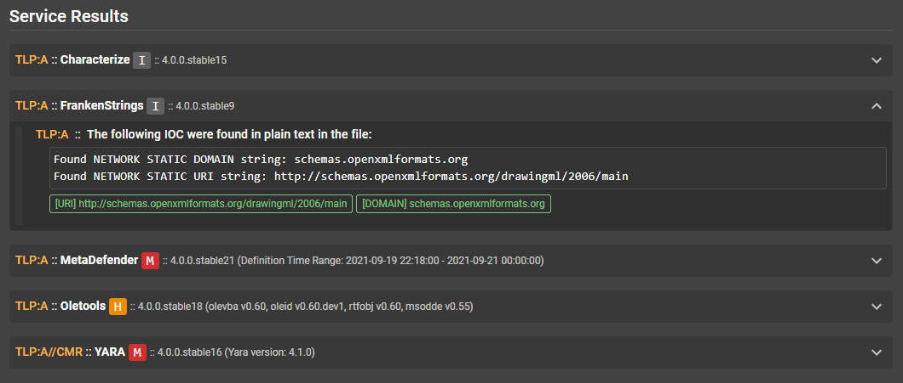

# Résultats d’Assemblyline

## Heuristiques

Par heuristique, on entend une fonction qui peut être détectée par le service dans le cadre de l’analyse.
- Elle se compose de ce qui suit :
    - un identifiant;
    - un nom;
    - une description;
    - une note (utilisée pour signaler une heuristique comme étant MALICIOUS [MALVEILLANTE], SUSPICIOUS [SUSPECTE] ou INFO);
    - l’ID de la matrice Mitre’s Att&ck;
    - des signatures qui sont souvent utilisées pour donner plus de contexte.

Le système fait le suivi des heuristiques pour fournir des statistiques sur le nombre d’occurrences et les notes attribuées afin d’apporter des ajustements si les performances des heuristiques sont adéquates ou insuffisantes.


Les heuristiques s’affichent dans l’interface utilisateur et sont associées à des codes de couleurs basés sur le degré de malveillance.



## Tags
Les étiquettes sont d’importantes métadonnées extraites d’un fichier. Leur nom doit respecter la même convention d’affectation que l’espace de noms, ce qui facilite leur organisation et permet de trouver plus facilement une information en particulier dans le système. De plus, les étiquettes sont indexées de manière à générer des résultats à une vitesse étonnante.

```
# Cette étiquette peut trouver les adresses IP extraites de manière statique peu importe le service utilisé lors de l’extraction.
result.sections.tags.network.static.ip;
```

Toutes les étiquettes enregistrées dans le système s’affichent dans le menu Help [Aide] > Searching Help [Aide à la recherche] de votre instance d’Assemblyline.


## Niveau de malveillance (Score)
La note attribuée à une soumission (degré de malveillance) est déterminée en fonction de la note la plus haute ayant été attribuée aux fichiers extraits au cours du processus d’analyse.

Prenons un fichier .zip comme exemple. Le fichier .zip peut avoir obtenu une note de 0, mais s’il contient deux fichiers ayant respectivement obtenus des notes de 100 et de 500, la note maximale de la soumission sera de 500. Si on pousse l’analyse, il est possible de comprendre sur quoi est basée chacune de ces notes.

Signification de la note (en supposant que vous exécutez la plupart des services, dont certains antivirus et de bonnes signatures Yara) :

```
-1000: sans dangé
0 - 299: information
300 - 699: suspicieux
700 - 999: très suspicieux
>= 1000: malicieux
```

## Rapport de soumission
Le rapport de soumission s’affiche sur la première page lorsqu’on consulte une soumission. Il s’agit d’un résumé général que l’analyste peut consulter pour déterminer s’il est justifié de pousser l’analyse plus loin.


### Information générale
On retrouve de l’information importante au haut de la fenêtre : la date et l’heure, le type de fichier détecté, sa taille, la note maximale et des condensés divers.



### Heuristiques
Dans cette section, on retrouve toutes les heuristiques catégorisées selon leur degré de malveillance, ainsi que tous les fichiers connexes.


### Attribution
Dans cette section, l’attribution est effectuée à partir des signatures Yara (si l’étiquette de l’auteur de menace est fourni dans les métadonnées de la règle) et les noms des virus dans l’antivirus.
Pour des résultats optimaux, il convient de mettre en pratique les règles Yara dictées par les [normes du CCC](https://github.com/CybercentreCanada/CCCS-Yara).




## Détails de la soumission
Le bouton **Submission Details** [Détails de la soumission] est situé au haut du rapport de soumission.


Les détails de la soumission affichent les paramètres de la soumission, à savoir les services sélectionnés au moment où le fichier a été soumis et les [métadonnées](../../integration/python/#submit-a-file-url-or-sha256-for-analysis) de la soumission. La section la plus importante est celle qui contient le bouton.


### Arborescence des fichiers d’extraction
La section contenant l’arborescence offre une vue de tous les fichiers ayant été traités et extraits, de même que leur note et leur type de fichier respectifs.

En cliquant sur les fichiers, on peut révéler la section la plus intéressante d’Assemblyline : la page de détails des fichiers.


## Détails des fichiers
La section des détails contient toute l’information concernant un fichier en particulier. Elle ne tient pas compte de la soumission dont le fichier faisait partie.

Dans le coin supérieur droit, on retrouve une série de fonctions utiles.

|Icone|Decription|
|----|----|
|  | Trouver toutes les soumissions connexes |
|  | Télécharger le fichier (lequel sera inséré au [format CaRT](https://pypi.org/project/cart/)) par défaut pour éviter une auto-infection accidentelle |
|  | Visionneuse de fichiers (vue ASCII, chaînes, hexadécimal) |
|  | Resoumettre le fichier aux fins d’analyse |
|  | Ajouter le fichier à la liste sûre |

### Fréquence des fichiers
Cette section indique combien de fois ce fichier a été détecté, ainsi que la première et dernière détection. Ce compte est basé sur la période de conservation du fichier dans le système.



### Étiquettes des fichiers
Cette section présente toutes les étiquettes regroupées selon leur type, qui sont extraites dans ce fichier. On y retrouve l’adresse IP, l’URL et plusieurs autres indicateurs de compromission (IC) que vous pouvez utiliser dans le cadre de votre enquête ou pour lancer une action dynamique (p. ex. mettre en place des interdictions sur vos pare-feux).

En cliquant sur l’une des étiquettes, il est possible d’afficher le service auquel elle appartient.


### Résultats du service
Cette section permet de consulter la sortie de chaque service, ainsi que les heuristiques et les étiquettes observées. Il est également possible de voir les services à l’origine des « fichiers extraits » à la fin des résultats de chaque service. Les résultats de fichiers mis en cache sont ignorés chaque fois qu’un service est mis à jour. Si plusieurs versions des résultats sont disponibles, elles s’affichent dans une liste déroulante, ce qui permet de consulter les résultats des analyses précédentes.

Pour afficher les détails, cliquer sur la section des résultats du service.


