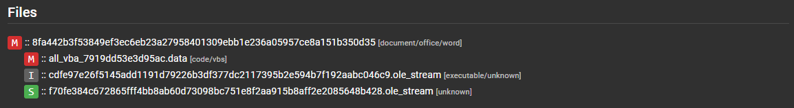

# AssemblyLine results
{: .no_toc }

## Table of contents
{: .no_toc .text-delta }

1. TOC
{:toc}

---

# Heuristics

A heuristic is a feature that is detected by the service performing the analysis. 
- Heuristic have:
    - id
    - name
    - description
    - score (used to label heuristic as MALICOUS / SUSPICOUS / INFO)
    - MITRE Att&ck ID
    - Signatures are often raise under a heuristics to provide more context

Heuristics are tracked by the system to provide statistics with number of hits and score statistics to help adjusting well performing or under performing heuristics.

Heuristics will be shown in the UI and be color coded based on their malicousness level.

# Tags

Tags are important metadata extracted from a file; tag name follow the same naming convention using namespace for better organization and help searching for specific information in the system, in addition tags are all indexed for blazing fast results.

    result.sections.tags.network.static.ip;     e.g: All IP extracted staticly will be found with this tag regardless of which service extracted it.

All tags registered with the system will be listed under the Help > Searching Help menu of your AssemblyLine instance.

# Score

The score of a submission (maliciousness level) is determined by the highest score of any file extracted during the analysis process.

For example let's take a zip file. The zip file might score 0 but if it containe two file one which score 100 and the other 500, then the max score of the submission will be 500. It is possible to drill down to understand exactly what contributed to each score.

Score meaning (this assume you are running most services including some anti-virus and good yara signatures):

<= -1000: whitelisted | 0: nothing found | < 500: suspicious | < 1000: highly suspicious | < 2000 likely malicous | => 2000 malicous

# Submission Report
The first page that will appear when you view a submission is the submission report. This page is a high level summary to allow an analyst to decide if it is worth digging deeper.

## General information
At the top you will find important information such as timestamps, file type detected, size, maximum score and various hashes.

## Heuristics
Under this section you will find all the heuristics categorized by maliciousness level and every files associated.

## Attribution
This section will provide attribution from Yara signatures (if the actor tag is provided in your rule's metadata) and anti-virus virus names.
For best result follow the Yara rules [CCCS standard](https://github.com/CybercentreCanada/CCCS-Yara).

# Submission Details
The "Submission Details" button is located at the top of the submission report.

Submission details will display submission parameters such as which services were selected when the file was submitted, submission [meta data](assemblyline_client.html#submit-a-file). The most important section is the buttom file section.

## Extraction Files Tree
The file tree section will show a view of all the files that were processed and extracted along with their respective score and file type.

Clicking on the files will reveal AssemblyLine's most interesting section the File details page.

# Files Details
Under the file details section you will find everything about a specific file. Regardless of which submission it came from. 

In the top right corner you will find a serie of useful functions

|  | Find all related submissons |
|  | Download file ( by default the file will be inerted in the [Cart format](https://pypi.org/project/cart/) ) to prevent accidental self-infection |
|  | File viewer (Ascii, Strings, Hex view ) |
|  | Resubmit the file for analysis |

## File Frequency
This section will give tell you how many time this file has been seen along with a first and last seen. This will be affected by the retention period of the file within the system.

## File Tags
This section will include all the tags group by type extracted within this file, this is where you will find IP, URL and many other IoC (indicators of compromise) which you can harvest to support your investigation or use to start a dynamic action (e.g: issue blocks on your firewalls).

If you click on one of the tag it will highlight which service it came from.

## Service Results
This section lets you visualize the output of each service along with any heuristics and tags raised. You can also see which services were the source of "extracted files" at the end of each service result. The cached file results are ignored every time a service is updated; if multiple results version are available they will be shown in a drop down which will let you look at older analysis results.

You can expand the details by clicking on a service result section.

[What about searching?](./searching.html){: .btn .btn-primary .fs-5 .mb-4 .mb-md-0 .mr-2 }