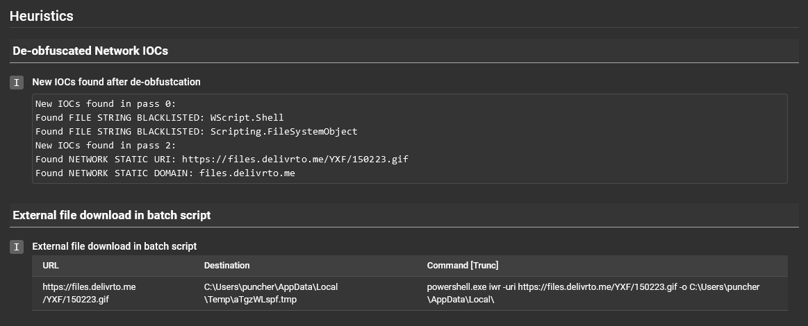
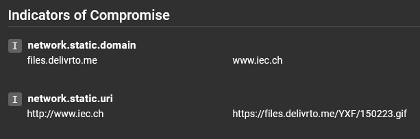
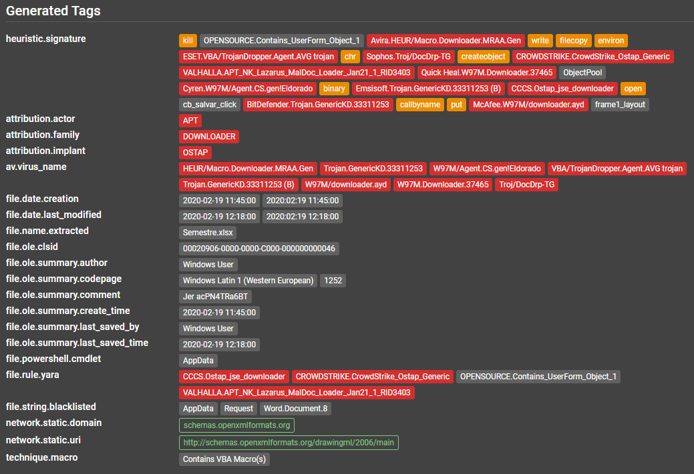

# Assemblyline results

Let's look at what an Assemblyline submission looks like! But before we do that, we need to go over some verbiage.

## Submission
A record of analysis for a given file and all its children with associated metadata and analysis parameters.

## Service
A plugin that performs analysis on specific types of files and returns a detailed result and a score.

## Heuristic
A specific feature/behaviour that a service is looking for in a file can generate a score and alert the analyst of potentially malicious intent.

- A heuristic has:
    - id
    - name
    - description
    - score (used to label heuristic as MALICIOUS / SUSPICIOUS / INFO)
    - MITRE Att&ck ID
    - Signatures are often raised under a heuristic to provide more context

Heuristics are tracked by the system to provide statistics on the number of hits and scores. Doing so can help with adjusting well-performing and under-performing heuristics.


Heuristics will be shown in the UI and will be colour-coded based on the level of their maliciousness.


## Tags
Important features extracted from a file which can be used to group multiple files.

All tag names follow the same naming convention. They are namespaced to improve organization and searching for specific information in the system

Tags are also all indexed, which allow for blazingly fast results.

`network.static.ip -> All IPs extracted statically will be found with this tag regardless of which service extracted it.`

All tags registered with the system will be listed under the Help menu > Current Configuration page > Tags section of your Assemblyline instance.

There are 202 different types of tags available as of this writing (Ex: IP, Domain, URL, Implant Family, PE Imports hash, Process Name, etc.).

## Score
A single number summarizing the risk associated with a file according to the services that analyzed it.

The score of a submission (maliciousness level) is determined by the highest score of any file extracted during the analysis process.

For example, let's take a `zip` file. The `zip` file itself might score 0 but if it contained two files, one of which
scored 100 and the other 500, then the max score of the submission will be 500. It is possible to drill down into the file
structure to understand exactly what contributed to each score.

### Verdict
The text version of the risk associated with a file or result. Can be one of the following:
```
-1000: safe
0 - 299: informative
300 - 699: suspicious
700 - 999: highly suspicious
>= 1000: malicious
```
The configuration model for these mappings can be found [here](../../odm/models/config/#verdicts).

For more details on how to interpret the score and verdict, head to [Assemblyline Verdicts](../../user_manual/verdicts)

## Submission Report
The first page that will appear when you view a submission is the submission report. This page is a high-level summary to allow an analyst to decide if it is worth digging deeper.

You can easily print out / save the report as a PDF via the printer icon button on the top right.

### General information
At the top of the report, you will find important information such as submission classification, submission ID, timestamps, the file type detected, file size, and various hashes representing the file contents. The analysis verdict is also given with the maximum score revealed when hovering over the verdict (i.e. 'Malicious').


### Heuristics
Under this section you will find all the heuristics that were raised for the submitted file as well as its children files, and the details for each heuristic can be found below the heuristic title. It looks like there were some de-obfuscated network indicators of compromise seen as well as an external file was downloaded from a batch script.



### Attribution
This section will provide attribution from Yara signatures (if the actor tag is provided in your rule's metadata) and anti-virus virus names.
For best results, follow the [CCCS standard](https://github.com/CybercentreCanada/CCCS-Yara) when writing Yara rules.


### Indicators of Compromise
This section where network indicators such as URIs, domains, and IPs are brought forward for the  reader to easily see.



## Submission Details
The "Submission Details" button is located at the top of the submission report.


Submission details will display submission parameters such as which services were selected when the file was submitted
and submission [metadata](../../integration/python/#submit-a-file-url-or-sha256-for-analysis).

### Extracted File Tree
The extracted file tree section will show a view of all the files that were processed and extracted along with their respective score and file type.

Clicking on the files will reveal Assemblyline's most interesting section the File details page.


## File Details
Under the "File Details" section you will find everything about a specific file. Regardless of which submission it came from.

In the top right corner, you will find a series of useful functions

| Icon | Description|
| ---- | -----|
|  | Find all related submissions |
|  | Download file (by default the file will be inserted in the [CaRT format](https://pypi.org/project/cart/) to prevent accidental self-infection) |
|  | File viewer (Ascii, Strings, Hex view)  |
|  | Resubmit the file for analysis |
|  | Add file to the safelist |

### File Frequency
This section will tell you how many times this file has been seen, along with a first and last seen timestamp. These
values will be affected by the retention period of the file in the system.


### File Tags
This section will include all the tags extracted within this file, grouped by type. This is where you will find IPs,
URLs and many other IoCs (indicators of compromise) which you can harvest to support your investigation or use to start
a dynamic action (e.g. issue blocks on your firewalls).

If you click on one of the tags it will highlight which service it came from.



### Service Results
This section lets you visualize the output of each service along with any heuristics and tags raised. You can also see
which services were the source of "extracted files" at the end of each service result. The cached file results are
ignored every time a service is updated; if multiple service result versions are available, they will be shown in a
dropdown which will let you look at older analysis results.

You can expand the details by clicking on a service result section.


