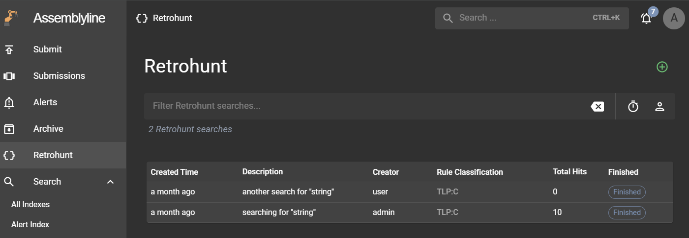
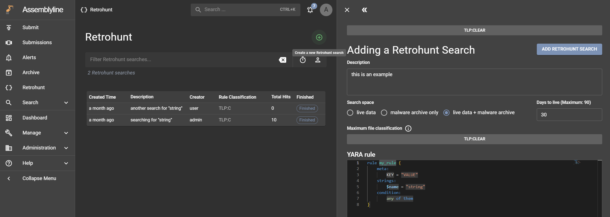
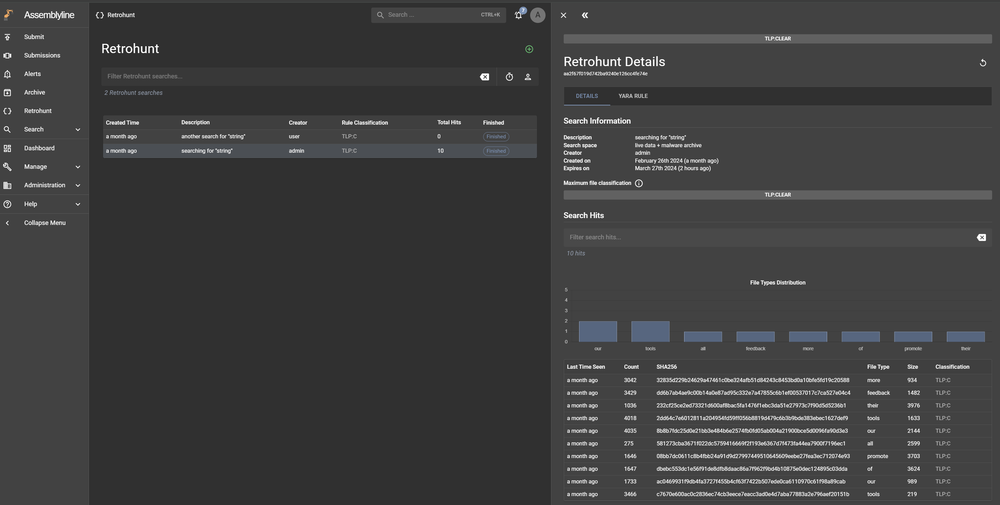
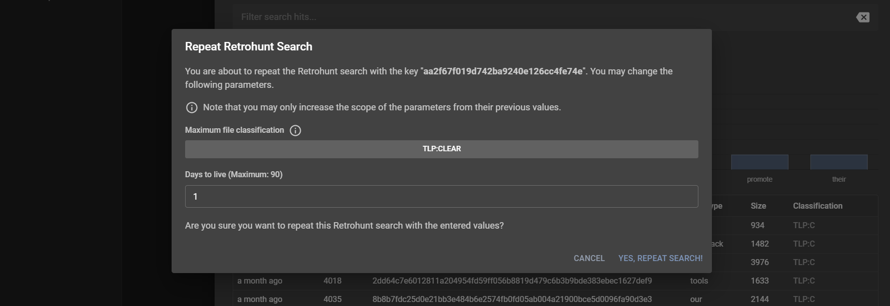

# Utiliser Retrohunt

## Vue d'ensemble

La fonctionnalité Retrohunt permet aux utilisateurs de scanner la collection historique de fichiers dans Assemblyline à l'aide de règles YARA afin de détecter des versions antérieures d'une attaque en utilisant des jeux de règles plus récents, et ainsi comprendre comment une attaque a évolué au fil du temps.

Pour commencer à utiliser Retrohunt, assurez-vous d'avoir la [configuration](../installation/configuration/retrohunt.md) appropriée.

Si vous souhaitez comprendre le fonctionnement de Retrohunt, une description détaillée est disponible dans [l'architecture du système](../../administration/architecture/#yara-back-in-time-retrohunt)

## Interface Retrohunt

Cliquez sur le lien "Retrohunt" dans la barre de navigation de gauche pour accéder à l'interface principale Retrohunt. Cette page affiche toutes les recherches Retrohunt créées par les utilisateurs en tenant compte de leur classification. Vous pouvez filtrer ces recherches avec vos propres paramètres de recherche, et elle propose aussi des actions de recherche rapide (à droite de la barre de recherche) pour afficher les tâches terminées dans les dernières 24h et vos propres tâches.

## Créer une nouvelle recherche Retrohunt

Pour créer une nouvelle tâche de recherche, cliquez sur le bouton vert "plus" en haut à droite de l'interface principale pour ouvrir la page Create Retrohunt Search. Saisissez les informations suivantes :

- **Informations de recherche** : Fournissez une description de la recherche, sélectionnez les index sur lesquels effectuer la recherche (espace de recherche) et indiquez la date d'expiration (durée de vie en jours).
- **Classification maximale des fichiers** : Cette propriété définit la portée des fichiers inclus dans la recherche, mais notez que même avec des niveaux de classification plus élevés, les utilisateurs avec une classification plus basse ne pourront pas voir tous les résultats après la fin de la recherche.
- **Règle YARA** : Lors de l'écriture d'une règle YARA, commencer à taper `rule` affichera un extrait qui créera un modèle de règle de base. Il existe un certain nombre de restrictions supplémentaires sur les règles YARA pour le retrohunting, décrites dans les détails de recherche.

Une fois terminé, cliquez sur "ADD RETROHUNT JOB" puis confirmez la tâche pour la créer. Si aucune erreur ne survient, une barre de notification verte devrait apparaître en bas et l'interface redirigera vers sa page de détails Retrohunt. Cette page affichera une barre de progression indiquant l'état de la recherche. Une fois la tâche terminée, elle affichera les résultats de la recherche.

### Détails de recherche

Une recherche retrohunt prend une seule règle YARA valide pour cibler la recherche. Cette règle est aussi soumise à des contraintes supplémentaires dues à la nature de la recherche.

La recherche retrohunt exécute d'abord une [recherche trigramme](https://en.wikipedia.org/wiki/Trigram_search) appelée étape de "filtrage" pour trouver des fichiers susceptibles de correspondre à la règle YARA. Les fichiers candidats sélectionnés pendant l'étape de filtrage sont ensuite testés normalement avec la règle YARA.

En raison de la nature particulière des recherches trigrammes, la règle YARA est décomposée en chaînes exprimables comme séquences de trigrammes. Les règles qui fonctionnent bien pour la recherche trigramme se décomposent en longues séquences de trigrammes obligatoires pour qu'une règle corresponde, ce qui provient de longues chaînes dont les conditions de la règle exigent la présence.

Lorsqu'une règle ne peut pas être décomposée en séquences trigrammes, la recherche échoue. Dans d'autres cas, les règles peuvent être décomposées en séquences trigrammes, mais seulement courtes, ce qui donne des recherches très lentes et qui peuvent manquer de nombreux résultats. Seul un nombre limité de fichiers est accepté depuis l'étape de filtrage pour l'exécution YARA ; une mauvaise décomposition trigramme produira de nombreux faux positifs qui satureront cet espace limité et empêcheront de considérer les véritables correspondances de la signature YARA.

Quelques règles générales pour choisir de bonnes règles YARA pour le retrohunting :

- Les longues chaînes obligatoires sont efficaces. Une chaîne de trois caractères est le minimum traitable ; chaque octet au-delà de trois améliore progressivement la qualité du filtrage.
- Quand des chaînes ont des alternatives (chaîne A ou chaîne B), l'effet de chaque chaîne sur le filtrage est légèrement affaibli.
- Quand des chaînes sont insensibles à la casse ou utilisent plusieurs encodages, l'effet de la chaîne est légèrement affaibli.
- Quand une chaîne inclut un joker, cela casse la chaîne en deux chaînes plus courtes pour la qualité du filtrage. Ainsi, une chaîne de cinq caractères avec un joker au milieu n'apporte aucun trigramme à l'étape de filtrage.
- La plupart des logiques de conditions de règle sont prises en charge, mais certaines fonctionnalités manquent, notamment les boucles qui ne sont pas prises en charge.
- Les regex sont prises en charge, mais elles sont déconstruites avec la même logique que les conditions et chaînes de la règle YARA ; les chaînes optionnelles dans une regex `(abc123)?` n'apportent aucun trigramme, tandis que les chaînes obligatoires ou alternatives apportent des trigrammes comme d'habitude. Une regex `.*(abc123|xyz456)+.` requise dans les conditions de la règle apportera deux séquences alternatives de quatre trigrammes et améliorera le filtrage de façon similaire à l'ajout direct de ces chaînes avec un **or** dans les conditions de la règle.

## Voir les résultats d'une recherche Retrohunt

La page de détails Retrohunt affiche les informations sous forme tabulaire.

- **Details** : Cet onglet affiche les informations de recherche et les résultats trouvés. Vous pouvez réduire la portée des résultats en saisissant une requête de recherche ou en cliquant sur une colonne dans les graphes de distribution pour ajouter une valeur de filtre. Cliquer sur une ligne du tableau ouvrira la page de détails de ce fichier.
- **YARA Rule** : La règle YARA soumise se trouve dans cet onglet.
- **Errors** : Cet onglet est accessible uniquement aux administrateurs, car il affiche les avertissements et erreurs survenus pendant le processus de recherche Retrohunt, pouvant servir au débogage.

## Répéter une recherche Retrohunt

La fonctionnalité Retrohunt permet de répéter des tâches terminées en utilisant la même règle YARA. Pour répéter une recherche, cliquez sur le bouton "Repeat this Retrohunt search" en haut à droite de la page de détails Retrohunt pour ouvrir la boîte de dialogue "Repeat Retrohunt Search". Vous pouvez modifier la `maximum file classification` et les `days to live`, mais notez que sélectionner une valeur plus basse ne mettra pas cette propriété à jour, même si l'interface ne vous empêche pas de les sélectionner.

