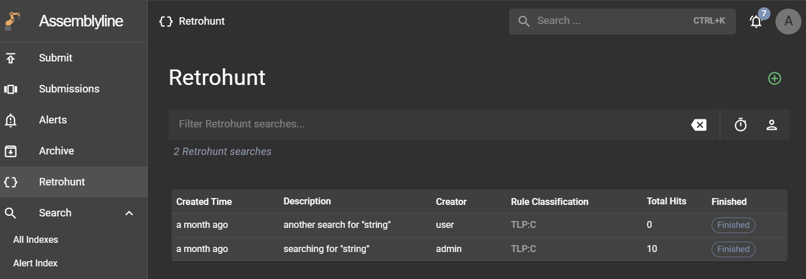
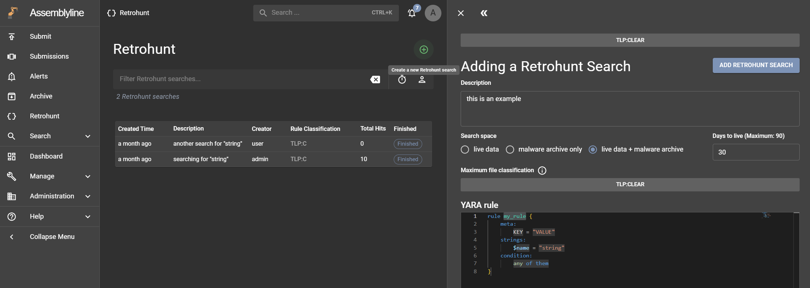
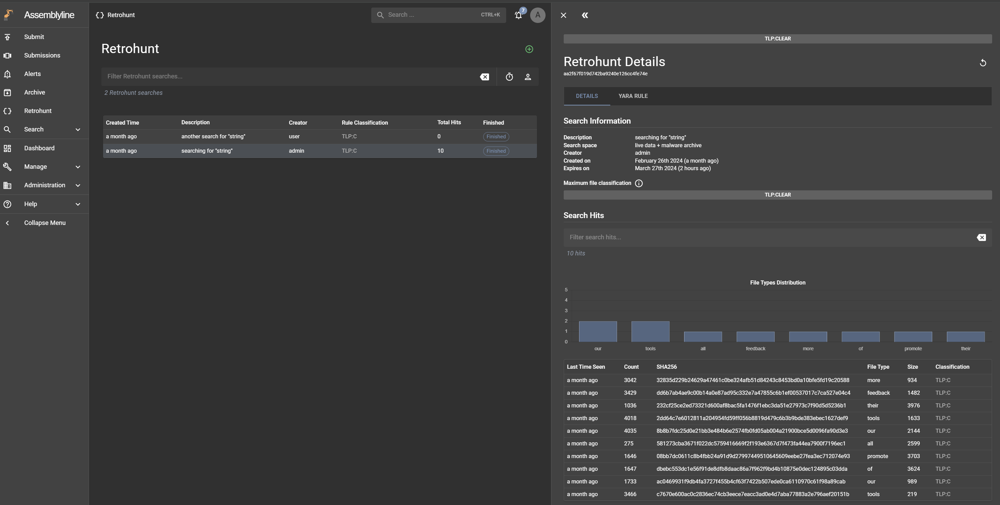
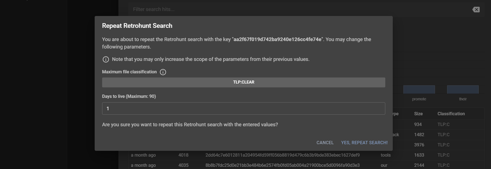

# Using Retrohunt

## Overview

The Retrohunt feature allows users to scan the historical collection of files in Assemblyline using YARA rules in order to detect early versions of an attack using newer rule sets to understand how an attack has evolved over time.

To start using Retrohunt, make sure you have the correct [configuration](../installation/configuration/retrohunt.md).

If you want to understand how Retrohunt works, a detailed description can be found in the [System Architecture](../../administration/architecture/#yara-back-in-time-retrohunt)

## Retrohunt Interface

Click the "Retrohunt" left navbar link to access the main Retrohunt interface. This page displays all the Retrohunt searches that users have created while taking into consideration their classification. You can filter these searches using your own search parameters, and it also provides quick search actions (on the right side of the search bar) to display jobs that were completed in the last 24h and your own jobs.

## Creating a new Retrohunt search

To create a new search job, click the green "plus" button on the top right of the main interface to open the Create Retrohunt Search page. Enter the following details:

- **Search information**: Provide a description for the search, select which indices to search on (search space) and enter the expiry date (days to live).
- **Maximum file classification**: This property defines the scope of the included files in the search, but note that even with higher classification levels, users with a lower classification will not be able to see all the resulting hits after the search has completed.
- **YARA rule**: When writing a YARA rule, starting to type `rule` will show a snippet that will create a basic rule template. There are a number of additional restrictions on YARA rules for retrohunting that are described in the searching details.

When you're done, click the "ADD RETROHUNT JOB" and confirm the job to create it. If no errors have occurred, a green snack bar should appear from the bottom and the interface should redirect to its Retrohunt Detail page. That page will show a progress bar denoting the status of the search. After the job has completed, it will show the resulting hits of the search.

### Searching details

A retrohunt search takes a single valid YARA rule to target the search. This rule is also subject to additional constraints due to the nature of the search. 

The retrohunt search first runs a [trigram search](https://en.wikipedia.org/wiki/Trigram_search) called the "filtering" stage to find files that may be hits for the YARA rule. The candidate files selected by the filtering stage then have the YARA rule run on them normally. 

Due to the particular nature of trigram searches the YARA rule is decomposed into strings which can be expressed as trigram sequences. Rules that work well for trigram searching break down into long trigram sequences that are manditory for a rule to hit, this comes from having long strings that the conditions of the rule require to be found. 

When a rule can't be broken down into trigram sequences the search will fail. In other cases rules can be broken into trigram sequences, but only short ones, this results in searches that run very slowly and may miss many results. Only a limited number of files are accepted from the filtering stage for YARA to run on, and a poor trigram decomposition will result in many false positives filling up that limited space blocking true hits on the YARA signature from being considered.

Some rules of thumb to help choose good YARA rules for retrohunting:

- Long manditory strings are strong. A three character string is the shortest that can be processed, every byte longer than three progressively improves the quality of the filtering.
- Where strings have alternates (string A or string B) the effect of each string on filtering is slightly weakened.
- Where strings are case insensitive or use multiple encodings the effect of the string is slightly weakened.
- When a string includes a wildcard, it breaks the string into two separate shorter ones for the purposes of filtering quality. So a five character string where the middle one is wildcard contributes no trigrams to the filtering stage.
- Most rule condition logic is supported but a few features are missing, most notably loops are not supported.
- Regex _is_ supported, but regexes are deconstructed using the same logic as the conditions and strings of the YARA rule, optional strings in a regex `(abc123)?` contribute no trigrams, but required or alternate strings contribute trigrams as usual. A regex `.*(abc123|xyz456)+.` required in the rule conditions will contribute two alternate sequences of four trigrams and will improve filtering similarly to if those strings were added with an **or** in the rule conditions directly.

## Viewing the hits of a Retrohunt search

The Retrohunt Detail page displays information in a tabular format.

- **Details**: This tab shows the search information and displays the resulting hits of the search. You may reduce the scope of the hits by entering a search query or by clicking on a column in the distribution graphs to add a filter value. Clicking on a table row will open the detail page of that file.
- **YARA Rule**: The submitted YARA rule is found in this tab.
- **Errors**: This tab is only accessible to administrators as it shows the warnings and errors that occurred during the Retrohunt search process, which may be used for debugging purposes.

## Repeating a Retrohunt search

The Retrohunt feature offers the ability to repeat completed jobs using the same YARA rule. To repeat a search, click on the "Repeat this Retrohunt search" button on the top right side of the Retrohunt Detail page to open the "Repeat Retrohunt Search" dialog box. You may change the `maximum file classification` and the `days to live`, but note that selecting a lower value will not update that property even though the interface doesn't prevent you from selecting them.

