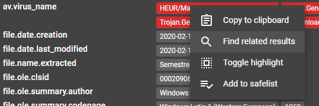

# Recherche

# Base de données
Assemblyline tire avantage des puissantes capacités de recherche pratiquement infinies de [Elasticsearch](https://www.elastic.co/).

## Banque de documents
Les index d’information sont un des principaux concepts à approfondir. Ils permettent à Assemblyline de dédupliquer la plupart des résultats dans le système, ce qui explique pourquoi l’outil peut s’adapter aussi efficacement. Les recherches dans les champs indexés s’effectuent très rapidement.

- On retrouve 5 index principaux :
    - Submissions [Soumissions];
    - Files [Fichiers];
    - Results [Résultats];
    - Alerts [Alertes];
    - Signatures.

Vous pouvez afficher tous les index et les champs indexés connexes après avoir assuré le bon fonctionnement d’Assemblyline en consultant l’aide sous `Help > Search help menu`.

## Recherche de comportements et limitations

Lors d’une recherche dans l’interface utilisateur, la requête est transmise dans tous les compartiments et renvoie tous les résultats correspondants.


Important 
{: .label .label-red }
Vous devez limiter vos critères de recherche à un seul compartiment. En d’autres mots, vous ne pouvez pas rechercher de l’information dans deux compartiments différents ou plus. 

Il est possible de contourner cette limitation en faisant appel à l’API REST. La méthode consiste alors à effectuer une recherche dans un compartiment, puis à l’élargir ou l’affiner en recherchant ces éléments dans d’autres compartiments.

# Recherche

Une manière de se familiariser avec les index de recherche est d’utiliser la Loupe incluse avec chaque balise. Cliquer sur la Loupe à droite de générera la requête suivante :

```ruby
result.sections.tags.av.virus_name:"Trojan-Downloader.VBA.Agent"
```

Vous pouvez également générer des recherches plus complexes en utilisant une syntaxe de requête complète. En voici quelques exemples :


```ruby
#Trouver tous les résultats où le service ViperMonkey a extrait l’adresse IP 10.10.10.10
result.sections.tags.network.static.ip:"10.10.10.10" AND response.service_name:ViperMonkey

#Trouver toutes les soumissions pour lesquelles une note de 2000 ou plus a été attribuée au cours des deux derniers jours
max_score:[2000 TO *] AND times.submitted:[now-2d TO now]

#Trouver tous les résultats de l’antivirus dont le nom de signature correspond à Emotet
result.sections.tags.av.virus_name:*Emotet*
```
Le système prend en charge un large éventail de paramètres de recherche, comme les caractères génériques, les plages et les expressions régulières. Vous trouverez la syntaxe complète dans l’aide sous ```Help > Search Help```.

Les requêtes de recherche peuvent également être utilisées dans le client d’Assemblyline pour instaurer un puissant mécanisme qui s’exécutera automatiquement lorsque de nouveaux fichiers seront analysés par le système.


