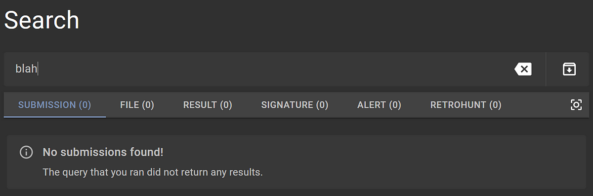
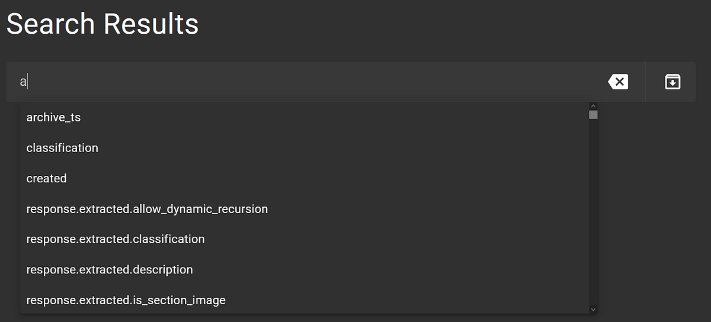
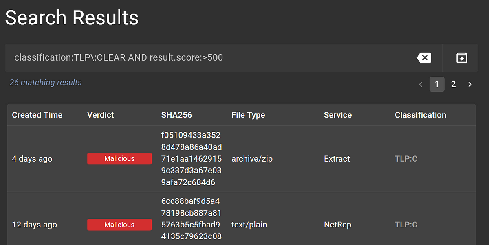

# Searching

Assemblyline leverages the powerful capabilities of [Elasticsearch](https://www.elastic.co/) which make it possible to
search for almost anything.

## Document store

One key concept to understand are the "*indices*" of information. These allow Assemblyline to deduplicate most of the results
in the system which is a major reason Assemblyline can scale so well. Searching indexed fields is also very fast.

- There are 6 primary "*indices*"
    - Submissions
    - Files
    - Results
    - Alerts
    - Signatures
    - Retrohunt

You can view all indices and their indexed fields once you have a working Assemblyline under `Help > Search Help` menu.

## Searching behaviours and limitations

When you search for something in the Search Bar at the top of the UI

{: .center }

or on the generic Search page


it will run your query in all the indices and return any matching results.

The fact that there are 6 separate indices is obvious when you make a search on one of the search bars mentioned above, as the results appear per index:




!!! tip "You must limit your search criteria to a single index; in other words, you cannot do JOIN queries with information present in two or more indices."

This limitation can be worked around by using the [Assemblyline Client](../../integration/python/) by performing queries on one index and then enriching or narrowing your search by searching for elements in another index.

## Search examples

One quick way to get familiar with search indices is to use the "*Find related results*" item from the tags dropdown menu.

{: .center }

Clicking it on the `av.virus_name` tag (`HEUR/Macro.Downloader.MRAA.Gen`) will build the following query:
```ruby
result.sections.tags.av.virus_name:"HEUR/Macro.Downloader.MRAA.Gen"
```

You can also build more complex searches by leveraging the [full Lucene query syntax](https://www.elastic.co/guide/en/kibana/current/lucene-query.html). Here are some other examples:
```ruby
# Find every result where the ViperMonkey service extracted the IP 10.10.10.10
result.sections.tags.network.static.ip:"10.10.10.10" AND response.service_name:ViperMonkey

# Find all submissions with a score greater than or equal to 2000 in the last two days
max_score:[2000 TO *] AND times.submitted:[now-2d TO now]

# Find all anti-virus results with Emotet in the signature name
result.sections.tags.av.virus_name:*Emotet*
```
The system supports a wide range of search parameter such as wildcards, ranges and regex. The full syntax range can be found under ```Help > Search Help```

Search queries can also be used with the [Assemblyline Client](../../integration/python) to build powerful tradecraft which can run automatically as new files get scanned by the system.

## Autofill
There are a lot of fields per index that you can query for, so exploring the "autofill" options is helpful. To do so, head to an index-specific search page, like "Result" (`/search/result`), and type something. The available fields that you can query for should pop up:



If you want to query all submissions that are TLP:CLEAR and have a service that scored greater than 500, the Result index is where you would want to search because that is where the service result data lives:


