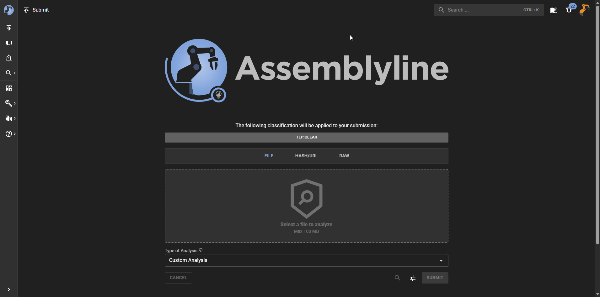
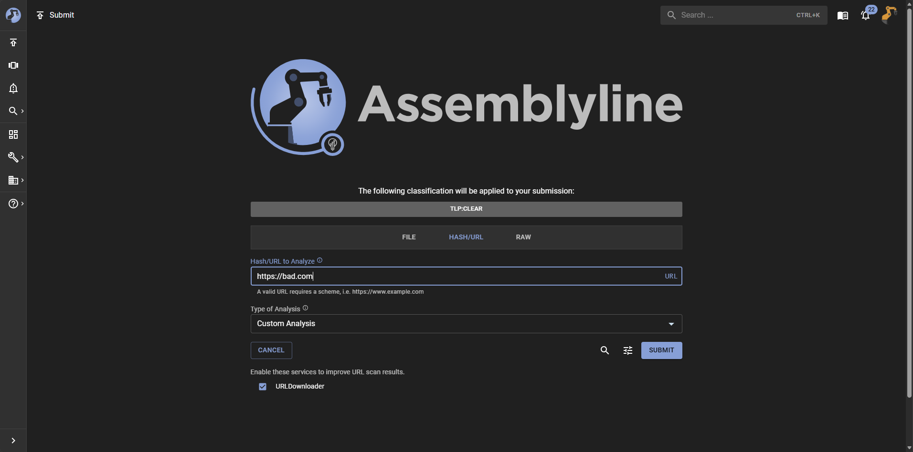

# Providing the Input

To get started with using Assemblyline for malware analysis, the first step is to submit a file or URL for analysis.

## Submitting Files

The UI supports multiple methods for submitting files for analysis, giving you the flexibility to choose the method that best suits your needs. The most common methods for submitting files are:

=== "File Upload"

    You can drag-and-drop files directly into the dropzone in the UI or click to select files from your local system to upload for analysis under the "File" tab.

    

=== "Using Identifiers"

    You can also submit files for analysis by providing their hashes (MD5, SHA1, or SHA256) if the file has already been analyzed or is known to the system. This can be done under the "Hash/URL" tab.

    The system also supports using custom identifiers for fetching files from file sources but this has to be setup by the administrator.

    If your deployment has "File Sources" configured, then the UI will attempt to auto-detect the type of file identifier you are submitting and provide you with a list of options that the system can use to retrieve the file for analysis. An example of a file source would be one for VirusTotal or Malaware Bazaar that can leverage the file hashes for fetching.

    <video controls src="../assets/input_file_id.mp4" title="Hash Submit"autoplay loop></video>

=== "From Clipboard"

    The UI also supports submitting files directly from your clipboard. At the moment, the system allows for you to paste the contents of your clipboard into the "Raw" tab and this allows you to modify the content before submitting it for analysis.

    More commonly, this feature is used to submit snippets of text or code for analysis. For example, you could paste a snippet of PowerShell code into the "Raw" tab and submit it for analysis. The system will treat the pasted content as a file and analyze it accordingly.

    <video controls src="../assets/input_raw.mp4" title="Clipboard Submit"autoplay loop></video>

## Submitting URLs

If you want to submit a URL for analysis, the system also allows you to do so under the "Hash/URL" tab.

When you submit a URL for analysis, the system will provide you with a list of services from the "Internet Connected" category that can be used for specialized fetching (ie. proxy support, custom user agents, etc.). The Assemblyline team provides the URLDownloader service as an out-of-the-box option.

## Checking for Existing Analysis

Once you provide an input for analysis, you can optionally request the system to check if there is already an existing analysis for the provided input.

This can be done by clicking on the magnifying glass icon next to the "Submit" button.

<video controls src="../assets/input_check_existing.mp4" title="Check existing analysis"autoplay loop></video>
