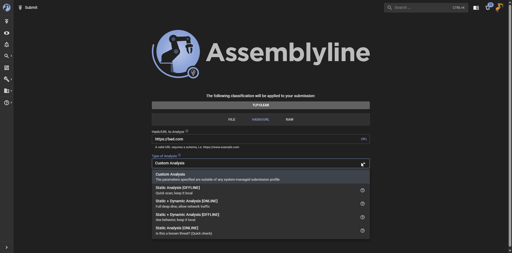

# Define Your Analysis

In addition to providing the input for analysis, you can also define the parameters of your analysis to ensure that you get the most relevant results from the system. This includes selecting which services you want to use for the analysis and configuring any specific parameters for those services.

## Classification and Sharing

!!! note "If classification enforcement isn't enabled, you can skip this step as you wouldn't see the picker mentioned below."

If your system is configured with a classification scheme, such as TLP, you can select the appropriate classification level for your analysis. This can help ensure that the results of the analysis are shared with the appropriate audience and that sensitive information is handled correctly.

This is an integral part of the submission process, as it allows you to control the visibility and sharing of the analysis results based on the sensitivity of the data being analyzed.

<video controls src="../assets/params_classification.mp4" title="Submission Profiles"autoplay loop></video>

## Submission Profiles

These are profiles of analysis defined by your system administrators that are designed to be used for specific types of analysis. For example, there could be a submission profile for analyzing email attachments that includes services that are relevant for analyzing email files.

The Assemblyline team has included some default submission profiles that are designed to be used for common types of analysis.

## Submission Parameters

For those that are more familiar with the system and want to have more control over the analysis, you can define your own submission parameters. This allows you to select which services you want to use for the analysis and configure any specific parameters for those services.

<video controls src="../assets/params_submission_parameters.mp4" title="Submission Parameters"autoplay loop></video>

The table below provides a high-level overview of the different types of parameters that you can define for your analysis:

| Section | Description | Example |
|:--: |:--|:--:|
| System Parameters | These are parameters used by the core system to define how the analysis should be performed. For example, you can specify the priority of the analysis, which can affect how quickly the analysis is performed and how much resources are allocated to it.  The "Submission Data" section is a common place to insert ephemeral data that all services can leverage. This can useful for setting something like a password or token that services can use during the analysis rather than setting it per-service.  For a full list of system parameters and their descriptions, please refer to the [Submission Parameters model](../../../odm/models/submission/#submissionparams). | <video controls src="../assets/params_system_parameters.mp4" title="Service Selection"autoplay loop></video> |
| Service Selection | The service selection allows you to choose which services you want to use for the analysis.  Services are categorized based on their functionality, such as Static Analysis, Dynamic Analysis, Extraction, etc. so you can decide to select all services within a category by just clicking on the category name or pick specific services that you want to use for the analysis. | <video controls src="../assets/params_service_selection.mp4" title="Service Selection"autoplay loop></video> |
| Service Parameters | These are parameters that are specific to each service and allow you to configure how the service should perform its analysis. These parameters can vary widely depending on the service and can include things like the level of analysis, specific settings for the service, or any other parameters that the service may require.  For example, you might have a password protected file that you want to analyze, so you can provide the password as a service parameter for the Extract service to use. | <video controls src="../assets/params_service_parameters.mp4" title="Service Parameters"autoplay loop></video> |
