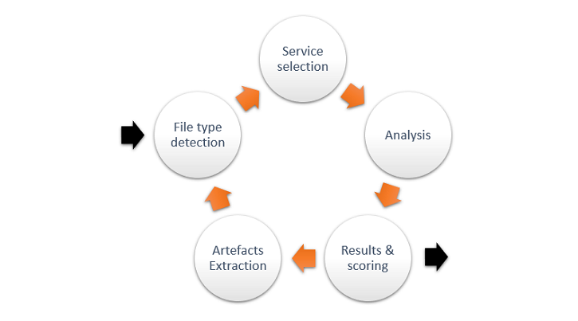

# Soumettre un fichier aux fins d’analyse

## Soumission
Il est facile de soumettre un fichier aux fins d’analyse. On peut le faire directement à partir de l’interface Web d’Assemblyline. En ce qui concerne l’automatisation et l’intégration, vous pouvez utiliser l’[REST API](../../integration/python/#submit-a-file-url-or-sha256-for-analysis).

### Partage et classification

Si votre système est configuré de manière à permettre le contrôle partagé (TLP) ou la classification, il est possible de choisir une restriction en cliquant sur la bannière.

### Sélection d’un fichier à analyser

Vous pouvez cliquer sur **Select a file to scan** [Sélectionner un fichier à analyser] ou glissez-déposez un fichier dans la zone pour l’ajouter à l’analyse.

## Options
D’autres options de soumission sont offertes et permettent de faire ce qui suit :

- sélectionner les catégories de services ou les services particuliers à utiliser aux fins d’analyse;
- préciser les options de configuration des services (p. ex. fournir un mot de passe ou l’expiration d’une analyse dynamique).

| Ignore filtering services | [Ignorer les services de filtrage] Contourne les services de mises en liste blanche |
| Ignore result cache | [Ignorer le cache des résultats] Force une nouvelle analyse même si le fichier a déjà été analysé récemment par la même version des services |
| Ignore dynamic recursion prevention | [Ignorer la prévention de la récursivité dynamique] Désactive la limite d’itération d'un fichier |
| Profile current scan | [Profiler l’analyse actuelle]|
| Perform deep analysis | [Effectuer une analyse en profondeur] Fournit un désobscurcissement maximal - **Fortement recommandé pour les fichiers malveillants connus ou hautement suspects afin de détecter le contenu considérablement obscurci** |
| Time to live | [Durée de vie] Durée (en jours) avant que le fichier soit supprimé du système |

{: .center }

## Analyse de fichiers

Une fois le fichier soumis dans Assemblyline, le système procédera automatiquement à plusieurs vérifications afin de déterminer la meilleure façon de le traiter. Le modèle d’analyse récursive est l’une des fonctionnalités les plus puissantes d’Assemblyline. Les maliciels et les documents malveillants utilisent souvent plusieurs couches d’obscurcissement. L’analyse récursive permet au système de supprimer ces couches et de poursuivre l’analyse du fichier. Il en résulte souvent un script en texte clair ou un maliciel non condensé qu’un antivirus conventionnel pourra détecter très facilement.

{: .center }
