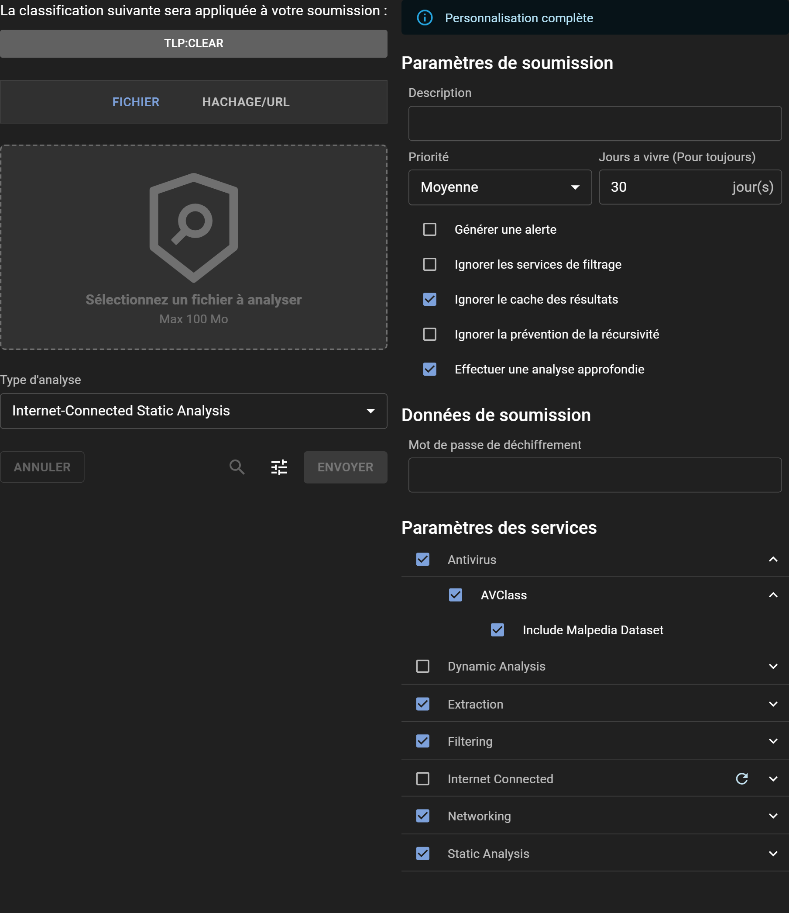

# Soumettre un Fichier pour Analyse

## Processus de Soumission

La soumission d'un fichier pour analyse dans Assemblyline est simple via l'interface WebUI. Pour les tâches automatisées et les besoins d'intégration, envisagez d'utiliser l'[API REST](../../integration/python/#submit-a-file-url-or-sha256-for-analysis).

### Partage et Classification
Sélectionnez le niveau de classification souhaité ou les restrictions de partage en cliquant sur la bannière de classification, à condition que votre configuration système comprenne TLP ou un autre schéma de classification.

### Sélection d'un Fichier à Analyser
Chargez un fichier à analyser soit en cliquant sur le bouton "Sélectionnez un fichier à analyser", soit en utilisant le glisser-déposer dans la zone délimitée par des pointillés.

### Choix du Type d'Analyse
Sélectionnez le type d'analyse le plus approprié pour votre fichier dans le menu déroulant "Type d'Analyse".

## Options

Accédez aux options avancées de soumission en cliquant sur l'icône "Ajuster" pour ouvrir le panneau "Réglages". En haut, une bannière indique le niveau de privilèges de personnalisation disponibles. Les utilisateurs ayant le rôle `submission_customize` ont la capacité de modifier tous les paramètres, sachant qu'ils comprennent l'impact sévère que certains paramètres peuvent avoir sur le système s'ils sont mal utilisés.

### Paramètres de Soumission :

- **Description** : Fournissez éventuellement une description pour l'analyse, ou laissez-la vide pour accepter la valeur par défaut définie par le système.
- **Priorité** : Désignez la priorité de traitement de la soumission.
- **Durée de vie (jours)** : Spécifiez combien de temps (en jours) le fichier doit être conservé dans le système.
- **Génération d'alerte** : Décidez si la soumission doit déclencher une alerte à l'achèvement de l'analyse.
- **Ignorer les services de filtrage** : Choisissez de contourner tous les services de liste blanche.
- **Ignorer le cache de résultats** : Demandez au système de réanalyser le fichier, indépendamment de toute analyse similaire récente.
- **Ignorer la prévention de récursion** : Supprimez les limites d'itération pour la soumission.
- **Effectuer une analyse approfondie** : Engagez un débogage approfondi, recommandé pour des fichiers confirmés malveillants ou hautement suspicieux.

### Données de Soumission :

- **Mot de passe de déchiffrement** : Entrez rapidement un mot de passe pour les fichiers chiffrés, éliminant le besoin de le fournir à chaque service individuel.

### Paramètres de Service :

- **Catégories de service** : Choisissez un groupe prédéfini de services.
- **Service spécifique** : Sélectionnez manuellement des services individuels pour l'analyse.
- **Paramètres de service** : Ajustez les paramètres spécifiques à chaque service en déployant leurs menus individuels.

### Métadonnées de Soumission :

- **Métadonnées système** : Remplissez les champs de métadonnées générés par le système requis.
- **Métadonnées supplémentaires** : Pour ceux ayant des capacités de personnalisation totales, tous les champs de métadonnées supplémentaires sont modifiables.

## Comprendre l'Analyse de Fichiers

Une fois soumis, Assemblyline effectue plusieurs évaluations pour déterminer le chemin d'analyse optimal. Sa capacité d'analyse récursive est particulièrement efficace pour décortiquer les couches d'obscurcissement souvent trouvées dans les logiciels malveillants, révélant finalement des scripts en clair ou des versions décompressées qui peuvent être plus facilement identifiées par les solutions antivirus traditionnelles.

